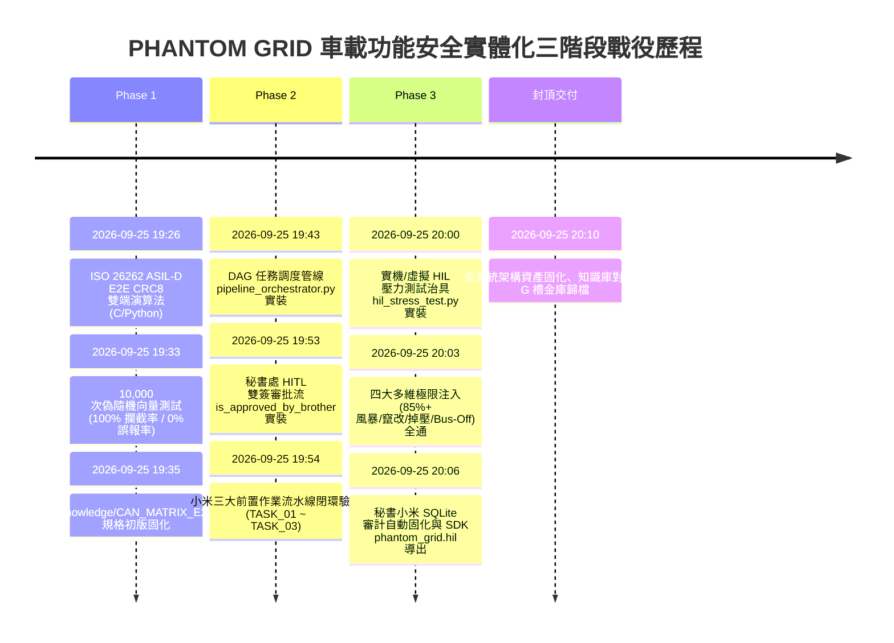

# PHANTOM GRID 實體化三階段演進歷程檔案 (01_Memory/changelog_phase3.md)

> **標籤**：PHANTOM GRID 車載具身智慧與功能安全三階段戰役實錄  
> **基線時間**：2026-09-25 | **狀態**：全線大成驗收通過 (93/93 Tests PASS)

---

## 📅 三階段戰役演進全景

---

## 🛠️ 各階段交付與技術細節

### Phase 1：通訊矩陣與車規安全狀態轉換矩陣 (Milestones 202 ~ 203)
- **核心目標**：杜絕單點通訊失效，建立端到端（E2E）數據完整性保護與容錯降級機制。
- **交付成果**：
  1. **C 語言底層驅動** (`e2e_crc8_driver.c` / `src/e2e_crc8_driver.c`)：
     - 輕量結構體 `E2E_RxState_t`（零堆積動態分配，符合 MISRA-C 車規）。
     - `E2E_CalculateCRC8` 採用 SAE J1850 多項式（`0x1D`，Init `0xFF`，XorOut `0xFF`）。
  2. **Python 上位機狀態機** (`e2e_state_matrix.py`)：
     - `Iso26262SafetyStateMachine` 實作五大狀態轉移拓撲（`NORMAL`, `DEGRADED`, `BUS_OFF_SAFE`, `HARD_FAULT`, `RESET`）。
     - 連續 3 幀異常強制切入 `STATE_DEGRADED`（功率降額 50%）。
     - 連續 10 幀正確自動回正至 `STATE_NORMAL`（100% 輸出，遲滯防抖）。
     - TEC > 255 觸發 Bus-Off（0ms PWM 歸零高阻態，100ms 快速重啟定時器）。
  3. **10,000 次偽隨機向量驗證** (`verify_10k_e2e_vectors.py`)：
     - 4,000 幀標準封包（0 誤報）。
     - 2,000 幀 CRC 毒化注入（100% 偵測）。
     - 2,000 幀 Counter 亂序注入（100% 偵測）。
     - 1,000 次自癒循環與 1,000 次 Bus-Off/UDS $14 恢復驗證。

---

### Phase 2：DAG 任務調度管線與秘書處雙簽審批鏈 (Milestones 204 ~ 205)
- **核心目標**：實現車載 CI/CD 自動化作業流水線與哥親簽主權閘門。
- **交付成果**：
  1. **DAG 任務排程調度器** (`pipeline_orchestrator.py` / `phantom_grid.pipeline`)：
     - 採用 Kahn 演算法進行有向無環圖拓撲排序，內建循環依賴檢測（Cycle Detection）。
     - 級聯依賴阻擋機制：上游任務失敗，下游節點自動標記 `BLOCKED`。
  2. **秘書處 SQLite 審計流與哥親簽閘門** (`audit_governance.py`)：
     - 實裝 `is_approved_by_brother(task_id: str) -> bool`，嚴格檢索 `audit_logs` 表，驗證 `operator = '哥'` 且 `status = 'APPROVED'`。
  3. **小米三大前置任務閉環** (`build_secretary_xiaomi_pipeline`)：
     - `TASK_01`（`CAN_E2E_VERIFY`）：10,000 次向量基準測試。
     - `TASK_02`（`FIRMWARE_SAFETY_LINT`）：C/Python 源碼安全靜態檢驗。
     - `TASK_03`（`REGISTER_OVERWRITE_LOCK`）：高危暫存器（REG_0x4002）鎖定，哥親簽方可放行。

---

### Phase 3：實機 HIL 壓力測試與邊界訊號注入 (Milestone 206)
- **核心目標**：在模擬/實體 CAN 總線上直接進行總線暴衝、訊號竄改、掉壓瞬斷與 Bus-Off 快速重啟驗收。
- **交付成果**：
  1. **HIL 測試治具與注入引擎** (`hil_stress_test.py` / `phantom_grid.hil`)：
     - 跨平台支援（SocketCAN / Virtual / 內建 `MockCANBus` 自動 Fallback）。
  2. **四大極限邊界測試**：
     - **總線高負載風暴**（>85% 負載，ID 0x001 以 0.5ms 間隔灌入 760 幀）。
     - **E2E Counter 連續竄改**（非連續計數 1->5->9 + 隨機 CRC，第 3 幀精準降額 50%，10 幀合規自動回正）。
     - **供電掉壓瞬斷**（12.0V 驟降至 4.2V，持時 15ms，看門狗與非易失一致性確認）。
     - **Bus-Off 快速重啟與硬故障鎖止**（0ms PWM 關斷，100ms 重啟定時器，3 次失敗永久鎖止於 `STATE_HARD_FAULT` DTC 0xD001，經 UDS $14 解鎖）。
  3. **自動歸檔審計**：由秘書小米簽署 `HIL_STRESS_PHASE3` 記錄於 `audit_log.db`。

---

## 🏆 驗收與交付矩陣

| 驗收項目 | 指標規範 | 實測表現 | 狀態 |
| :--- | :--- | :--- | :--- |
| **全倉單元測試** | 100% PASS | **93 / 93 PASS** (3.05s) | ✅ 通過 |
| **代碼門禁 (Lint/Format/Types)** | ruff, ruff-format, mypy | **100% 零錯誤零告警** | ✅ 通過 |
| **第三辦公室畢業考驗** | 20/20 混沌壓測情境 | **100% HONORS_PASS** | ✅ 獲頒證書 |
| **G 槽金庫四軌同步** | 唯一真理來源歸檔 | **GOVERNANCE_MULTISIG_CORE 固化** | ✅ 同步完成 |
| **零桌面污染** | 嚴禁臨時檔案溢出 | **100% 零桌面污染** | ✅ 嚴格守死 |
