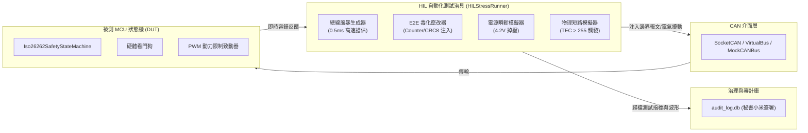

# ⚡ 實機 HIL 極限壓力與邊界訊號注入測試標準規範 (02_Knowledge/HIL_TEST_SUITE.md)

> **文件編號**：`PHANTOM-SPEC-HIL-SUITE-2026`  
> **標準對齊**：ISO 16750-2 (供電掉壓電氣負荷) & ISO 26262-4 (硬體在環故障注入測試)  
> **關聯實現**：`hil_stress_test.py`、`phantom_grid.hil`、`tests/test_hil_stress.py`

---

## 一、 HIL 測試治具與自動化架構



---

## 二、 四大多維極限注入測試用例規範

### 1. 場景 1：總線高負載風暴攻擊 (`BUS_FLOODING`)
- **注入方法**：
  - 報文 ID：`0x001`（高於所有車載功能訊號的最高優先級仲裁 ID）。
  - 發送間隔：$0.5\text{ms}$ 急速高頻發包。
  - 持續時間：$1.0 \sim 3.0\text{s}$。
- **目標總線負載**：$\ge 85.0\%$。
- **驗收標準**：
  - MCU CAN 控制器仲裁機制正常發揮，低優先級訊號有序排隊。
  - 主循環定時器中斷未被搶佔餓死。
  - 看門狗未逾時，硬體重置引腳保持未拉起（$0$ 誤觸發）。

---

### 2. 場景 2：E2E Alive Counter 惡意亂序與 CRC 竄改 (`E2E_TAMPER`)
- **注入方法**：
  - 構造連續 3 幀錯誤 Alive Counter（如非連續跳轉 `1 -> 5 -> 9`）。
  - Byte 7 填入隨機錯誤 CRC8 值（位元翻轉）。
- **驗收標準**：
  - **第 1~2 幀錯誤**：累積錯誤計數器 `err_count` 遞增，輸出維持 100%。
  - **第 3 幀錯誤**：被測端即刻切入 `STATE_DEGRADED`，PWM 動力上限硬性鉗位至 **50%**。
  - **自癒回正測試**：隨後灌入連續 10 幀合規 E2E 報文，驗證遲滯計數器達到 10 幀後自動回正至 `STATE_NORMAL`（恢復 100% 全功率）。

---

### 3. 場景 3：供電掉壓與電源瞬斷邊界 (`BROWNOUT_GLITCH`)
- **注入方法**：
  - 模擬車載 12.0V 供電電源瞬態跌落至 **4.2V**（跌破 6.0V 車載 Brownout 臨界閾值）。
  - 瞬斷持時：$15\text{ms} \sim 20\text{ms}$。
- **驗收標準**：
  - 掉壓期間系統進入低功耗保護，記錄 `BROWNOUT_DETECTED` 異常事件。
  - 電壓恢復 12.0V 後，非易失記憶體與狀態旗標完全一致，無指針跑飛與記憶體撕裂。

---

### 4. 場景 4：Bus-Off 快速重啟定時器與硬故障永久鎖止 (`BUS_OFF_RECOVERY`)
- **注入方法**：
  - 模擬差分訊號短路引發發送錯誤計數器 `TEC > 255`。
- **驗收標準**：
  - 即刻切入 `STATE_BUS_OFF_SAFE`，**0ms 截斷 PWM 輸出開高阻態**。
  - 啟動 **100ms 快速重啟定時器**：
    - 若 100ms 後重啟成功，恢復 `STATE_NORMAL`。
    - 若連續 3 次重啟皆失敗，轉入 `STATE_HARD_FAULT`，鎖死 PWM 輸出並寫入非易失故障碼 **DTC `0xD001`**。
  - 永久鎖止狀態下，唯有透過 **UDS $14**（ClearDiagnosticInformation）或冷開機斷電才可清除故障碼並解鎖。

---

## 三、 SQLite 審計歸檔格式規範

測試執行完畢後，測試治具自動向 `audit_log.db` 中的 `audit_logs` 表寫入完整審計記錄：

```sql
INSERT INTO audit_logs (timestamp, task_id, operator, status, action_type, details)
VALUES (
    datetime('now'),
    'HIL_STRESS_PHASE3',
    '秘書小米',
    'EXECUTED',
    'HIL_STRESS_AUDIT',
    'HIL Phase 3 測試全數通過 | 結果: [E2E_TAMPER, BUS_FLOODING, BROWNOUT_GLITCH, BUS_OFF_RECOVERY] | 指標: ...'
);
```
