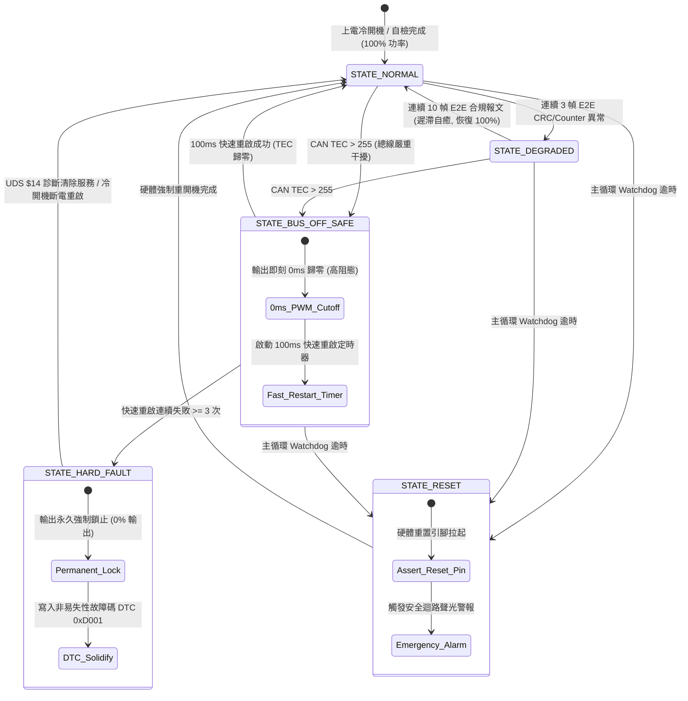

# 🛡️ ISO 26262 ASIL-D 車規安全狀態流轉與 Bus-Off 恢復矩陣規範 (02_Knowledge/SAFE_STATE_TRANS.md)

> **文件編號**：`PHANTOM-SPEC-SAFETY-FSM-2026`  
> **標準對齊**：ISO 26262:2018 Part 5 (硬體安全) & Part 6 (軟體安全) ASIL-D  
> **關聯實現**：`e2e_state_matrix.py`、`phantom_grid.e2e`、`src/e2e_crc8_driver.c`

---

## 一、 安全狀態機拓撲結構 (Mermaid FSM)

---

## 二、 五大安全狀態詳細行為規範

| 狀態名稱 | 輸出約束 | 觸發條件 | 恢復機制與約束 |
| :--- | :--- | :--- | :--- |
| **`STATE_NORMAL`** | 100% 額定輸出 PWM 佔空比 100% | 系統上電正常自檢通過、通訊訊號正常 | 基準運轉態 |
| **`STATE_DEGRADED`** | **50% 動力限縮** PWM 上限制動於 50% | 連續 3 幀檢測到 CRC-8 校驗失敗或 Alive Counter 亂序跳變 | **遲滯防抖自癒**：連續 10 幀合規 E2E 幀自動恢復至 `STATE_NORMAL` |
| **`STATE_BUS_OFF_SAFE`** | **0% 輸出 (高阻態)** PWM 0ms 即刻截斷 | CAN 發送錯誤計數器 `TEC > 255`（差分短路/外部強干擾） | 啟動 **100ms 快速重啟定時器**；重啟成功則恢復 `STATE_NORMAL` |
| **`STATE_HARD_FAULT`** | **永久鎖死 (0% 輸出)** 繼電器與 PWM 物理隔離 | 快速重啟定時器連續失敗 $\ge 3$ 次（嚴重硬體損壞） | **不可自癒**：寫入非易失性 DTC `0xD001`，必須經由 **UDS $14** 或斷電重啟解鎖 |
| **`STATE_RESET`** | **0% 輸出** 安全迴路警報拉高 | 任務主循環 Watchdog 餵狗逾時（> 50ms 未響應） | 硬體重置引腳強制拉低，MCU 核心冷重開機 |

---

## 三、 關鍵安全參數與時間約束矩陣

1. **E2E 降級時間約束**：
   - 連續 3 幀錯誤偵測時延：$\le 3 \times 10\text{ms} = 30\text{ms}$。
   - 動力限縮致動時延：$\le 1\text{ms}$。
2. **Bus-Off 快速保護約束**：
   - 檢測到 `TEC > 255` 至 PWM 關斷時延：**$\le 0\text{ms}$（中斷直截）**。
   - 快速重啟週期：$100\text{ms} \pm 5\text{ms}$。
   - 最大快重啟次數：$3$ 次。超過則鎖入 `STATE_HARD_FAULT`。
3. **UDS 診斷服務解鎖約束**：
   - 服務識別碼：`0x14`（ClearDiagnosticInformation）。
   - 授權前置：必須通過 SecAccess 密鑰認證或秘書處雙簽審批方可清除 DTC `0xD001`。
4. **暫存器防護 (Hardware Register Lock)**：
   - 關鍵暫存器 `REG_0x4002` 鎖定硬體降額閾值，未經 `is_approved_by_brother` 親簽授權，任何程式碼不得修改。
