# UniversalWord: follow the word

**Three source-language perspectives. One word machine. Four target machines. A Lean file for every stage of the journey.**

UniversalWord, hosted here as `ai-free`, brings Forth, a BCPL subset, and Wolfram-style scalar and matrix computations into a shared intermediate language. Its central character is the machine word: a fixed-width value that can carry an integer, a truth flag, or a memory address. Around that value, the project builds reference semantics, translations, reusable proofs, target machine models, emitters, and executable comparison harnesses.

Think of this repository as a railway atlas. The source frontends are departure stations. Universal Word IR is the interchange where their different expressions become a common instruction stream. The x86-64, AArch64, RISC-V and WebAssembly backends are four routes onward. The Lean modules describe the track, establish how each connection behaves, and carry the argument from a source computation to a target outcome.

This README is the project's single guide. [Part I](#part-i-the-atlas) is a guided journey through that atlas: every Lean file receives an individual stop, with a link, a description, and a reason to open it. You can follow the whole route or jump directly to the part that interests you: writing Forth, understanding compiler correctness, exploring matrix multiplication, inspecting native assembly, or studying WebAssembly dispatch.

**Inventory note:** the source tree contains **130 `.lean` files**, and the numbered atlas below gives each one its own stop, including library entry files, executable entry points, and the audit. The original survey of `master`, commit [`93d6d84`](https://github.com/SNAPKITTYWEST/ai-free/tree/93d6d84fe80d3b7f333e31324b35ba27a964b9cc), counted 81; `Forth/LoopProps.lean`, `Forth/Grammar.lean`, `Forth/Double.lean`, `Forth/DoubleMath.lean`, `Forth/DoubleCorrect.lean`, the 23 files of the AArch64 backend (`backend/arm64`) and the 21 files of the RISC-V backend (`backend/riscv64`) have been added since. CI runs [`scripts/check_inventory.sh`](scripts/check_inventory.sh), which fails when a Lean file has no stop or a stop links to a missing file, so the inventory stays complete. [Part II](#part-ii-how-each-part-works) is the technical companion to the atlas: what each library defines and proves, with diagrams of the pipeline, each backend's design and the trust boundaries. The project's direction, and where it stands against each part, is in the [game plan](docs/GAME_PLAN.md).

## Contents

* [Choose your route](#choose-your-route) and [the big picture](#the-big-picture)
* [Part I: the atlas](#part-i-the-atlas): one numbered stop for every Lean file, station by station
* [Part II: how each part works](#part-ii-how-each-part-works): the technical tour, library by
  library, and [the trust boundaries](#trust-boundaries-in-one-place)
* [Part III: run it and read it](#part-iii-run-it-and-read-it): building, running the checks,
  reading routes, the verification practice, and the license
* Elsewhere: the [game plan](docs/GAME_PLAN.md) (direction and status) and
  [NEXT_STEPS.md](NEXT_STEPS.md) (the next concrete items)

## Choose your route

| Destination | Start here | What you will discover |
| --- | --- | --- |
| A first working example | [Forth.Example](forth/Forth/Example.lean) | How `5 DUP +` becomes a machine computation |
| Forth source text | [Forth.Parse](forth/Forth/Parse.lean) | Definitions, variables, comments, recursion, and loops |
| The common machine | [WordDialect.Machine](formal/WordDialect/Machine.lean) | Instructions, state, outcomes, and authoritative execution |
| Reusable compiler proofs | [WordIR.Frag](word-ir/WordIR/Frag.lean) | How verified control-flow fragments compose |
| Memory-oriented source programs | [BCPL.Semantics](bcpl/BCPL/Semantics.lean) | Word expressions, indirection, assignment, and statements |
| Mathematical computations | [Wolfram.MatrixExample](wolfram/Wolfram/MatrixExample.lean) | A concrete matrix product and its formal ingredients |
| Native execution | [X86.Lower](backend/x86_64/X86/Lower.lean) | Register conventions, assembly sequences, and guards |
| WebAssembly execution | [Wasm.Lower](backend/wasm/Wasm/Lower.lean) | Instruction functions and the dispatch loop |
| ARM64 execution | [A64.Isa](backend/arm64/A64/Isa.lean) | The AArch64 model and how it differs from x86-64 |
| RISC-V execution | [RV.Isa](backend/riscv64/RV/Isa.lean) | A target without condition flags: compare-and-branch everywhere |
| Proof dependency inspection | [Audit](formal/Audit.lean) | The project's namespace-wide axiom audit |

The numbered entries are arranged by the computation's journey rather than alphabetical order. Within each region, the order moves from vocabulary and execution toward translation, correctness, examples, and public imports. This makes the map useful both as a reference and as a reading course.

## The big picture

The repository is one Lake package (`UniversalWord`) with nine Lean libraries and four
executables:

| Library / executable | Directory | Role |
| --- | --- | --- |
| `WordDialect` | `formal/` | The Universal Word IR: words, memory, instructions, execution, invariants |
| `WordIR` | `word-ir/` | Proof toolkit shared by every frontend: straight-line code, control-flow fragments, loops |
| `Forth` | `forth/` | A Forth subset: semantics, parser, printer, compiler to the IR, proofs |
| `BCPL` | `bcpl/` | A BCPL subset: semantics, compiler to the IR, proofs |
| `Wolfram` | `wolfram/` | Wolfram-style integer arithmetic and matrix products, lowered to the IR |
| `Harness` | `backend/common/` | Shared differential-testing harness and sample programs |
| `X86` + `wordc` | `backend/x86_64/` | x86-64 model, lowering, assembly emitter, proofs; native test driver |
| `Wasm` + `wasmw` | `backend/wasm/` | WebAssembly model, lowering, WAT emitter, proofs; wasmtime test driver |
| `A64` + `a64c` | `backend/arm64/` | AArch64 model, lowering, assembly emitter, proofs; qemu test driver |
| `RV` + `rv64c` | `backend/riscv64/` | RISC-V (RV64IM) model, lowering, assembly emitter, proofs; qemu test driver |

Everything is organised around one intermediate language, the **Universal Word IR**, defined in
`formal/WordDialect/Machine.lean`. Frontends translate *into* it and prove that the translation
preserves the meaning of the source program. Backends translate *out of* it and prove that the
generated machine code preserves the meaning of the IR program. Composing the two gives
source-to-machine correctness for each pair.

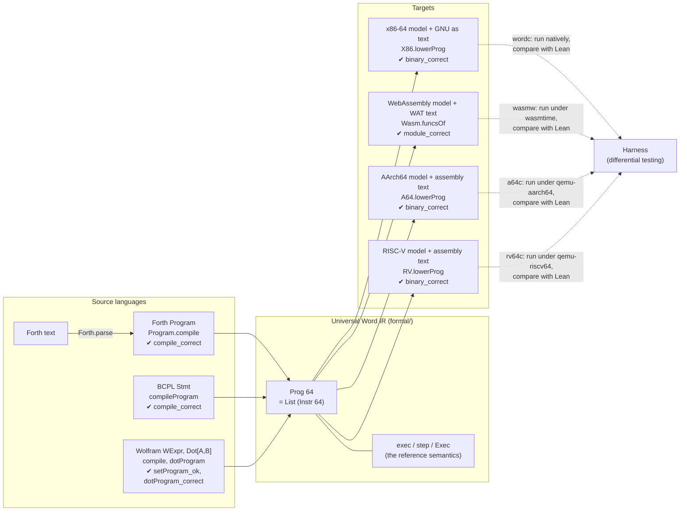

Solid arrows are translations with machine-checked correctness theorems (named with ✔ in the
box the arrow starts or ends at). Dotted arrows are
*testing*: the proofs are about Lean models of x86-64, AArch64, RISC-V and WebAssembly, and the harness
checks that those models agree with real hardware (or its emulation) and a real engine.

### Three levels of description

A correctness claim in this repository connects three levels. The real systems (an x86-64
processor, AArch64 and RISC-V processors, Wasmtime) are described by mathematical models: transition systems on machine
states. Lean states and proves properties of those models as theorems about its own terms, and
the Lean kernel checks the proofs. The step from models to real systems is not proved; the
harness tests it.

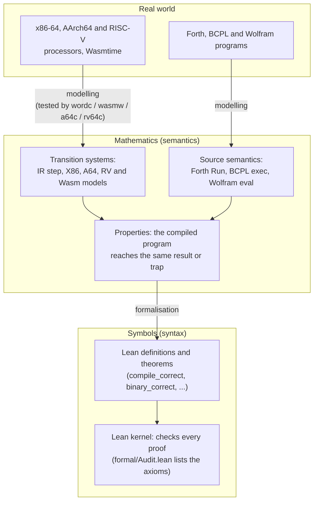

The IR's machine state is a small von Neumann machine, and each part has a counterpart in a
conventional processor:

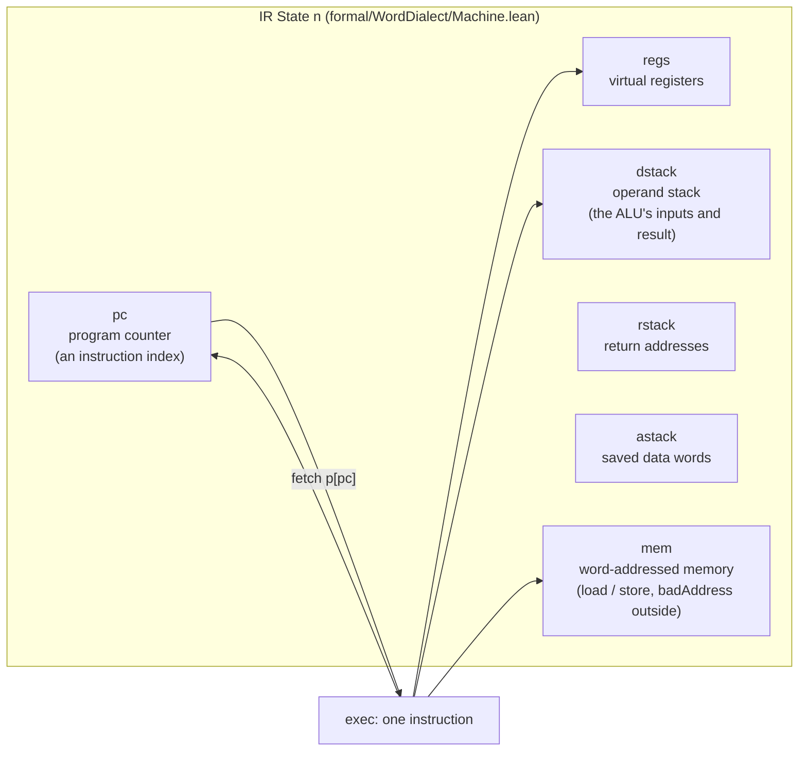

Where a conventional processor has an accumulator, the IR has an operand stack. The backends
map that stack, the registers and the auxiliary stack onto memory (x86-64) or linear memory
(WebAssembly).

### Library dependencies

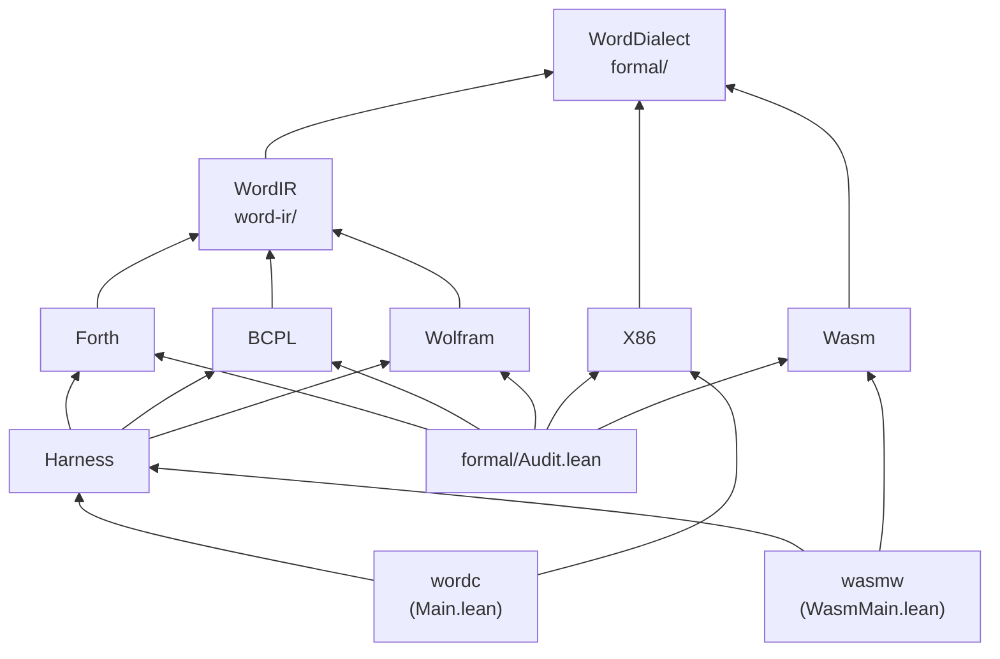

The backends depend only on the IR, never on a frontend: they are correct for *every* IR
program, whichever frontend produced it. The frontends depend on the IR and the shared
`WordIR` toolkit, never on a backend. Only the harness and the audit see everything.

## Before departure: the machine's vocabulary

A `Word n` is a Lean `BitVec n`. Addition, subtraction, and multiplication follow fixed-width modular arithmetic. A pointer interprets the same representation as a word address. Source-level arithmetic therefore has a precise destination: a bit-vector result, with signed and unsigned interpretations used where the operation calls for them.

The IR uses word-addressed memory. Address `a` selects one word; a 64-bit backend places that cell at a corresponding byte address separated by eight bytes. Its data stack is a list with the top at the head. For a binary expression written as `a b op`, `b` is on top and the result is `a op b`. Keeping that convention in mind makes the instruction definitions and compiler output much easier to follow.

Control addresses are instruction indices. The machine has virtual registers, a data stack, a return stack of code addresses, and a separate auxiliary stack of words. Calls and returns use the code-address stack. Forth's return-data operations use the auxiliary stack. That separation lets saved data and loop parameters survive calls and recursion, and it carries through all four backends.

Execution can continue, halt, or trap. The executable targets report the shared traps with a common vocabulary:

| Exit code | Meaning |
| --- | --- |
| `0` | Successful halt |
| `1` | Data-stack underflow |
| `2` | Bad memory address |
| `3` | Division by zero |
| `4` | Bad program counter |
| `5` | Return-stack or auxiliary-stack underflow |
| `6` | Target stack capacity exceeded |

The IR describes unbounded stacks. The targets provide finite regions and check capacity before growing them. Their correctness results incorporate that relationship: a target reaches the IR outcome or reports overflow; when the execution stays within capacity, it reaches exactly the IR outcome. These are useful, explicit contracts to keep beside the rest of the tour.

# Part I: the atlas

## Station I: the common word machine — files 1–10

Every route passes through this region. Its definitions give the shared instruction stream meaning, and its theorems provide the language used throughout the frontend and backend proofs.

### 1. [Word.lean](formal/WordDialect/Word.lean) — the value carried everywhere

Defines `Word n`, pointer interpretation, comparison conditions, truth conversion, shifts, and rotations. Its lemmas establish pointer round trips and numeric behavior.

### 2. [Memory.lean](formal/WordDialect/Memory.lean) — the address book

Defines word cells, address validity, and optional reads and writes. The accompanying theorems describe reading a written cell, preserving other cells, and commuting independent writes.

### 3. [Machine.lean](formal/WordDialect/Machine.lean) — the interchange

Defines the IR instructions, traps, machine state, outcomes, `exec`, and `step`. Arithmetic, stack manipulation, register access, memory, and control flow meet here. It also defines the separate auxiliary stack.

### 4. [Stack.lean](formal/WordDialect/Stack.lean) — count the passengers

Assigns each instruction its operand and result counts. The underflow theorems establish what happens when operands are missing and show that sufficient operands exclude a data-stack-underflow result.

### 5. [Rules.lean](formal/WordDialect/Rules.lean) — the instruction handbook

Presents explicit execution rules for literals, pointers, arithmetic, memory, stack operations, and registers. Numeric lemmas connect word operations to modular arithmetic and exact results under stated bounds.

### 6. [Invariants.lean](formal/WordDialect/Invariants.lean) — what stays in place

Proves frame conditions for a successful instruction: stack-depth change, stable address validity, memory and register effects, and return- and auxiliary-stack preservation. It also characterizes halting and trap causes.

### 7. [Exec.lean](formal/WordDialect/Exec.lean) — from a step to a journey

Defines finite continuing paths with `Steps`, terminating executions with `Exec`, and the fuel-bounded interpreter `run`. Soundness, completeness, and determinism connect executable interpretation to the relations.

### 8. [Init.lean](formal/WordDialect/Init.lean) — the first platform

Builds memory from an image, defines the initial state, and extracts a final data stack from an outcome. It includes the direct IR version of `5 DUP +` and proves its result.

### 9. [WordDialect.lean](formal/WordDialect.lean) — the public doorway

Collects the word-machine modules into one import. Its role is architectural: users and downstream libraries can open the semantic foundation through `import WordDialect`.

### 10. [Audit.lean](formal/Audit.lean) — the proof ledger

Imports the project libraries and implements `#audit_wd`. It traverses theorem declarations in the `WordDialect` namespace and collects their axiom dependencies. The command allows Lean's standard `propext`, `Quot.sound`, and `Classical.choice`, reporting other dependencies as errors.

## Station II: the compiler's construction kit — files 11–17

The frontends share more than an instruction set. This region packages recurring compiler arguments so expressions, branches, and loops can reuse an established foundation.

### 11. [Straight.lean](word-ir/WordIR/Straight.lean) — an uninterrupted stretch

Defines straight-line instructions, code placement with `At`, and sequence execution with `execSeq`. Its theorems turn sequence calculations into machine paths or trapping executions.

### 12. [Frag.lean](word-ir/WordIR/Frag.lean) — track that fits its position

Defines position-dependent fragments whose emitted addresses adapt to their placement while their size stays fixed. Sequencing, conditionals, until loops, while loops, and repeat loops come with placement and execution rules.

### 13. [Flag.lean](word-ir/WordIR/Flag.lean) — a shared signal convention

Defines source truth flags as all ones for true and zero for false. The IR comparison produces one or zero; `cmpFlagCode` converts that result to the Forth and BCPL convention.

### 14. [RExpr.lean](word-ir/WordIR/RExpr.lean) — expressions with a destination

Defines register-and-memory expressions built from constants, registers, arithmetic, and loads. Each expression has an evaluator and an instruction sequence that leaves its result on the data stack.

### 15. [Loop.lean](word-ir/WordIR/Loop.lean) — repeat with an invariant

Builds a counted loop using a virtual register, initialization, an unsigned bound test, and an increment. `countedLoop_run` carries a supplied invariant through every iteration to the endpoint.

### 16. [Program.lean](word-ir/WordIR/Program.lean) — arrive at a final outcome

Lifts straight-line code into a complete program by appending `halt`. Its theorems connect a successful `execSeq` calculation to a halted execution and a trapping calculation to the same trap.

### 17. [WordIR.lean](word-ir/WordIR.lean) — the workshop entrance

Exports the straight-line, fragment, flag, expression, loop, and whole-program tools through one import. This entry file shows the compiler layer's reusable vocabulary at a glance.

## Station III: Forth, from text to execution — files 18–33

Forth makes the common machine tangible. Its data-stack operations have direct IR counterparts, while definitions, recursion, variables, return-data operations, and structured loops reveal how the translation grows into a complete source pipeline.

### 18. [Semantics.lean](forth/Forth/Semantics.lean) — Forth's own account

Defines operations, blocks, programs, source state, and the `Run` relation. It specifies signed division, remainder, truth flags, memory access, calls, early exit, `BEGIN … WHILE … REPEAT`, `CASE … ENDCASE`, data space (`CREATE ALLOT ,`), the core stack and arithmetic words, the double-cell words (`UM*`, `UM/MOD`, `M*`, `SM/REM`, `FM/MOD`, `*/MOD`, `*/`), `DO … LOOP`, `DO … +LOOP`, `LEAVE` and `UNLOOP`. The source return-data stack is separate from call frames.

### 19. [Compile.lean](forth/Forth/Compile.lean) — words become instructions

Lowers primitives and blocks into IR fragments. It places the main block before `halt`, then lays out definition bodies followed by `ret`. Definition addresses come from fixed code sizes. Each block is compiled with a leave target, the end of its innermost loop, where `LEAVE` jumps.

### 20. [OpCorrect.lean](forth/Forth/OpCorrect.lean) — each primitive keeps its meaning

Proves that lowering a Forth operation produces straight-line code with the behavior specified by `Op.sem`. Success transfers the resulting source state to the machine; failure preserves the trap.

### 21. [Double.lean](forth/Forth/Double.lean) — two words for one number

Builds the double-cell words from single-word instructions. `UM*` is a shift-and-add loop and `UM/MOD` a restoring-division loop, each run `n` times by `countedLoop` with its state in virtual registers. `M*` corrects the unsigned product's high word for negative factors. `SM/REM` divides absolute values with `UM/MOD` and puts the signs back; `FM/MOD` does the same with a floor adjustment. `*/MOD` and `*/` combine `M*` and `SM/REM`.

### 22. [DoubleMath.lean](forth/Forth/DoubleMath.lean) — the arithmetic behind the loops

Natural-number and integer facts with no machine in sight: the shift-and-add and restoring-division invariants, one round at a time (`umstar_step`, `umdiv_step`), truncated and floored division through absolute values (`tdiv_natAbs`, `tmod_natAbs`, `fdiv_fmod_natAbs`), and the exact overflow conditions of `SM/REM` and `FM/MOD` (`smrem_cond`, `fmmod_cond`).

### 23. [DoubleCorrect.lean](forth/Forth/DoubleCorrect.lean) — the loops compute the product and quotient

Proves each double-cell word against `Op.sem` for every width `n`, on success and on traps, with a register invariant per loop. `opFrag_run` then states one correctness lemma for every operation, straight-line or loop, and is what `Correct.lean` uses.

### 24. [Correct.lean](forth/Forth/Correct.lean) — the complete translation argument

Connects source `Run` derivations to compiled machine paths, early returns, and matching traps. `DefsAt` describes dictionary-body placement, including recursive calls. `Program.compile_correct` lifts the argument to an initialized whole program.

### 25. [LoopProps.lean](forth/Forth/LoopProps.lean) — where a counted loop stops

Proves that the `+LOOP` exit test is ANS Forth's crossing rule, the signed overflow of `index - limit - 2^(n-1) + step` (`loopCrossed_eq_saddOverflow`), and that with step one it is the `LOOP` test `index + 1 = limit` (`loopCrossed_one`).

### 26. [Eval.lean](forth/Forth/Eval.lean) — a reference you can evaluate

Implements a fuel-bounded source interpreter and proves `eval_sound` against `Run`. Concrete evaluation can therefore supply a source-semantics derivation, including for recursive words.

### 27. [Example.lean](forth/Forth/Example.lean) — five becomes ten

Takes `5 DUP +` through source semantics, compilation, and machine execution. The tiny example makes the entire frontend argument visible without a large program.

### 28. [Parse.lean](forth/Forth/Parse.lean) — the text ticket office

Turns source text into a dictionary, main block, and variable count. It handles case-insensitive words, comments, literals, colon definitions, recursion, early exit, variables, constants, conditionals, and loops, including `+LOOP`, `?DO` and `LEAVE` (rejected outside a loop).

### 29. [Print.lean](forth/Forth/Print.lean) — a return ticket to text

Prints programs using canonical variable and definition names, then proves `parse_print` for well-formed programs. The argument covers both token generation and parsing.

### 30. [ParseProps.lean](forth/Forth/ParseProps.lean) — the parser's promises

Proves that successful parsing yields a well-formed program and that printing such a result gives canonical source. Further results cover case behavior, comments, constants, dictionary definitions, and `RECURSE`.

### 31. [Grammar.lean](forth/Forth/Grammar.lean) — the parser's timetable without fuel

Gives the parser an inductive grammar, `Seq` for blocks, `Top` for definitions, variables and constants, and `Prog` for whole programs, and proves the parser accepts exactly its derivations (`parse_iff`), which are unambiguous. The fuel is irrelevant (`parseSeq_fuel`), and `parse` never reports running out of it (`parse_ne_fuel`).

### 32. [TextExample.lean](forth/Forth/TextExample.lean) — the journey in source spelling

Provides concrete examples spanning parsing, reference evaluation, compilation, and machine results. Its subjects include recursive sums, variables, constants, remainder, early exits, nested loops, `+LOOP` up and down, `?DO`, `LEAVE`, `UNLOOP`, and return-data operations. It also records parser outcomes for selected malformed inputs.

### 33. [Forth.lean](forth/Forth.lean) — the frontend entrance

Exports the Forth library through one import, bringing its semantics, compiler, proofs, evaluator, text tools, and examples together. For an application, this is the convenient access point.

## Station IV: BCPL and the memory-centered route — files 34–39

BCPL reaches the same machine from a different source perspective. Variables are memory cells, values are words, and expression and statement semantics supply the reference for compilation.

### 34. [Semantics.lean](bcpl/BCPL/Semantics.lean) — expressions and statements in words

Defines the supported syntax, operator meanings, expression evaluation, assignment, and statement execution. It includes indirection, address-of, conditionals, and loops. Evaluation order and signed division are explicit, and comparisons use all-ones truth flags.

### 35. [Compile.lean](bcpl/BCPL/Compile.lean) — memory programs enter the interchange

Lowers expressions to stack-producing instruction sequences and statements to fragments. Variables use a supplied address mapping, and statements restore the data stack on completion. Arithmetic and assignments use straight-line code; structured control uses the common fragment toolkit.

### 36. [ExprCorrect.lean](bcpl/BCPL/ExprCorrect.lean) — expression results travel intact

Proves straight-line properties and correctness for operator and expression lowering, covering successful values and traps. These results establish the evaluator-to-instruction connection needed by statement compilation.

### 37. [Correct.lean](bcpl/BCPL/Correct.lean) — statements reach their promised memory

Proves assignment and statement translation correctness. Successful compiled execution reaches the statement endpoint with the source result's memory and an unchanged data stack; trapping source execution leads to the matching machine trap.

### 38. [Example.lean](bcpl/BCPL/Example.lean) — put five in a cell

Uses the assignment `x := 2 + 3` to demonstrate the complete BCPL route. Given an addressable variable cell, the reference statement produces the expected memory and the compiled machine program stores five there.

### 39. [BCPL.lean](bcpl/BCPL.lean) — the BCPL doorway

Collects the BCPL semantics, translation, correctness results, and example under one import. The entry file marks a clean frontend boundary: the source language has its own account of execution, then connects through compiler proofs to the shared machine.

## Station V: mathematical expressions and matrix cargo — files 40–44

The Wolfram-style route connects mathematical integer expressions to fixed-width computation. Matrix multiplication then turns that connection into nested loops over a concrete memory layout.

### 40. [Scalar.lean](wolfram/Wolfram/Scalar.lean) — integers meet fixed-width words

Defines scalar expressions for integer literals, symbols, addition, multiplication, subtraction, and negation. Integer evaluation connects to `RExpr` lowering modulo the word width. Compilation and assignment theorems cover successful results and errors.

### 41. [MatrixLayout.lean](wolfram/Wolfram/MatrixLayout.lean) — pack the rows

Defines partial dot sums, row-major matrix representation with `MatAt`, and destination-prefix updates with `CWritten`. Its lemmas describe extending the written output while preserving source cells outside that region.

### 42. [MatrixDot.lean](wolfram/Wolfram/MatrixDot.lean) — three loops carry the product

Lowers matrix multiplication into row, column, and accumulation loops using four virtual registers. Geometry conditions specify address bounds and separation. Proofs progress from index expressions and accumulation to cells, rows, the full fragment, and `dotProgram_correct`.

### 43. [MatrixExample.lean](wolfram/Wolfram/MatrixExample.lean) — a product you can recognize

Instantiates the matrix geometry and memory representation for `[[1,2],[3,4]]` multiplied by `[[5,6],[7,8]]`, whose product is `[[19,22],[43,50]]`. It stores the inputs at word addresses zero and four and the output at eight.

### 44. [Wolfram.lean](wolfram/Wolfram.lean) — the mathematical entrance

Exports the scalar and matrix modules, connecting expression lowering, layout vocabulary, multiplication proofs, and the worked example. Start through this import when constructing a mathematical sample.

## Station VI: the shared observation platform — file 45

### 45. [Harness.lean](backend/common/Harness.lean) — compare the arrivals

Defines samples, expected Lean outcomes, target result decoding, the backend `Runner` interface, fixed examples, and generated programs. The harness compares trap codes or final data stack, memory, and virtual registers.

## Station VII: the x86-64 express — files 46–67

The native route implements the IR with concrete registers, guarded stack regions, and GNU assembly. Its proof structure proceeds from machine semantics through local simulation to whole-program and entry-point results.

### 46. [Isa.lean](backend/x86_64/X86/Isa.lean) — the native vehicle

Models the emitted x86-64 instruction subset, registers, condition flags, memory access, and target outcomes. Faults and runtime exits are explicit.

### 47. [Lower.lean](backend/x86_64/X86/Lower.lean) — choose the native track

Defines runtime register roles, operand and capacity guards, instruction sizes, offsets, and lowering. The data stack uses `r15`, virtual registers use `r14`, IR memory uses `r13`, entry stack position uses `r12`, and auxiliary data uses `rbp`.

### 48. [Emit.lean](backend/x86_64/X86/Emit.lean) — print the assembly journey

Prints lowered instructions in GNU assembler Intel syntax and supplies the runtime prologue and output/exit helpers. Runtime declarations establish memory and stack regions. Successful execution writes a binary state dump; traps and overflow use their exit codes.

### 49. [Rel.lean](backend/x86_64/X86/Rel.lean) — match the two timetables

Defines runtime geometry and the relation between IR and native states. It maps stacks, virtual registers, memory, and return addresses into disjoint target regions. Frame lemmas support updates.

### 50. [Run.lean](backend/x86_64/X86/Run.lean) — locate and follow native code

Defines native continuing and terminating execution relations, code placement, and theorems locating each lowered IR instruction. It connects offset calculations to the emitted instruction list, including the trailing bad-program-counter stub.

### 51. [Seq.lean](backend/x86_64/X86/Seq.lean) — compose short native stretches

Provides straight-line native execution and its connection to native step paths. It also proves the conditional-jump-and-trap guard pattern.

### 52. [Flags.lean](backend/x86_64/X86/Flags.lean) — read the signals correctly

Proves that native condition-code interpretation after subtraction matches all ten IR comparison predicates. The argument accounts for zero, sign, carry, and overflow flags.

### 53. [Micro.lean](backend/x86_64/X86/Micro.lean) — the smallest useful moves

Establishes local effects of target loads, stores, scratch-register updates, stack-pointer adjustment, and pushing a word. Each lemma works with the state relation.

### 54. [Guard.lean](backend/x86_64/X86/Guard.lean) — check room and operands

Proves operand-count guards and data- and return-stack capacity checks. With enough operands or room, the code continues; otherwise it produces the specified underflow or overflow outcome.

### 55. [SimBin.lean](backend/x86_64/X86/SimBin.lean) — one pattern, many operators

Defines `MidSpec` and proves a generic binary-operation simulation. The pattern loads two operands, computes in scratch state, stores the result, and removes one stack slot.

### 56. [SimOps.lean](backend/x86_64/X86/SimOps.lean) — instantiate the arithmetic route

Applies the generic binary pattern to arithmetic, bitwise operations, shifts, rotations, and comparisons. Its middle specifications show the target computation matches the IR operation.

### 57. [SimStack.lean](backend/x86_64/X86/SimStack.lean) — rearrange the carried words

Proves simulations for literals, pointers, complement, duplication, dropping, swapping, copying a lower stack item, and rotation. Local target-step lemmas support the stack updates.

### 58. [SimMem.lean](backend/x86_64/X86/SimMem.lean) — preserve neighboring regions

Develops address and frame lemmas for virtual-register and IR-memory access. It establishes the effects of reading and writing those cells while preserving stack and other-region relations.

### 59. [SimMemOps.lean](backend/x86_64/X86/SimMemOps.lean) — perform the checked access

Proves the address bounds guard and complete simulations for virtual-register push/pop and memory load/store. Both successful access and bad-address traps are covered, with overflow behavior for a growing data stack.

### 60. [SimDiv.lean](backend/x86_64/X86/SimDiv.lean) — handle division's special junctions

Covers unsigned division, signed division, and three-operand selection. The proofs include zero-divisor traps and the signed divisor-minus-one path that avoids native division overflow while preserving modular word semantics.

### 61. [SimCtl.lean](backend/x86_64/X86/SimCtl.lean) — branch, call, and return

Proves simulations for jumps, conditional branches, calls, returns, and halt. The native return stack stores lowered return-code indices corresponding to IR addresses. Return underflow and call overflow receive explicit results.

### 62. [SimAux.lean](backend/x86_64/X86/SimAux.lean) — a separate place for saved data

Proves auxiliary-stack access, push/pop effects, capacity and empty-stack guards, and the `tor`, `fromr`, and `rfetch` simulations. Its dedicated region and `rbp` pointer preserve saved words across native calls.

### 63. [SimStep.lean](backend/x86_64/X86/SimStep.lean) — every instruction gets a connection

Combines the instruction-family results into `sim_exec`, covering each IR instruction and continuing, halted, or trapped outcomes. `Fits` describes required stack headroom, and simulation includes overflow where capacity runs out.

### 64. [Correct.lean](backend/x86_64/X86/Correct.lean) — preserve the complete journey

Lifts instruction simulation to whole-program behavior. `lowerProg_correct_or_overflow` allows a matching IR outcome or overflow; `lowerProg_correct` gives the matching outcome when reachable states fit. Geometry, layout agreement, code-address bounds, and valid register indices make the program's target contract explicit.

### 65. [Init.lean](backend/x86_64/X86/Init.lean) — begin at the binary entrance

Models the prologue and proves its effect, then relates the resulting native state to `State.init`. `Loader.Holds` gathers the loader's memory, placement, and entry-stack facts.

### 66. [X86.lean](backend/x86_64/X86.lean) — the native library entrance

Exports the native model, lowering, emitter, relations, simulation modules, whole-program proofs, and initialization result. This import gives users the complete backend library.

### 67. [Main.lean](backend/x86_64/Main.lean) — take the express for a run

Implements `wordc`: emit assembly, assemble and link with `as` and `ld`, execute, and compare against Lean. It supports fixed/generated checks and Forth files, plus auxiliary-stack and overflow samples.

## Station VIII: the WebAssembly line — files 68–86

WebAssembly offers structured control, typed operands, and byte memory. This route represents each IR instruction as a function returning the next instruction index, then runs those functions through a dispatch loop.

### 68. [Isa.lean](backend/wasm/Wasm/Isa.lean) — the WebAssembly vehicle

Models typed values, globals, byte-addressed linear memory, the emitted instruction subset, function tables, and structured execution. Reads and writes use little-endian bytes; loops and branches obey label discipline. Division and host-exit behavior are explicit.

### 69. [Lower.lean](backend/wasm/Wasm/Lower.lean) — turn jumps into dispatch

Lowers each IR instruction to a function returning an `i32` next index. A dispatch loop calls through the function table. Globals track program counter and three stack pointers; memory regions hold registers, IR cells, and stacks.

### 70. [Emit.lean](backend/wasm/Wasm/Emit.lean) — print the module

Produces WebAssembly text from lowered instructions and supplies memory declarations, data bytes, globals, imports, and the halt helper. Runtime layout constants determine region placement and capacity.

### 71. [Mem.lean](backend/wasm/Wasm/Mem.lean) — eight bytes make a word

Proves that writing eight bytes reconstructs the same 64-bit value on a read at that address. Reads of disjoint cells stay unchanged, and writes preserve memory size.

### 72. [Rel.lean](backend/wasm/Wasm/Rel.lean) — align the two state views

Defines runtime geometry and the relation between IR values and WebAssembly globals and memory. Separate views cover the data stack, registers, IR memory, return addresses, and auxiliary words.

### 73. [Seq.lean](backend/wasm/Wasm/Seq.lean) — join target computations

Defines straight-line execution with `execL` and derives the target `Run` relation from successful calculations. Sequencing lemmas handle normal completion and abrupt outcomes, with useful conditional cases.

### 74. [Frame.lean](backend/wasm/Wasm/Frame.lean) — update one region at a time

Proves how eight-byte writes affect the five state views. Updates to a stack, register, or IR-memory cell preserve the other regions. Further lemmas handle stack-pointer adjustment and pushing or popping return and auxiliary entries.

### 75. [Guard.lean](backend/wasm/Wasm/Guard.lean) — the checked platform edge

Proves sequence append behavior, state-relation conveniences, operand guards, and capacity guards. Passing checks preserve the required relation; failing checks produce the appropriate exit.

### 76. [SimAlu.lean](backend/wasm/Wasm/SimAlu.lean) — the arithmetic carriage

Provides generic binary-operation simulation and instantiates it for arithmetic, bitwise operations, rotations, and comparisons. It connects two stack-cell loads, a target operation, a result store, and stack adjustment.

### 77. [SimAlu2.lean](backend/wasm/Wasm/SimAlu2.lean) — arithmetic's special connections

Handles shifts, division, signed division, and complement. Large shift counts yield zero as required by the IR, while division checks zero explicitly. The signed divisor-minus-one case preserves modular semantics while avoiding WebAssembly's signed-division overflow trap.

### 78. [SimStack.lean](backend/wasm/Wasm/SimStack.lean) — move words through memory

Proves stack manipulation, selection, literals, pointers, and virtual-register transfers. General push and core-sequence lemmas support multiple operations, with guards for operand availability and capacity.

### 79. [SimMem.lean](backend/wasm/Wasm/SimMem.lean) — find the right eight bytes

Proves IR-address checking, conversion to `mb + 8a`, and simulations of load and store. A valid word address reaches the corresponding bytes; an invalid address exits with bad-address code two.

### 80. [SimCtl.lean](backend/wasm/Wasm/SimCtl.lean) — return the next station index

Covers jumps, branches, calls, returns, halt, and the bad-program-counter stub. Continuing instruction functions leave the next IR index for dispatch. Calls and returns update the dedicated return region; empty returns and full call stacks receive defined exits.

### 81. [SimAux.lean](backend/wasm/Wasm/SimAux.lean) — preserve the saved-word connection

Proves `tor`, `fromr`, and `rfetch` over the auxiliary region tracked by `$ap`. It covers successful movement and copying, empty-stack code five, and capacity code six.

### 82. [SimExec.lean](backend/wasm/Wasm/SimExec.lean) — one complete dispatch step

Combines all instruction-family results into `sim_step`. It defines stack headroom, trap-code mapping, and the relation between one emitted function's execution and one IR outcome.

### 83. [Correct.lean](backend/wasm/Wasm/Correct.lean) — carry the result through the loop

Proves dispatch-loop preservation and lifts it to the module's start function. The two main results offer matching IR behavior with overflow allowed, or exact matching behavior under capacity conditions.

### 84. [Init.lean](backend/wasm/Wasm/Init.lean) — start from an instantiated module

Constructs initial globals and zeroed memory with the emitted data image, proves runtime geometry and the initial state relation, and establishes `module_correct`. Program-layout fit and register and instruction bounds remain explicit.

### 85. [Wasm.lean](backend/wasm/Wasm.lean) — the WebAssembly library entrance

Exports the target model, lowering, emitter, memory facts, relations, framing, guards, instruction simulations, whole-program correctness, and initialization. One import provides the full WebAssembly backend.

### 86. [WasmMain.lean](backend/wasm/WasmMain.lean) — ride the line in Wasmtime

Implements `wasmw`: emit WAT, run it through Wasmtime, and compare target output with Lean. It supports sample checks, generated programs, source Forth execution, and source emission.

## Station IX: the AArch64 line — files 87–109

The ARM64 route keeps the x86-64 backend's register roles, lowering shape and proof structure, so most of its files are the x86-64 files with AArch64 registers. The differences are where the two machines differ: AArch64 division never faults, there is no rotate-left instruction, calls and returns use a dedicated return-stack register, and 64-bit constants are built from 16-bit pieces. `a64c` runs the emitted binaries under `qemu-aarch64`.

### 87. [Isa.lean](backend/arm64/A64/Isa.lean) — the ARM vehicle

Models the emitted AArch64 subset: `x` registers, `NZCV` flags (with the carry stored as the borrow, `NOT C`, so conditions read like their x86-64 counterparts), loads and stores, `csel`, `udiv`/`sdiv` as `BitVec.udiv`/`BitVec.sdiv`, and the three fixed sequences `movImm` (`movz` + `movk`), `call` and `ret`. Arithmetic is modelled as making the flags unknown, which is more conservative than the hardware. For hand-written programs it also models `x0`–`x8`, the three-register forms (`add x2, x0, x1`, `sub mul and orr eor`) and shifts by a constant (`lsl`, `lsr`, `asr`), which the lowering does not use.

### 88. [Lower.lean](backend/arm64/A64/Lower.lean) — the same track on new rails

The x86-64 lowering with AArch64 registers. The data stack uses `x19`, virtual registers use `x20`, IR memory uses `x21`, the empty return stack is `x22`, the return-stack pointer is `x23`, and auxiliary data uses `x24`. Division needs only the zero guard, and `rotl` is `neg` followed by `ror`.

### 89. [Emit.lean](backend/arm64/A64/Emit.lean) — print the ARM assembly

Prints the model instructions as AArch64 assembly for `clang --target=aarch64-linux-gnu`. Each condition is printed under its AArch64 name, and the three fixed sequences are expanded. An immediate or displacement the encoding cannot hold becomes an `.error` directive, so the assembler rejects it. The runtime places the data, return and auxiliary stacks in their own sections and dumps state on halt through Linux system calls.

### 90. [Rel.lean](backend/arm64/A64/Rel.lean) — match the two timetables

The relation between IR and AArch64 states, with the same disjoint regions as x86-64. The return stack is the `.rstack` section below `sp0`.

### 91. [Run.lean](backend/arm64/A64/Run.lean) — locate and follow the code

Defines the running and terminating relations `ASteps` and `AExec` and the code-placement predicate `AAt`, and locates each lowered IR instruction and the trailing bad-pc stub.

### 92. [Seq.lean](backend/arm64/A64/Seq.lean) — compose short stretches

Straight-line execution (`aseq`) and the branch-and-trap guard pattern.

### 93. [Flags.lean](backend/arm64/A64/Flags.lean) — read the signals correctly

Proves that each condition, evaluated on the flags of `cmp a, b`, is the IR comparison predicate, for all ten conditions.

### 94. [Micro.lean](backend/arm64/A64/Micro.lean) — the smallest useful moves

Local effects of loads, stores, scratch-register writes, stack-pointer adjustment and the two-instruction push, under the state relation.

### 95. [Guard.lean](backend/arm64/A64/Guard.lean) — check room and operands

Operand-count guards and data- and return-stack capacity checks: continue, trap `stackUnderflow`, or exit with `overflow`.

### 96. [SimBin.lean](backend/arm64/A64/SimBin.lean) — one pattern, many operators

`MidSpec` and the generic binary-operation simulation: load two operands, compute, store, pop one slot.

### 97. [SimOps.lean](backend/arm64/A64/SimOps.lean) — the arithmetic route

Arithmetic, bitwise operations, shifts, rotations and comparisons. `ror_neg` proves that rotating right by `-n` is rotating left by `n`, which is how `rotl` is lowered.

### 98. [SimStack.lean](backend/arm64/A64/SimStack.lean) — rearrange the carried words

Literals, pointers, complement, `dup`, `drop`, `swap`, `over` and `rot`.

### 99. [SimMem.lean](backend/arm64/A64/SimMem.lean) — preserve neighboring regions

Address and frame lemmas for virtual-register and IR-memory access.

### 100. [SimMemOps.lean](backend/arm64/A64/SimMemOps.lean) — perform the checked access

The address bounds guard and the `push`/`pop` and `load`/`store` simulations, for both success and bad-address traps.

### 101. [SimDiv.lean](backend/arm64/A64/SimDiv.lean) — division without special junctions

`select`, and both divisions through one lemma (`sim_divop_ok`). After the zero guard the division is a single instruction, because AArch64 `udiv` and `sdiv` never fault and are exactly the IR's `BitVec` division.

### 102. [SimCtl.lean](backend/arm64/A64/SimCtl.lean) — branch, call, and return

Jumps, branches, calls, returns and halt. `call` pushes the return index on the `x23` stack and `ret` pops it, both writing `x30`. Return underflow and call overflow have explicit outcomes.

### 103. [SimAux.lean](backend/arm64/A64/SimAux.lean) — a separate place for saved data

The auxiliary stack on `x24`: its guards and the `tor`, `fromr` and `rfetch` simulations.

### 104. [SimStep.lean](backend/arm64/A64/SimStep.lean) — every instruction gets a connection

`sim_exec`: every IR instruction, for every outcome, including overflow when a stack is full.

### 105. [Correct.lean](backend/arm64/A64/Correct.lean) — preserve the complete journey

Whole-program preservation: `lowerProg_correct_or_overflow` and `lowerProg_correct`, with the same hypotheses as x86-64.

### 106. [Init.lean](backend/arm64/A64/Init.lean) — begin at the binary entrance

The six-instruction prologue model and its proved effect, `entry_rel`, and the end-to-end `binary_correct`. Because the return stack is a linked section rather than the operating system's stack, `Loader.Holds` has no entry-register fact, only memory, placement and image facts.

### 107. [DataOps.lean](backend/arm64/A64/DataOps.lean) — hand-written ARM programs

The general AArch64 data-processing forms that hand-written programs use: three registers (`add x2, x0, x1`, and likewise `sub mul and orr eor`) and shifts by a constant (`lsl`, `lsr`, and the arithmetic `asr`). It proves what each computes (`alu_toNat`, `lsl_toNat`, `lsr_toNat`, `asr_toInt`, `udiv_toNat`, `sub_toInt`, `mul_toInt`) and that a short program using all of them halts with the values its comments state (`dataProcessing_run`). `a64c check` runs that program and 100 random ones under qemu and compares the registers with the model.

### 108. [A64.lean](backend/arm64/A64.lean) — the AArch64 library entrance

Exports the AArch64 model, lowering, emitter, simulation modules, whole-program proofs and initialization result.

### 109. [A64Main.lean](backend/arm64/A64Main.lean) — ride the line under qemu

Implements `a64c`: emit assembly, assemble with `clang`, link with `ld.lld`, run under `qemu-aarch64` (or directly on an AArch64 Linux host), and compare against Lean. It runs the same fixed, generated, auxiliary-stack, overflow and Forth-file checks as `wordc`, plus a check of hand-written programs: the data-processing program of `DataOps.lean` and 100 random programs over the three-register and constant-shift forms, compared register by register (`x0`–`x11`) with the model.

## Station X: the RISC-V line — files 110–130

The RV64 route keeps the register roles and proof structure of the x86-64 and AArch64 backends, but RISC-V has no condition flags. Every check is a compare-and-branch on two registers, a comparison result comes from a branch around a constant, and `select` branches around a move. There is no indexed addressing and no rotate instruction in the base ISA. `rv64c` runs the emitted binaries under `qemu-riscv64`.

### 110. [Isa.lean](backend/riscv64/RV/Isa.lean) — a machine without flags

Models the emitted RV64IM subset: integer registers, `ld`/`sd`, register-register arithmetic, `sltiu`, `sll`/`srl` with the amount modulo 64, and `divu`/`div` exactly as RISC-V defines them (all ones on a zero divisor; `div` wraps on overflow). The conditional branch `bcc c a b t` takes the IR's own comparison `Cond`, so its meaning needs no flag encoding. `movImm` (the assembler's `li`), far branches, `call` and `ret` are fixed sequences.

### 111. [Lower.lean](backend/riscv64/RV/Lower.lean) — the same track without signals

The data stack uses `s1`, virtual registers use `s2`, IR memory uses `s3`, the empty return stack is `s4`, the return-stack pointer is `s5`, and auxiliary data uses `s6`. Each guard is three instructions (load a limit, `bcc`, trap or overflow stub). Memory access computes the address with `slli` and `add`. `shl`/`shr` mask the result to zero for amounts of 64 or more, and the rotations are two shifts and an `or`.

### 112. [Emit.lean](backend/riscv64/RV/Emit.lean) — print the RISC-V assembly

Prints the model instructions for `clang --target=riscv64-linux-gnu -march=rv64im`. Each conditional branch is printed as the opposite branch over a `j`, so it reaches as far as `j` does. An out-of-range immediate becomes an `.error` directive. The runtime uses `li`/`lla`, places the three stacks in their own sections, and dumps state on halt through Linux system calls.

### 113. [Rel.lean](backend/riscv64/RV/Rel.lean) — match the two timetables

The relation between IR and RISC-V states. The regions and their disjointness are the same as on the other native targets.

### 114. [Run.lean](backend/riscv64/RV/Run.lean) — locate and follow the code

`RSteps`, `RExec` and `RAt`, and the placement of each lowered IR instruction and the trailing bad-pc stub.

### 115. [Seq.lean](backend/riscv64/RV/Seq.lean) — compose short stretches

Straight-line execution (`rseq`), and the branch-and-stub guard lemmas `guard_pass`/`guard_trap` and `ovf_pass`/`ovf_trap`, all stated directly on `Cond.eval` of two registers.

### 116. [Micro.lean](backend/riscv64/RV/Micro.lean) — the smallest useful moves

Local effects of loads, stores, scratch-register writes, stack-pointer adjustment and the two-instruction push.

### 117. [Guard.lean](backend/riscv64/RV/Guard.lean) — check room and operands

The operand-count guard (`bcc .ule`) and the data- and return-stack capacity guards (`bcc .uge`), each with its passing and failing case.

### 118. [SimBin.lean](backend/riscv64/RV/SimBin.lean) — one pattern, many operators

`MidSpec` and the generic binary-operation simulation, as on the other native targets.

### 119. [SimOps.lean](backend/riscv64/RV/SimOps.lean) — arithmetic without rotate

Arithmetic, bitwise operations, shifts and rotations. `mask_lt` justifies the shift mask, and `rotl_shifts`/`rotr_shifts` prove that two shifts and an `or` are the rotations.

### 120. [SimStack.lean](backend/riscv64/RV/SimStack.lean) — rearrange the carried words

Literals, pointers, complement, `dup`, `drop`, `swap`, `over` and `rot`.

### 121. [SimMem.lean](backend/riscv64/RV/SimMem.lean) — compute the address, keep the neighbours

Frame lemmas for the register file and IR memory, and the address computation `idx_addr`/`idx_steps` that replaces indexed addressing.

### 122. [SimMemOps.lean](backend/riscv64/RV/SimMemOps.lean) — perform the checked access

The `bltu` bounds guard and the `push`/`pop` and `load`/`store` simulations, for success and bad-address traps.

### 123. [SimDiv.lean](backend/riscv64/RV/SimDiv.lean) — branches inside an instruction

The divisions after a `bnez` zero guard, and the two instructions whose lowering branches internally: `select` (`beqz` over a `mv`) and `cmp` (`bcc` over setting `0`), each proved for both paths.

### 124. [SimCtl.lean](backend/riscv64/RV/SimCtl.lean) — branch, call, and return

`jmp`, `branch` (`bnez`), `call` and `ret` on the `s5` return stack, and halt.

### 125. [SimAux.lean](backend/riscv64/RV/SimAux.lean) — a separate place for saved data

The auxiliary stack on `s6`: its `bcc` guards and the `tor`, `fromr` and `rfetch` simulations.

### 126. [SimStep.lean](backend/riscv64/RV/SimStep.lean) — every instruction gets a connection

`sim_exec`: every IR instruction, for every outcome, including overflow when a stack is full.

### 127. [Correct.lean](backend/riscv64/RV/Correct.lean) — preserve the complete journey

`lowerProg_correct_or_overflow` and `lowerProg_correct`, with the same hypotheses as the other native targets.

### 128. [Init.lean](backend/riscv64/RV/Init.lean) — begin at the binary entrance

The six-instruction prologue model and its effect, `entry_rel`, and the end-to-end `binary_correct`.

### 129. [RV.lean](backend/riscv64/RV.lean) — the RISC-V library entrance

Exports the RISC-V model, lowering, emitter, simulation modules, whole-program proofs and initialization result.

### 130. [RVMain.lean](backend/riscv64/RVMain.lean) — ride the line under qemu

Implements `rv64c`: emit assembly, assemble with `clang`, link with `ld.lld`, run under `qemu-riscv64` (or directly on a RISC-V Linux host), and compare against Lean, with the same checks as `wordc` and `a64c`.

# Part II: how each part works

This part walks through every library: what it defines, what it proves, how it depends on the
others, and where the trust boundaries are. It is meant to be read next to the code; the atlas in
Part I gives each file its own stop.

## `formal/`: the Universal Word IR

This library is the single source of truth. Every other correctness theorem in the repository
is stated relative to the definitions here.

### `WordDialect/Word.lean`

The machine word `Word n` is `BitVec n`, so the IR is parametric in the word width; both
backends instantiate it at 64. A pointer `Ptr n` is a word *interpreted* as a word-granular
address; converting in either direction is the identity on representation (`toWord_ofWord`,
`ofWord_toWord`), and `offset` is pointer displacement modulo `2^n`.

The file fixes conventions every other module relies on: arithmetic is two's complement;
unsigned division by zero is *not* defined here (the machine traps instead); a shift by a count
of `n` or more shifts every bit out (`Word.shl`, `Word.shr`); rotates reduce the count modulo
`n`. It also defines the ten comparison conditions `Cond` (`eq ne ult ule ugt uge slt sle sgt
sge`) with `Cond.eval`, and the boolean bridge `ofBool` / `isTrue` (a word is true iff it is
nonzero). Lemmas such as `shl_toNat`, `shr_le` and `rotr_rotl` give the numeric meaning of the
shift and rotate operations.

### `WordDialect/Memory.lean`

Memory is word-addressed: one address names one `Word n`. A `Memory n` is a `cell` function
plus a `valid` predicate. `read?` and `write?` return `none` outside the valid set, so an
invalid access is always a trap, never undefined behaviour. The lemmas are the standard
algebra of a store: `read_write_same`, `read_write_other`, `write?_valid` (writes never change
validity), `write_read_self` (writing back what you read changes nothing observable) and
`write_comm` (writes to distinct addresses commute). Mapping word addresses to byte addresses is
explicitly a backend concern.

### `WordDialect/Machine.lean`

The authoritative semantics. It defines:

* `Instr n`: `word`, `ptr`, `load`, `store`, `add sub mul div sdiv`, `and or xor not`,
  `shl shr rotl rotr`, `cmp c`, `select`, `jmp t`, `branch t`, `call t`, `ret`, `push r`,
  `pop r`, `dup drop swap over rot`, `tor fromr rfetch`, `halt`;
* `Trap`: `stackUnderflow`, `badAddress`, `divideByZero`, `badPc`, `returnUnderflow`;
* `State n`: `pc`, the data stack `dstack`, the return stack `rstack` (code addresses), the
  auxiliary data stack `astack`, the register file `regs : Nat → Word n` and `mem`;
* `Outcome n`: `next s`, `halted s`, `trapped t`;
* `exec i s`, the meaning of one instruction, and `step p s`, which fetches `p[s.pc]` and
  executes it (fetching outside the program is `badPc`).

The stack convention is Forth's: the head of `dstack` is the top, and a binary operation on
`a b` (with `b` on top) computes `a op b`. Code addresses are instruction indices, so control
flow is independent of any ISA. The register file is unbounded; mapping virtual registers onto
physical storage is the backend's job.

Two stacks deserve a note. `rstack` holds return addresses and is touched only by `call` and
`ret`. `astack` holds data words and is touched only by `tor` (move the data top onto it),
`fromr` (move its top back) and `rfetch` (copy its top). Because `call`/`ret` never touch
`astack`, a value parked there survives calls and recursion. This is exactly what Forth's
`>R`, `R>`, `R@` and `DO … LOOP` need. Taking from an empty `astack` traps
`returnUnderflow`, the same trap as `ret` on an empty `rstack`.

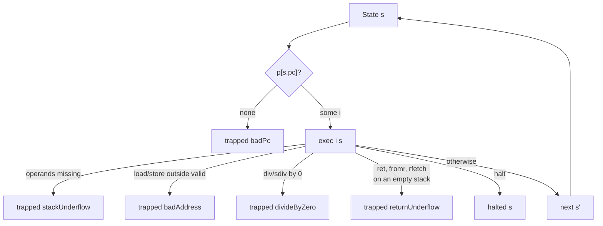

### `WordDialect/Stack.lean`

Defines, for each instruction, how many operands it consumes (`Instr.pops`) and how many results
it produces (`Instr.pushes`), and proves the two halves of operand checking:
`exec_underflow` (with too few operands an instruction traps `stackUnderflow` and does nothing
else) and `exec_not_underflow` (with enough operands it never does). Every backend relies on
`pops`: the code it emits for an instruction starts with a guard that compares the data-stack
depth against `pops`.

### `WordDialect/Invariants.lean`

Frame conditions for a single instruction, each proved by exhaustive case analysis over every
instruction and stack shape: the data-stack depth moves by exactly `pushes - pops`
(`exec_depth`); the set of valid addresses never changes (`exec_valid`); only `store` changes
memory (`exec_mem_frame`); only `pop` changes registers (`exec_regs_frame`); only `call`/`ret`
change the return stack (`exec_rstack_frame`); only `tor`/`fromr` change the auxiliary stack
(`exec_astack_frame`); only `halt` halts, leaving the state untouched (`exec_halted`); and every
trap has one of four causes (`exec_trap`). These are the facts a reader can check to see that
the IR has no hidden effects.

### `WordDialect/Exec.lean`

Execution over many steps:

* `Exec p s o`: running `p` from `s` terminates with final outcome `o` (halted or trapped). It is
  inductive, so non-terminating runs simply have no derivation.
* `Steps p s s'`: `s'` is reachable by finitely many non-terminal steps.
* `run`: a fuel-bounded interpreter, proved equivalent to `Exec` (`run_sound`, `run_complete`,
  `exec_iff_run`).

`Exec.deterministic` shows a program and a start state fix the outcome. The control-flow lemmas
(`step_jmp`, `step_branch_taken/fall`, `step_call`, `step_ret`, `step_ret_empty`,
`call_ret_roundtrip`) and `Steps.append_right` (code appended after a fragment does not affect
it) are what the frontend proofs use. The proof pattern throughout the repository is: show a
translated fragment moves the machine from one state to another with `Steps`, then hand the
rest of the program to `Exec`.

### `WordDialect/Rules.lean`

Every rule of `exec` restated as a named lemma (`exec_add`, `exec_load_bad`, `exec_pop`, …), plus
the numeric denotation of the word operations: `add`, `sub`, `mul` are arithmetic modulo `2^n`,
and `div` is exact integer division whenever the divisor is nonzero. A lowering from
mathematical expressions (Wolfram) relies on these.

### `WordDialect/Init.lean`

`State.init mem` is the start of execution: `pc = 0`, empty data, return and auxiliary stacks,
all registers zero. `Memory.ofImage img` builds an IR memory from a list of numbers: word `a`
holds `img[a]` modulo `2^n`, and exactly the addresses below `img.length` are valid. The test
harness and all four backends' end-to-end theorems start from exactly this pair, so "the program run
on the image" means the same thing in the proofs and in the tests. The file closes with the
specification's own example, Forth `5 DUP +`, run to the stack `[10]`.

### `formal/WordDialect.lean` and `formal/Audit.lean`

`WordDialect.lean` re-exports the eight modules above. `Audit.lean` imports every library and
collects every theorem in the `WordDialect` namespace, more than two thousand of them. For each
it computes the axioms the proof depends on. Lean's standard `propext`, `Quot.sound` and
`Classical.choice` are allowed; any other axiom is reported with `logError`, so the command, and
CI, fail. Together with CI's ban on `sorry`, `admit`, `native_decide` and `axiom` declarations,
this is what makes "proved" mean proved.

## `word-ir/`: the frontend toolkit

Frontends need the same few proof patterns over and over. This library proves them once.

### `WordIR/Straight.lean`

Straight-line code is code in which every instruction continues at `pc + 1`
(`Instr.isStraight`). `At p pc code` says `code` sits at address `pc` in program `p`, with
`at_append` and `at_embed` for composing placements. `execSeq` is a pure executor for a code
sequence, defined with `exec` alone, and `execSeq_steps` / `execSeq_trap` connect it to the
machine: a completed sequence is a `Steps` path, a trapping sequence is a `Steps` path followed
by a trapping step. Frontends then prove equalities about `execSeq`, which is ordinary
equational reasoning, instead of reasoning about program counters.

### `WordIR/Frag.lean`

A `Frag n` is a *position-parametric* code fragment: its jump targets depend on the address it
is placed at, its size does not. Every frontend builds its control flow from these combinators,
so the control-flow proofs are done once:

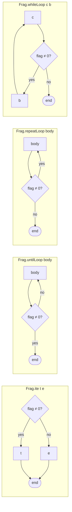

Each combinator has a size lemma (`seq_size`, `ite_size`, `until_size`, `repeat_size`, …), a
decoding lemma saying what instructions sit where (`ite_decode`, `until_decode`,
`repeat_decode`), and *rules* in terms of `Steps` (`ite_true_rule`, `until_again_rule`,
`repeat_again_rule`, …). `repeatLoop` was added for Forth's `DO … LOOP`, whose test leaves a
nonzero flag exactly when the loop must go round again.

### `WordIR/Flag.lean`

Source languages such as Forth and BCPL use `-1` for true and `0` for false, while IR `cmp`
yields `1`/`0`. `cmpFlagCode c` is the shared conversion (`cmp c` then `0 - x`), proved once
(`cmpFlagCode_exec`) and used by both frontends.

### `WordIR/RExpr.lean`

Register-and-memory expressions (`RExpr`): the building block for index arithmetic and
accumulators. `RExpr.code` leaves an expression's value on the data stack, and `code_ok` /
`code_err` prove it against `RExpr.eval`, for success and for traps.

### `WordIR/Loop.lean`

`countedLoop r N body` runs `body` for `r = 0 … N-1` using virtual register `r` as the counter.
`countedLoop_run` is a verified loop rule in Hoare style: given an invariant `Inv k` that the
body preserves (with the counter and data stack untouched), the loop ends with `Inv N`. The
invariant may mention memory, the stacks and every register other than `r`. The Wolfram matrix
lowering is three of these nested.

### `WordIR/Program.lean`

Lifts straight-line results to whole programs: `code ++ [HALT]` run from `pc = 0` halts with the
state `execSeq` computes (`exec_straight_halt`) or traps with the trap it reports
(`exec_straight_trap`).

## `forth/`: Forth, from text to IR

Forth is the most developed frontend. It has source text, a parser with proofs in both
directions and a grammar it provably implements, colon definitions with recursion, `EXIT`,
variables, constants, data space (`CREATE ALLOT ,`), `CASE … ENDCASE`, `BEGIN … WHILE … REPEAT`,
the core stack and arithmetic words (`?DUP 2DUP 2SWAP /MOD NEGATE ABS MIN MAX`), double-cell
arithmetic (`UM* UM/MOD M* SM/REM FM/MOD */MOD */`), and the return-stack words `>R R> R@` with
`DO … LOOP`, `DO … +LOOP`,
`?DO`, `LEAVE`, `UNLOOP`, `I` and `J`.

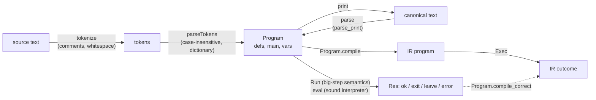

### `Forth/Semantics.lean`

The reference semantics, defined directly on a Forth state with no reference to the IR:

* `Op`: literals and the primitive words (`+ - * / MOD AND OR XOR INVERT LSHIFT RSHIFT`,
  comparisons, `0=`, stack words, `@ !`, and the return-stack words);
* `FState`: the data stack, memory, and a return-data stack `rstack` of words;
* `Block`: `nil`, `op o rest`, `ite t e rest` (`IF … ELSE … THEN`), `untilL body rest`
  (`BEGIN … UNTIL`), `call i rest` (a colon definition), `exit`, `doLoop body rest`
  (`DO … LOOP`), `plusLoop body rest` (`DO … +LOOP`), `leave` (`LEAVE`) and
  `whileL cond body rest` (`BEGIN … WHILE … REPEAT`);
* `Program`: a dictionary of word bodies `defs`, a `main` block and a variable count `vars`;
* `Res`: a run ends `ok` (fell off the end), `exit` (ran `EXIT`), `leave` (ran `LEAVE`, which the
  innermost loop catches) or `error t` (trapped);
* `Run defs b st r`: a big-step relation, with `Run.deterministic`.

The conventions are ANS Forth's: `/` truncates toward zero and `MOD` is the matching remainder;
true is `-1`. Variables are memory cells `0 … vars-1` (`Program.MemOk` states what a program may
assume about memory). The return-data stack is *separate* from call frames, mirroring the IR's
auxiliary stack. So unbalanced `>R` across `EXIT` or a call is defined behaviour here rather than
undefined as in ANS Forth, and the module documents each such choice explicitly. Examples are the
`LOOP` exit rule (exit when `index+1 = limit`), what `EXIT` inside a loop leaves behind, and `I`/`J`
outside a loop. `+LOOP` ends when `loopCrossed index limit step` holds, which
`Forth/LoopProps.lean` proves to be ANS Forth's crossing rule (`loopCrossed_eq_saddOverflow`)
and, for step `1`, the `LOOP` rule (`loopCrossed_one`).

### `Forth/Compile.lean`

The lowering. Forth's data stack *is* the IR data stack, so most words map one-to-one;
comparisons go through `cmpFlagCode`, `MOD` lowers to `OVER OVER SDIV MUL SUB`, `ABS`/`MIN`/`MAX`
use `CMP` with `SELECT`, `2SWAP` borrows the auxiliary stack, and the
return-stack words lower to `tor`/`fromr`/`rfetch`. Colon definitions become IR subroutines:

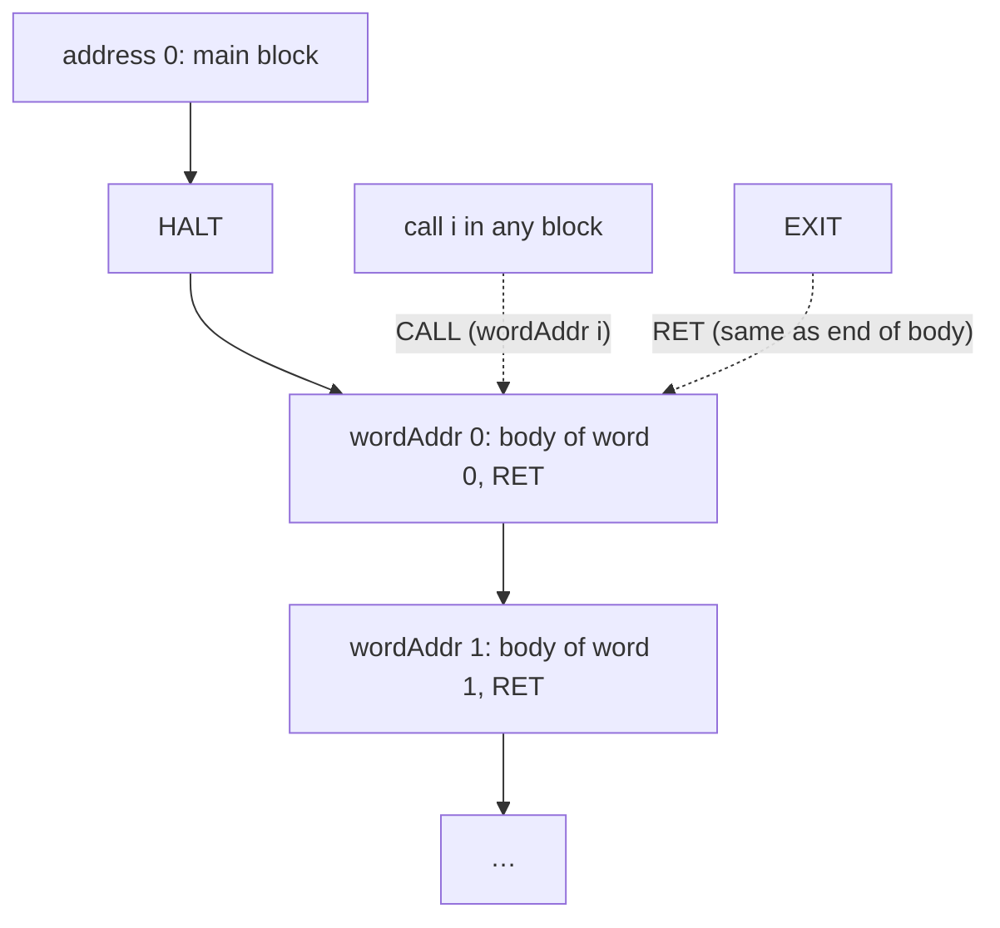

Code sizes do not depend on call targets or on the leave target (`compile_size`), so word
addresses are prefix sums of `Block.size`. `DO body LOOP` lowers to `SWAP TOR TOR`, the body,
then a test that increments the index, leaves `limit-(index+1)`, branches back while it is
nonzero, and finally drops both loop parameters (`loopFrag`). `DO body +LOOP` (`plusFrag`) has a
26-instruction test computing `index+step` and the `loopCrossed` flag, and branches *out* on it.
`BEGIN … WHILE … REPEAT` lowers with `Frag.whileLoop`, the combinator BCPL's `while` also uses.
`compile addr lv b` takes a *leave target* `lv`: `LEAVE` lowers to `FROMR FROMR DROP DROP JMP lv`,
and a loop compiles its body with its own end address as the target.

### `Forth/OpCorrect.lean`

Each primitive operation, lowered to straight-line IR, behaves exactly as `Op.sem` says:
success reaches the corresponding state (`compileOp_ok`), failure traps with the same trap
(`compileOp_err`), both through `execSeq`.

### `Forth/Double.lean`, `Forth/DoubleMath.lean` and `Forth/DoubleCorrect.lean`

The double-cell words have no IR instruction of their own, and the backends are unchanged. Each
word is a fragment built from single-word instructions and the virtual registers (Forth programs
get eight):

* `UM*` shifts and adds, one bit of `b` per round, from the top bit down. A round doubles the
  pair `(lo, hi)` and adds `a` times the bit, with the carry `lo <u x` into `hi`.
* `UM/MOD` is restoring division. It first traps unless `hi <u u`, by dividing `1` by that flag.
  A round shifts `(r, lo)` left and subtracts `u` when the shifted remainder reaches `u` or
  overflowed.
* `M*` runs `UM*` on the bit patterns, then subtracts `b` from `hi` when `a < 0` and `a` when
  `b < 0`.
* `SM/REM` takes absolute values, negating the dividend as two words with a borrow. It runs
  `UM/MOD`, traps when the unsigned quotient does not fit the signed result, and puts the signs
  back. The quotient's sign is the xor of the operands' signs; the remainder takes the dividend's.
* `FM/MOD` (floored division) uses `SM/REM`'s preparation and `UM/MOD`. When the signs differ
  and the remainder `r` is nonzero, the quotient becomes `q + 1` and the remainder `|v| - r`
  before the signs are applied; the remainder takes `v`'s sign. Its overflow test is
  `DoubleMath.fmmod_cond`, and `fdiv_fmod_natAbs` states floored division through absolute
  values.
* `*/MOD` is `>R M* R> SM/REM`. `*/` adds `SWAP DROP`.

Both loops are `countedLoop`s of `n` rounds. `countedLoop_run'` carries a register invariant,
whose step is a natural-number lemma in `DoubleMath` (`umstar_step`, `umdiv_step`). At width `0`
the loop runs no rounds. `DoubleCorrect` proves every word against `Op.sem`, success and traps,
for all widths. `mstar_split` shows that `M*`'s two words are exactly the double-cell `a * b`,
so `*/MOD`'s correctness is `SM/REM`'s. `Op.loopy` marks these operations, and `opFrag o` is any
operation's code. `opFrag_run`, one lemma for straight-line and loop code alike, is what
`Correct.lean` uses for the `op` case.

### `Forth/Correct.lean`

The main theorem. `compile_correct` is proved by induction on the `Run` derivation. Whenever the
reference semantics derives result `r` for block `b`, the machine runs any program that contains
every word body at its address (`DefsAt`). Started at the block's address, with matching data
stack, memory and auxiliary stack, and with any return stack, it does exactly one of four things:

* it reaches the end of the block's code with matching stacks and memory and the return stack
  unchanged;
* for `EXIT`, it reaches a `RET` in the same situation;
* for `LEAVE`, it reaches the leave target in the same situation;
* it reaches a state whose next step traps with exactly Forth's trap.

The induction needs no separate argument for recursion, because a call's derivation contains the
callee's derivation, and a loop iteration's derivation contains the next iteration's.
`Program.compile_correct` lifts this to whole programs from `State.init`, and
`compileProgram_correct` is the special case without definitions.

### `Forth/LoopProps.lean`

What the `+LOOP` exit test means. `loopCrossed_eq_saddOverflow`: the loop ends exactly when
adding the step to `index - limit - 2^(n-1)` overflows as a signed number, which is ANS Forth's
rule that the index crossed the boundary between `limit - 1` and `limit`. `loopCrossed_one`: with
step `1` it is the `LOOP` test `index + 1 = limit`.

### `Forth/Eval.lean`

A fuel-bounded executable interpreter for the reference semantics, `eval`, with `eval_sound`:
if it returns a result, `Run` derives that result. This lets concrete facts, including about
recursive words, be established by evaluation instead of by hand-built derivations.

### `Forth/Parse.lean`

The text frontend. `tokenize` splits on whitespace and removes `\` line comments and `( … )`
comments (an unterminated `(` is an error). `parse` is case-insensitive. It reads integer
literals including negative ones, the primitive words, the return-stack words,
`IF/ELSE/THEN`, `BEGIN/UNTIL`, `BEGIN/WHILE/REPEAT`, `CASE/OF/ENDOF/ENDCASE` and `?DUP`
(both parsed into `IF`s), `CREATE`/`ALLOT`/`,` (data space laid out at parse time), `DO/LOOP`, `DO/+LOOP`, `?DO` (parsed to an `IF` that skips the
loop when limit and index are equal), `LEAVE` (only inside a loop: `Program.leaveOK`), colon
definitions, `RECURSE`, `EXIT`, `VARIABLE` and `CONSTANT`. A name is visible from the start of its own body, which is how recursion by name
works, and a later definition shadows an earlier one. Every failure returns a message, for
example "unknown word: FOO", "DO without LOOP or +LOOP" or "definition of X has no ;".

### `Forth/Print.lean`

A printer from `Program` back to Forth source, and the round trip

    parse_print : P.WF → parse (print P) = .ok P

for every well-formed program. A program is well formed (`Program.WF`) when every call targets
a word already defined, counting the word being defined, `EXIT` occurs only inside
definitions, and `LEAVE` only inside loops. The proof has two halves: `tokenize_join` (the lexer splits printed text back into
the printed tokens) and `parseTokens_print` (the token-level parser inverts the printer).

### `Forth/ParseProps.lean`

The converse direction, which is also the largest file in the repository:

* `parse_wf`: every successful parse is well formed; hence `parse_print_of_parse`, so printing is
  a canonical form for any parseable source.
* Case: `tokenize_upper`, `parse_toUpper_ok` and `parse_case_insensitive`. Upper-casing the
  source changes neither the parsed program nor whether parsing fails; only the spelling quoted in
  an error message can change.
* Comments: `tokenize_paren_comment` and `tokenize_line_comment`. Comments tokenize like
  whitespace, with the exact side conditions under which that is true.
* Dictionary words: `n CONSTANT X` makes `X` the literal `n` (`classify_constant`), and
  `RECURSE` inside definition `k` is a call of word `k` (`classify_recurse`,
  `parseSeq_recurse_name`).

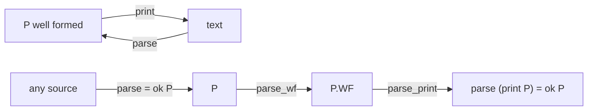

### `Forth/Grammar.lean`

A fuel-free specification of the parser. `Seq` is an inductive grammar for blocks (a token list
is a block, a stop word, and the remaining tokens), `Top` the grammar of top-level code with
definitions, variables and constants, and `Prog` adds the `LEAVE` check. The parser implements
it exactly: `parseSeq_iff`, `parseTop_iff`, `parseTokens_iff` and `parse_iff` (for every fuel
larger than the input, which is what `parse` uses), and the grammar is unambiguous
(`Seq.unique`, `Prog.unique`). The fuel is irrelevant: `parseSeq_fuel` (same result, error
message included, for all such fuel) and `parse_ne_fuel` (`parse` never reports
`input too deeply nested` or `input too long`).

### `Forth/Example.lean` and `Forth/TextExample.lean`

`Example.lean` takes `5 DUP +` through the semantics, the lowering and machine execution.
`TextExample.lean` does the same from source text, and pins the parser's behaviour on concrete
inputs: comments and case, `BEGIN/UNTIL`, words outside the subset, unknown words, use before
definition, a missing `;`, unbalanced control structures, a recursive `SUM` whose compiled
program halts with `55`, and examples for each newer word, including `+LOOP` counting up and
down, `?DO` skipping its loop, `LEAVE`, `UNLOOP EXIT`, the rejection of `LEAVE` outside a
loop, and Euclid's algorithm with `WHILE`.

## `bcpl/`: BCPL statements to IR

### `BCPL/Semantics.lean`

Abstract syntax (`Expr`, `LVal`, `Stmt`) and a reference semantics on word-addressed memory.
BCPL is typeless: every value is a word, a variable is a memory cell at `addr x`, and `!e` / `@x`
are indirection and address-of. Relational operators yield `-1`/`0`; a condition is true iff
nonzero; `/` truncates toward zero and traps on zero. Evaluation order is fixed, left operand
before right, and in `lhs := rhs` the right side before an indirect left side.
`Exec.deterministic` holds.

### `BCPL/Compile.lean`

There is no runtime. Expressions leave their value on the data stack (`compileE`), statements
leave the data stack as they found it (`compile`), and assignments write the variable's cell
(`assignCode`). Control flow uses `Frag.ite` and `Frag.whileLoop`.

### `BCPL/ExprCorrect.lean` and `BCPL/Correct.lean`

`ExprCorrect.lean` proves expression and assignment code straight-line correct against
`evalE` / `assignSem`, for success and traps. `Correct.lean` proves statements, including
sequencing, `IF/TEST` and `WHILE`, by induction on the semantics. `compile_correct` either
reaches the end of the statement's code with the stack unchanged and memory equal to the BCPL
result, or traps exactly as BCPL does. `compileProgram_correct` lifts it to whole programs.

### `BCPL/Example.lean`

`x := 2 + 3`, compiled and run on the machine, halts with `5` in `x`'s cell whenever that cell
is addressable.

## `wolfram/`: integer arithmetic and matrix products

### `Wolfram/Scalar.lean`

`Plus`, `Times`, `Subtract`, `Minus` over integers, with symbols bound to memory cells. An
expression denotes an *integer* (`evalZ`), and the machine computes modulo `2^n`. So the theorems
(`lower_eval_ok`, `compile_ok`, `setProgram_ok`, and their error twins) state that the machine's
word is `ofInt n z`, where `z` is the exact mathematical value.

### `Wolfram/MatrixLayout.lean`

The vocabulary for matrices: a matrix is a function `Nat → Nat → Int`, `dotSum` is the partial
inner product, `MatAt` says a matrix sits row-major in memory, and `CWritten` says exactly the
first `cnt` words of the destination have been written.

### `Wolfram/MatrixDot.lean`

`Dot[A, B]` is lowered to three nested counted loops over memory, with virtual registers
`rI rJ rL rAcc`:

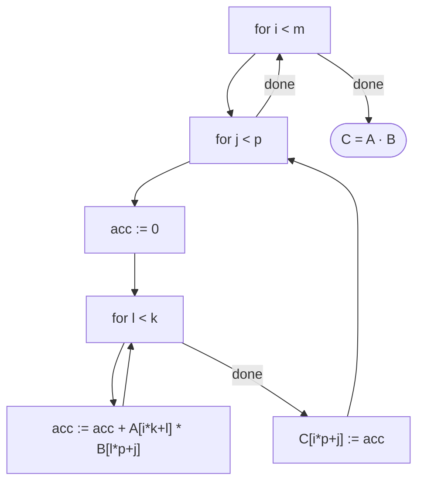

The IR never sees a matrix. The proofs go loop by loop: `inner_run`, then `cell_run`, `row_run`,
`dot_run` and `dotProgram_correct`, each an instance of `countedLoop_run` with an invariant built
from `dotSum` and `CWritten`.

### `Wolfram/MatrixExample.lean`

The preconditions of `dotProgram_correct` are satisfiable, and the theorem delivers the right
numbers. `[[1,2],[3,4]] · [[5,6],[7,8]] = [[19,22],[43,50]]`, with `A` at address 0, `B` at 4 and
`C` at 8.

## `backend/common/Harness.lean`: differential testing

The harness is where the proofs meet reality. A backend supplies a `Runner` that takes a
`Sample` (IR program, memory image, register count), runs it on the real target, and reports the
dumped final state or the exit code. The harness runs the same program under the Lean semantics
(`WordDialect.run` from `State.init (Memory.ofImage mem)`) and compares.

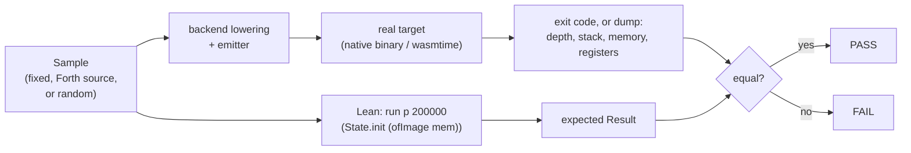

The samples include fixed programs from every frontend, Forth programs written as source text
(a parse failure is reported as an error, never silently skipped), and hand-written IR programs.
A fuzzer (`genInstr`, `genProg`) produces random programs that exercise every instruction,
including the auxiliary-stack instructions and forward jumps and branches. Exit codes are
common to all backends:

| Code | Meaning |
| --- | --- |
| 0 | halted; the state is dumped to stdout |
| 1 | `stackUnderflow` |
| 2 | `badAddress` |
| 3 | `divideByZero` |
| 4 | `badPc` |
| 5 | `returnUnderflow` (empty return stack on `ret`, or empty auxiliary stack) |
| 6 | target stack overflow (no IR counterpart: IR stacks are unbounded) |

## `backend/wasm/`: the WebAssembly backend

### The design

The IR has arbitrary jumps, calls and returns; WebAssembly only has structured control flow. The
lowering therefore turns every IR instruction `k` into its own function `f_k : () → i32`, which
performs the instruction and returns the index of the next one. The module's start function is a
dispatch loop:

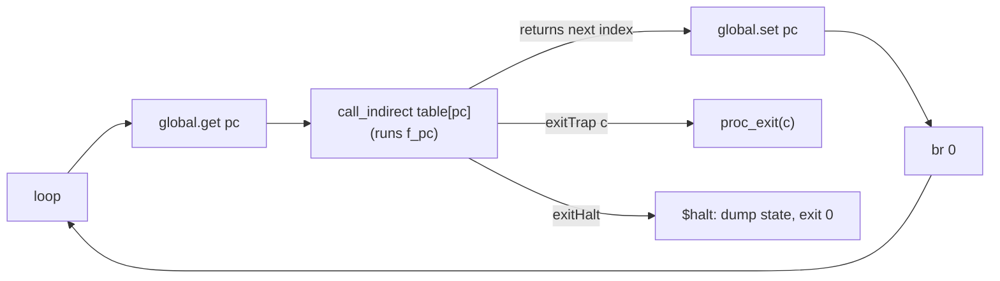

The data stack, return stack, auxiliary stack, register file and IR memory all live in linear
memory at fixed addresses. Four globals hold `pc`, `sp`, `rp` and `ap`. WebAssembly's own operand
stack is used only for temporaries within one instruction.

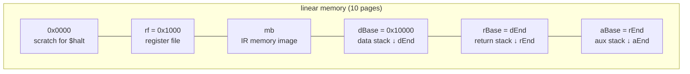

### Files, in dependency order

* **`Wasm/Isa.lean`** is a model of the WebAssembly subset the backend emits, following the
  core specification. It covers typed `i32`/`i64` values, globals, a byte-level linear memory
  (`read64`/`write64` little-endian, trapping when any byte is out of range, with no aliasing
  assumptions), `div_s`/`div_u` traps, shift counts modulo 64, `if`/`loop`/`br` with the
  specification's label discipline including operand-stack unwinding, and `call_indirect` on a
  fresh operand stack. Semantics is big-step (`RunI`, `Run`), so loops need no fuel. That this
  model matches a real engine is the trusted assumption, and `wasmw` tests it.
* **`Wasm/Lower.lean`** contains the lowering, built from small fragments.
  * `uf` is the operand-count guard, which exits 1.
  * `ovf` is the overflow guard, which exits 6.
  * `memAddr` bounds-checks addresses (exit 2) and scales them to bytes.
  * `binBody`, `shiftBody`, `zeroGuard` (exit 3) and `sdivBody` (which avoids the
    `INT64_MIN / -1` trap) build the arithmetic.
  * `lowerInstr` handles every IR instruction, `instrCode` adds the bad-pc stub (exit 4),
    `funcsOf` builds the function table, and `mainBody` is the dispatch loop.
  * Jump targets are clamped to the program length, so a jump past the end traps `badPc` as in
    the IR.
* **`Wasm/Emit.lean`** prints WAT from exactly the `WI` lists the lowering builds, so the text and
  the verified model cannot diverge. It also contains the small runtime: the globals, the memory
  with the IR image as a data segment, and `$halt`, which dumps the state through WASI.
* **`Wasm/Mem.lean`** gives the byte-level read-after-write facts that replace any "word cell"
  assumption.
* **`Wasm/Rel.lean`** defines the state relation. `Cfg` and `Geom` describe the regions and prove
  them disjoint and inside 32-bit memory. `StackRel`, `RegRel`, `MemRel`, `RsRel` and `AuxRel`
  read each IR component out of the bytes, and `Rel0` bundles them with the global pointers and
  capacity facts.
* **`Wasm/Seq.lean`** covers straight-line execution `execL` and its connection to `Run`,
  including `if` handling.
* **`Wasm/Frame.lean`** shows how one 8-byte write into one region leaves the other four views
  unchanged and updates its own view as expected (`wr_stack`, `wr_regs`, `wr_mem`, `push_rel`,
  `push_rs`, `pop_rs`, `adj_sp`).
* **`Wasm/Guard.lean`** covers `execL` over appended code, the pass/trap lemmas for the operand
  guard (`uf_pass`, `uf_trap`) and the overflow guard (`ovfD_pass/trap`, `ovfR_pass/trap`).
* **`Wasm/SimAlu.lean`, `SimAlu2.lean`, `SimStack.lean`, `SimMem.lean`, `SimCtl.lean` and
  `SimAux.lean`** contain one simulation theorem per IR instruction, covering every outcome.
  * `SimAlu` and `SimAlu2` cover the binary operations, shifts, division and `not`.
  * `SimStack` covers the stack words, `word`, `ptr`, `push`, `pop` and `select`.
  * `SimMem` covers `load` and `store` with their `badAddress` traps.
  * `SimCtl` covers `jmp`, `branch`, `call`, `ret` (exit 5 on an empty return stack), `halt` and
    the bad-pc stub.
  * `SimAux` covers `tor`, `fromr` and `rfetch`.
* **`Wasm/SimExec.lean`** has `sim_step`, the case analysis over the whole instruction set. From
  a related state, the function emitted for the current instruction either simulates the IR step
  (next, halted or trapped with the matching code), or the state lacks headroom (`¬ Fits`) and
  the code exits 6.
* **`Wasm/Correct.lean`** holds the dispatch-loop induction. `loop_step` covers one iteration,
  and `lowerProg_correct_or_overflow` is the whole-program theorem with no capacity hypothesis:
  IR outcome, or exit 6. `lowerProg_correct` adds `Fits` at every reachable state and gets
  exactly the IR outcome.
* **`Wasm/Init.lean`** contains the end-to-end theorem. `initState r` is the state WebAssembly
  instantiation produces for the emitted module: globals initialised, memory zero except the data
  segment, built with the emitter's own byte encoding. `geom` proves the runtime's fixed layout
  satisfies `Geom`, `init_relD` proves the entry relation, and `module_correct` composes them.
  Its only hypotheses are about the program: it fits the layout, has fewer than `2^32`
  instructions, and uses registers in range.

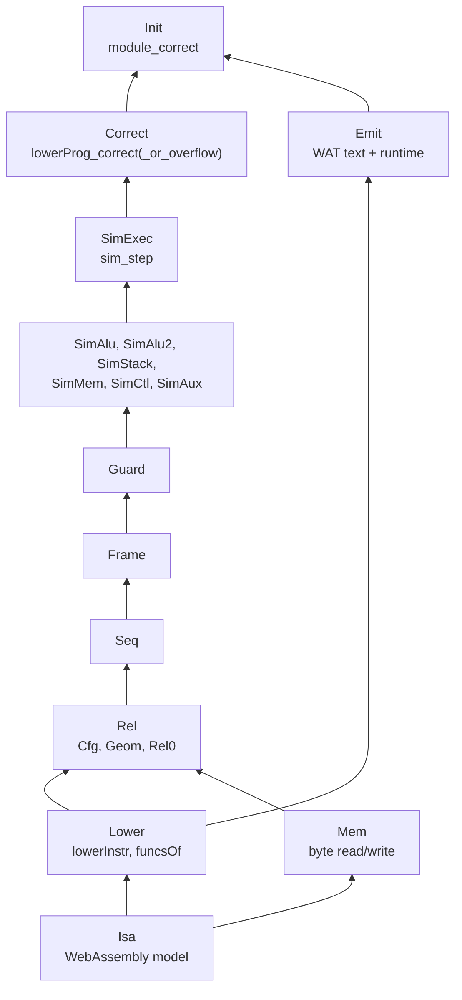

### `WasmMain.lean` (the `wasmw` executable)

It lowers each sample, emits WAT, runs it under `wasmtime` (found through `WASMTIME` or `PATH`),
and compares with the Lean semantics. It also runs auxiliary-stack programs and overflow programs
that must exit 6. `wasmw forth file.fs` and `wasmw emit-forth file.fs` do the same for a Forth
source file.

## `backend/x86_64/`: the x86-64 backend

### The design

Here the IR's control flow maps directly onto the machine. IR `call`/`ret` are native
`call`/`ret`, so the IR return stack *is* the native stack. Every instruction's code has a size
that depends only on the instruction, so jump targets are absolute code indices computed as
prefix sums (`offs`). Register conventions:

| Register | Role |
| --- | --- |
| `r15` | data-stack pointer (grows down, empty at `dEnd`) |
| `r14` | base of the virtual register file |
| `r13` | base of IR memory |
| `r12` | `rsp` at entry; the native stack below it is the IR return stack |
| `rbp` | auxiliary-stack pointer (grows down, empty at `aEnd`) |
| `rax rcx rdx rbx` | scratch |

### Files, in dependency order

* **`X86/Isa.lean`** is a model of the x86-64 subset the backend emits. It has 64-bit registers,
  the shared `Memory 64` at byte addresses with aligned 8-byte accesses only, and concrete flags
  `ZF SF CF OF`. Instructions that leave flags architecturally undefined set them to `none`, and
  reading `none` *faults*, so a proof that the code never faults shows it never relies on
  undefined flags. Faults are a distinct outcome. `exitHalt`, `exitTrap t` and `exitOvf` stand
  for the runtime stubs. That the model matches the hardware is the stated assumption.
* **`X86/Lower.lean`** contains the lowering.
  * Guards: `uf` (operand count), `ovfD` and `ovfR` (data and return stack room, exit 6), and
    the address bounds check before `load`/`store`.
  * Sizing and placement: `isize` (code size), `lowerInstr`, `offs` (prefix sums), `lowerGo` and
    `lowerProg`.
  * The program ends with a bad-pc stub.
* **`X86/Emit.lean`** prints GNU `as` text with one label per model instruction, generated from
  exactly the list the lowering builds. It also contains the runtime: the prologue that
  establishes the register conventions, `.Lhalt` (dump state, `exit(0)`), the `.Ltrap1`–`.Ltrap6`
  stubs, the `.data` image, the `.bss` register file, and the `.dstack` and `.astack` sections.
  `Runtime.layout` is the one definition of the lowering constants, shared by `wordc` and the
  theorems.
* **`X86/Flags.lean`** proves that `Cc.holds` on `subFlags` coincides with `Cond.eval` for all
  ten conditions. This is what makes `cmp; cmovcc` a correct lowering of IR `cmp`.
* **`X86/Run.lean`** defines the run relations `XSteps` and `XExec`, code placement `XAt`, and
  `lowerProg_at` and `lowerProg_stub`, which locate each instruction's code inside the whole
  program.
* **`X86/Rel.lean`** has `Cfg`, `Geom` (regions disjoint and below `2^64`), `RegionsValid`
  (every region addressable), the per-component relations, and `Rel0`/`Rel`. `Rel` also requires
  `x.pc = offs p s.pc`.
* **`X86/Seq.lean`** covers straight-line execution `xseq` and the guard pattern `jcc; exitTrap`
  used for every check.
* **`X86/Micro.lean`** contains lemmas about how single instructions act on a related state.
  Every simulation proof is a chain of these.
* **`X86/Guard.lean`** has the operand guard (`uf_pass`, `uf_trap`) and the overflow guards
  (`ovfD_pass/trap`, `ovfR_pass/trap`). The return-stack guard computes its bound from `r12` at
  runtime, because the entry `rsp` differs between runs.
* **`X86/SimBin.lean`, `SimOps.lean`, `SimStack.lean`, `SimMem.lean`, `SimMemOps.lean`,
  `SimDiv.lean`, `SimCtl.lean` and `SimAux.lean`** hold the per-instruction simulations.
  * `SimBin` gives a generic proof for the binary-operation shape, instantiated for arithmetic,
    shifts, rotates and comparisons.
  * `SimDiv` handles division's zero guard, the `-1` special case of `idiv` that avoids the
    hardware overflow fault, and `select`.
  * `SimMem` and `SimMemOps` cover `push`, `pop`, `load` and `store`.
  * `SimCtl` covers `jmp`, `branch`, native `call` and `ret`, and `halt`.
  * `SimAux` covers the auxiliary-stack instructions on `rbp`.
* **`X86/SimStep.lean`** has `sim_exec`, the case analysis over every instruction and outcome,
  with the overflow alternative.
* **`X86/Correct.lean`** contains `step_sim` (one IR step, including the bad-pc stub),
  `lowerProg_correct_or_overflow` (no capacity hypothesis) and `lowerProg_correct` (with
  `Fits`).
* **`X86/Init.lean`** contains the end-to-end theorem from the binary's entry point. The
  prologue is modelled (`prologueCode`) and its effect proved (`prologue_run`). In it, each
  `lea` is read as a load of the address the linker resolves, which is the one trusted reading.
  What the operating system's loader provides at `_start` cannot be derived inside the model, so
  it is stated once, explicitly, as `Loader.Holds`:
  * the entry `rsp`;
  * the `.data` image;
  * the zeroed `.bss` register file;
  * that every region is addressable;
  * that the placement is disjoint.

  `binary_correct` composes these with the code-index bound `offs_lt`, derived from the program
  length.

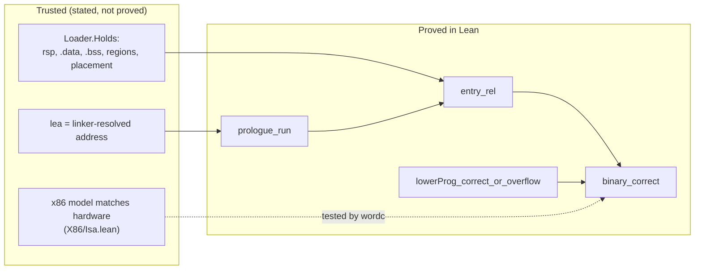

### `Main.lean` (the `wordc` executable)

It emits assembly, assembles and links with `as`/`ld` (placing `.dstack` and `.astack` at fixed
addresses), runs the binary, and compares the exit status and dump with the Lean semantics. It
also runs the auxiliary-stack and overflow programs. `wordc forth file.fs` runs a Forth source
file natively.

## `backend/arm64/`: the AArch64 backend

### The design

The AArch64 backend keeps the x86-64 backend's design: the same register roles, the same
lowering shape for every IR instruction, and the same proof structure (`Rel`, the `Sim*`
files, `Correct`, `Init`). Most of its files are the x86-64 files with the registers renamed.
The differences follow from the machines:

| | x86-64 | AArch64 |
| --- | --- | --- |
| data stack, register file, IR memory, auxiliary stack | `r15 r14 r13 rbp` | `x19 x20 x21 x24` |
| return stack | the native stack (`rsp`, empty at `r12`) | the `.rstack` section (`x23`, empty at `x22`) |
| IR `call` / `ret` | `call` / `ret` | `adr x30; str x30, [x23, #-8]!; b` and `ldr x30, [x23], #8; br x30` |
| 64-bit constant | `movabs` | `movz` + three `movk` |
| `div`, `sdiv` | `div` / `idiv`, with a `-1` path to avoid the overflow fault | `udiv` / `sdiv`, which never fault |
| `rotl` | `rol` | `neg` then `ror` (`ror_neg`) |
| conditional move | `cmovcc` | `csel` |

Three model instructions are fixed sequences in the emitted text (`movImm`, `call`, `ret`); the
model gives each the combined effect of its sequence, and the `call`/`ret` sequences' write to
`x30` is in the model. The flags are `NZCV`, stored with the carry as the borrow (`NOT C`), so
each condition code keeps its x86-64 meaning and `Emit` prints its AArch64 name (`b` as `lo`,
`ae` as `hs`, …). AArch64 only sets flags in `cmp`, `cmn` and `tst`; the model conservatively
makes them unknown after arithmetic, so a proof that the code never faults never relies on
flags surviving an arithmetic instruction.

### Files

They correspond one to one to `backend/x86_64/X86/*` (the x86-64 section above), with these differences:

* **`A64/Isa.lean`, `A64/Lower.lean`, `A64/Emit.lean`**: the model, lowering and emitter above.
  The emitter prints an `.error` directive for an immediate or displacement that the AArch64
  encoding cannot hold, so the assembler rejects the program instead of producing different
  code.
* **`A64/SimOps.lean`**: `ror_neg`, rotating right by `-n` is rotating left by `n`.
* **`A64/SimDiv.lean`**: one lemma, `sim_divop_ok`, for both divisions, since after the zero
  guard each is a single instruction equal to the IR's `BitVec.udiv` / `BitVec.sdiv`.
* **`A64/SimCtl.lean`**: `call` and `ret` also write `x30`.
* **`A64/Init.lean`**: a six-instruction prologue. The return stack is a linked section, so
  `Loader.Holds` has no fact about an entry register, only memory, placement and image facts.
  `binary_correct` is the end-to-end statement.

### `A64/DataOps.lean`: hand-written AArch64 programs

The model also covers the data-processing instructions as hand-written AArch64 programs use them:
three registers (`add/sub/mul/and/orr/eor d, a, b`, the `alu` instruction) and shifts by a
constant (`lsl/lsr/asr d, a, #n`, the `shiftImm` instruction), on `x0 … x8` as well as the
lowering's registers. `DataOps.lean` proves what each computes: `alu_toNat` (arithmetic modulo
`2^64`, bitwise operations), `sub_toInt`/`mul_toInt` (the signed reading), `lsl_toNat`
(multiplication by `2^n` modulo `2^64`), `lsr_toNat` (unsigned division by `2^n`), `asr_toInt`
(signed division by `2^n`, rounded toward negative infinity) and `udiv_toNat`.
`dataProcessing_run` runs a ten-instruction program (`mov x0, #10; mov x1, #3`, then one of each)
in the model and proves the result, `x2 … x11 = 13 7 30 3 2 11 9 40 5 5`, from any initial
registers and memory. `a64c check` runs the same program, and 100 random ones, printed by
`A64.Emit`, under `qemu-aarch64` and compares `x0 … x11` with the model.

### `A64Main.lean` (the `a64c` executable)

It emits assembly, assembles it with `clang --target=aarch64-linux-gnu`, links with `ld.lld`
(placing `.dstack`, `.rstack` and `.astack` at fixed addresses), runs the binary under
`qemu-aarch64`, and compares exit status and dump with the Lean semantics, on the same samples,
generated programs, auxiliary-stack and overflow programs, and Forth files as `wordc`.

## `backend/riscv64/`: the RISC-V backend

### The design

The RISC-V (RV64IM) backend keeps the register roles and the proof structure of the x86-64 and
AArch64 backends (`Rel`, the `Sim*` files, `Correct`, `Init`). What changes is that RISC-V has no
condition flags. Its conditional branches compare two registers directly, so the model's
`bcc c a b t` takes the IR's own predicate `c : Cond`; no flag encoding or flag lemmas are
needed, and the `Flags.lean` of the other native backends has no counterpart here.

| | AArch64 | RISC-V |
| --- | --- | --- |
| data stack, register file, IR memory, auxiliary stack | `x19 x20 x21 x24` | `s1 s2 s3 s6` |
| return stack (empty, pointer) | `x22`, `x23` | `s4`, `s5` |
| guards | `cmp` + `b.cond` + stub (4 instructions) | load limit + `bcc` + stub (3) |
| IR `cmp c` | `cmp` + `csel` | `li t2, 1`, `bcc c` over `li t2, 0` |
| `select` | `tst` + `csel` | `beqz` over `mv` |
| `load`/`store` addressing | `ldr x, [b, i, lsl #3]` | `slli`, `add`, then `ld`/`sd` |
| `shl`/`shr` for amounts ≥ 64 | `cmp` + `csel` | AND with the mask `-(amount <u 64)` |
| `rotl`/`rotr` | `neg` + `ror` / `ror` | two shifts and an `or` (`rotl_shifts`, `rotr_shifts`) |
| division by zero (hardware) | `0` | all ones |

In every case the lowering guards the zero divisor before dividing, so the hardware's value at
zero is never observed; after the guard `divu`/`div` equal `BitVec.udiv`/`BitVec.sdiv`.
`select` and `cmp` branch inside one IR instruction, and `SimDiv.lean` proves both paths.
Conditional branches are emitted as the opposite branch over a `j`, so their range is that of
`j` rather than the 4 KiB of a RISC-V branch.

### `RVMain.lean` (the `rv64c` executable)

It emits assembly, assembles it with `clang --target=riscv64-linux-gnu -march=rv64im`, links
with `ld.lld`, runs the binary under `qemu-riscv64`, and compares exit status and dump with the
Lean semantics, on the same samples, generated programs, auxiliary-stack and overflow programs,
and Forth files as `wordc` and `a64c`.

## Trust boundaries in one place

Every theorem in this repository is a statement about Lean definitions. What connects them to
the outside world is listed here, together with how each link is checked.

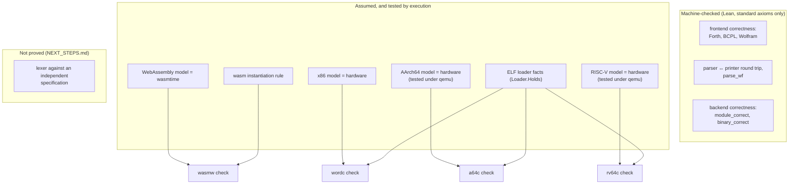

Things to keep in mind when reading the theorems:

* **Stacks are bounded on the targets and unbounded in the IR.** All four backends check before
  every push and every call, and exit 6 when a stack is full. The `_or_overflow` theorems say
  "IR outcome or exit 6"; the theorems without that suffix assume `Fits` and give the exact
  outcome.
* **Program-level hypotheses are small and checkable.** They are: registers named by
  `push`/`pop` exist (`RegsOk`), the program has fewer than `2^32` instructions (WebAssembly) or
  `17 · length < 2^64` (x86-64, AArch64 and RISC-V), and the register file and memory image fit the runtime layout
  (WebAssembly).
* **The emitted text is generated from the verified instruction lists.** `Wasm.Emit`,
  `X86.Emit`, `A64.Emit` and `RV.Emit` print exactly what the lowering produced, so there is no second hand-written copy of
  the code to drift. The hand-written parts are the small runtimes (prologue, dump routine, trap
  stubs), and each module documents them.

# Part III: run it and read it

## Make your first journey

Install Git and [elan](https://github.com/leanprover/elan), then make `lean` and `lake` available on your path. The repository pins `leanprover/lean4:v4.34.1`; elan selects that toolchain. The Lake package is named `UniversalWord`, and its manifest lists no external package dependencies.

```sh
git clone https://github.com/SNAPKITTYWEST/ai-free.git
cd ai-free
lake build
```

The default build includes the semantic and frontend libraries, shared harness, the four backend libraries, and the `wordc`, `wasmw`, `a64c` and `rv64c` executables. Native execution uses x86-64 Linux with GNU `as` and `ld`. WebAssembly execution uses [Wasmtime](https://github.com/bytecodealliance/wasmtime/releases); the workflow selects version `30.0.2`. AArch64 and RISC-V execution use `clang` and `ld.lld` to build the binary and `qemu-aarch64` / `qemu-riscv64` (Debian/Ubuntu package `qemu-user`) to run it; on a matching Linux machine the binaries run directly.

Try a short source file containing `5 DUP +`, or use the repository's [Forth examples](examples/forth). The commands below exercise real source parsing and compilation before comparing target behavior with Lean:

```sh
.lake/build/bin/wordc forth examples/forth/fib.fs
.lake/build/bin/wasmw forth examples/forth/memory.fs 16
.lake/build/bin/a64c forth examples/forth/double.fs
.lake/build/bin/rv64c forth examples/forth/loops.fs
.lake/build/bin/wordc emit-forth examples/forth/sum.fs > /tmp/sum.s
.lake/build/bin/wasmw emit-forth examples/forth/sum.fs > /tmp/sum.wat
.lake/build/bin/a64c emit-forth examples/forth/sum.fs > /tmp/sum-a64.s
.lake/build/bin/rv64c emit-forth examples/forth/sum.fs > /tmp/sum-rv.s
```

The optional memory-word count defaults to sixteen. Variables occupy cells starting at zero; the executable frontend arranges memory for the parsed program. Forth definitions can call themselves, and `RECURSE` names the current definition. `DO … LOOP`, `I`, `J`, and return-data words provide especially interesting examples because their data survives calls through the auxiliary stack. [`leave.fs`](examples/forth/leave.fs) exercises `+LOOP` counting up and down, `?DO`, `LEAVE` and `UNLOOP`, [`while.fs`](examples/forth/while.fs) `BEGIN … WHILE … REPEAT`, [`core.fs`](examples/forth/core.fs) `CASE`, `CREATE`/`ALLOT`/`,` and the core stack and arithmetic words, and [`double.fs`](examples/forth/double.fs) the double-cell words and `*/`.

For a broader trip, run the fixed samples and three hundred generated programs on each destination:

```sh
.lake/build/bin/wordc check 300
.lake/build/bin/wasmw check 300
.lake/build/bin/a64c check 300
.lake/build/bin/rv64c check 300
```

With no count, the generated-program count defaults to two hundred. `check 0` runs the fixed checks without generated programs. The shared reference interpreter uses bounded fuel; programs that exhaust it are reported as skipped. Generation uses a fixed seed, helping make comparisons reproducible. Backend checks additionally exercise auxiliary-stack behavior and intentional overflow.

You can also inspect a built-in sample's output without running the target:

```sh
.lake/build/bin/wordc emit forth_five_dup_plus > /tmp/five.s
.lake/build/bin/wasmw emit forth_five_dup_plus > /tmp/five.wat
```

Other named samples include `bcpl_sum_1_to_10`, `wolfram_dot_2x2`, and `raw_call_ret`. The shared harness contains the complete sample lists. Native execution artifacts are written under `/tmp/wordc`; WebAssembly artifacts use `/tmp/wasmw`, AArch64 artifacts `/tmp/a64c`, and RISC-V artifacts `/tmp/rv64c`. Successful target output is a binary state dump decoded by the harness, so these commands are most informative when used with the comparison tools or emitter output.

## Checking everything at once

```sh
lake build                                   # every library and all four executables
lake env lean formal/Audit.lean              # fails if any theorem uses a non-standard axiom
.lake/build/bin/wordc check 300              # x86-64: samples + 300 random programs, natively
.lake/build/bin/wasmw check 300              # WebAssembly: the same under wasmtime
.lake/build/bin/a64c check 300               # AArch64: the same under qemu-aarch64
.lake/build/bin/rv64c check 300              # RISC-V: the same under qemu-riscv64
.lake/build/bin/wordc forth examples/forth/loops.fs
```

CI runs all of these, plus a grep that rejects `sorry`, `admit`, `native_decide` and `axiom`
declarations anywhere in the Lean sources.

## Where to start reading

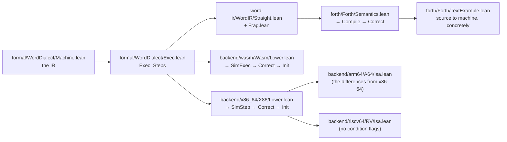

* For the meaning of a program, read `Machine.lean` (one screen) and `Exec.lean`.
* For a frontend proof in miniature, read `forth/Forth/OpCorrect.lean`, then the `op` and `call`
  cases of `Forth/Correct.lean`.
* For a backend, read the module docstring of `Lower.lean` and one simulation theorem, for
  example `sim_add` in `Wasm/SimAlu.lean`. Then read `sim_step`, and finally the top of
  `Init.lean` for the end-to-end statement.
* For concrete runs, read `forth/Forth/TextExample.lean` and `examples/forth/*.fs`, and run
  `wordc forth` / `wasmw forth` / `a64c forth` / `rv64c forth` on them.

## Read the proofs as a connected story

A source correctness theorem begins with a source execution result. The compiler translates that program into the shared IR, and its theorem establishes the corresponding machine execution. A backend theorem then connects that machine execution to a target model. Initialization results establish the relation at the target's starting state. The examples make these connections concrete with values and memory images you can recognize.

When exploring a theorem, start with its conclusion and then inspect its hypotheses. A matrix theorem's geometry explains where input and output cells live. A backend theorem's register condition explains which virtual-register indices the configured file supports. A capacity condition explains when a bounded target follows the IR outcome exactly. These hypotheses are part of the module's usable interface and often reveal the clearest path to constructing your own example.

For a small complete reading route, follow Forth's example into its compiler and correctness file, then open the shared harness and one executable entry point. For a deeper route, begin with the machine, read straight-line and fragment composition, and follow BCPL statement correctness. For nested-loop reasoning, take the counted-loop module into matrix layout, matrix multiplication, and its concrete example.

The backend routes offer an illuminating comparison. The three native lowerings (x86-64, AArch64, RISC-V) compute target offsets and keep return addresses on a stack in memory. WebAssembly lowering returns IR instruction indices through a table-driven dispatch loop. All of them preserve the same source of meaning, use separate storage for call addresses and auxiliary words, and connect local instruction simulations to complete execution results. Their different implementations make the common semantic layer especially valuable to readers.

A useful exercise is to trace one value across the map. In `5 DUP +`, parsing produces a literal and two operations; reference evaluation duplicates five and adds the pair; compilation emits the corresponding IR sequence; either backend carries that sequence to its target representation. The final stack contains ten. For BCPL, trace the same arithmetic into a variable cell instead. For matrix multiplication, trace one output entry through its accumulator register, the inner loop, and the destination write. These three examples give you stack, memory, and loop perspectives on the same architecture. Once those routes feel familiar, the larger theorem files become easier to navigate: identify the local semantic result, find its compiled fragment, locate the appropriate simulation, and follow the composition to the final outcome. Each step has a named home in this atlas for your next exploration.

## The project's verification practice

The repository includes a namespace-wide axiom audit and a [CI workflow](.github/workflows/lean.yml) that builds the libraries, checks prohibited proof constructs, runs the audit, runs every backend's differential check (x86-64 natively, WebAssembly under Wasmtime, AArch64 and RISC-V under qemu), and runs the Forth example files. The audit command is:

```sh
lake env lean formal/Audit.lean
```

Formal results describe the machine models and their stated interfaces. Differential execution compares emitted artifacts through real assemblers and runtimes with the Lean reference. Together, these give readers a theorem route through the definitions and an execution route through concrete programs. The audit makes theorem dependencies inspectable across the imported libraries.

When adding an operation, a useful path is to define its semantic behavior, connect its translation with an appropriate correctness result, and add a shared sample. An existing example provides a manageable starting point. For source-interface work, parser and printer properties show how text behavior can receive the same attention as machine behavior. For backend work, the instruction-family files indicate where a new local simulation joins the complete step theorem.

After a code change, use the project's build, audit, and backend checks as the repository workflow prescribes. For navigation and documentation, this atlas lets you move directly to the relevant source file and follow its imports. Each numbered stop identifies a real module's contribution, from the first word representation to the four target machines.

## License

The project uses the [Parr Source License — No AI Training, Version 1.0](License), copyright © 2026 Ahmad Ali Parr. The license text defines permitted purposes and its conditions, including restrictions concerning competing use and AI training. Refer to that file for the governing terms when using, modifying, or distributing the project.
