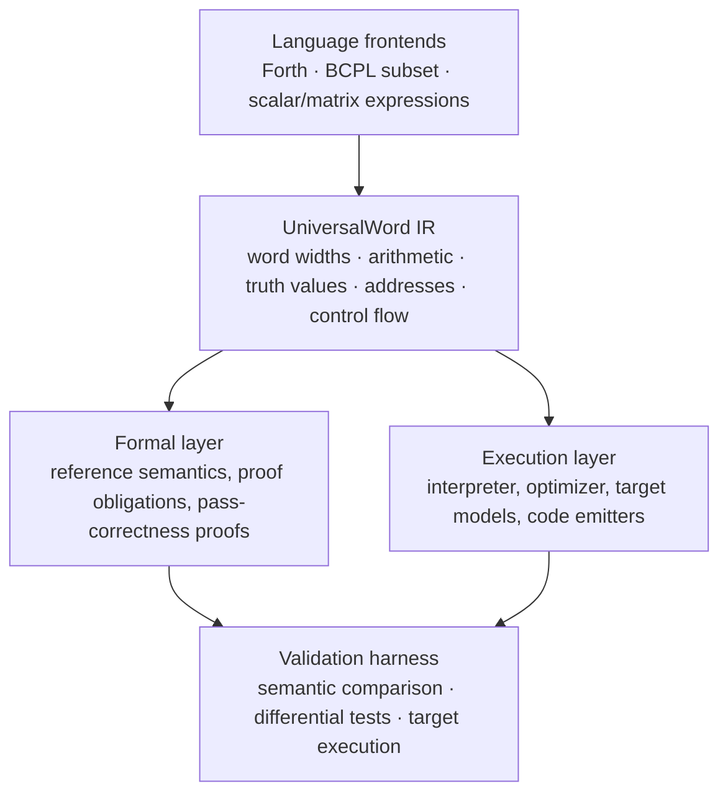
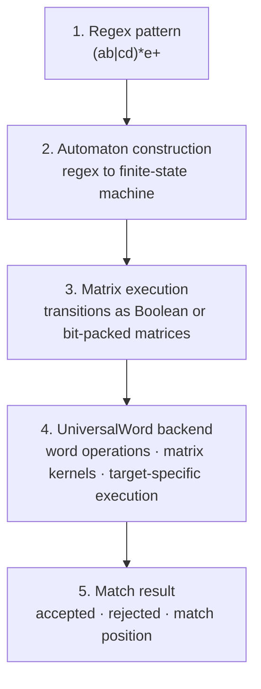

# UniversalWord game plan

UniversalWord is most useful as a formally specified machine-word intermediate representation
(IR): a common semantic layer where you can translate programs written in different
computational styles, prove properties about their behavior, and compare their execution
across target machines.

Given this architecture, it is best used as a foundation for a verified low-level compiler and
hardware execution stack, rather than as just another programming language.

The **Status** notes in this document record where the repository stands against each part of
the plan. [`NEXT_STEPS.md`](../NEXT_STEPS.md) lists the concrete next items.

## The five strongest applications

### 1. Cross-language compiler and verification engine

Translate Forth stack operations, BCPL-style pointer and integer operations, and scalar or
matrix expressions into one shared representation.

* Define exact integer widths, overflow, truth values, and address semantics.
* Prove that source-to-IR translation preserves behavior.
* Compare the IR interpreter against generated machine code.

Best starting point: establish semantic equivalence before adding optimizations.

**Status:** in place. The word semantics are in `formal/WordDialect/`, generic over the width
`n`. The source-to-IR theorems are `Forth.Program.compile_correct`, `BCPL.compile_correct` and
`Wolfram.dotProgram_correct`. `wordc`, `wasmw`, `a64c` and `rv64c` compare the Lean semantics against real
execution.

### 2. Bare-metal and embedded systems

Use the machine-word model to describe register operations, fixed-width arithmetic, memory
accesses, and control flow for constrained processors.

* Generate code for a defined target instruction set.
* Model address arithmetic and memory boundaries.
* Test whether generated instructions match the reference semantics.

This is particularly valuable when you want tight control over what executes on the hardware.

**Status:** x86-64, AArch64 (ARM64), RISC-V (RV64IM) and WebAssembly are each modelled,
emitted, and proved against their models (`X86.Emit.binary_correct`, `A64.Emit.binary_correct`,
`RV.Emit.binary_correct`, `Wasm.module_correct`). Memory accesses outside the valid cells trap
`badAddress`. AArch64 and RISC-V are the two instruction sets most used in current embedded
application processors; both backends are tested under qemu. Microcontroller profiles (32-bit
words, no operating system, for example ARM Cortex-M or RV32) are not modelled yet.

### 3. Verified GPU and numerical kernels

Represent scalar arithmetic and matrix computations in a common IR, then lower supported
operations into CPU or GPU kernels.

* Check integer widths and arithmetic transformations.
* Specify matrix dimensions and numerical behavior.
* Compare optimized kernels against a reference implementation.

For GPU work, you would still need explicit models for floating-point arithmetic, parallel
execution, synchronization, and memory ordering. A machine-word model alone does not establish
numerical or concurrency correctness.

**Status:** integer matrix products are compiled and proved (`Wolfram.dotFrag`,
`dotProgram_correct`). There is no floating point, parallelism or GPU target.

### 4. Reusable proof library

Make UniversalWord the common semantic foundation for proofs reused across language frontends
and machine targets. Examples include:

* fixed-width arithmetic and overflow;
* stack-machine instruction correctness;
* pointer and address invariants;
* compiler-pass preservation;
* correctness of emitted instructions.

The key benefit is amortization: prove a semantic rule once, then reuse it wherever the same
IR operation appears.

**Status:** `word-ir/` is this library. It provides straight-line code (`execSeq_steps`),
position-independent fragments (`Frag`), loops (`countedLoop_run`, `Frag.whileLoop`) and flag
conversion (`cmpFlagCode`). All three frontends share it, and the double-cell Forth words reuse
the same counted loop as the matrix product. `formal/Audit.lean` checks that every theorem uses
only Lean's standard axioms.

### 5. Differential testing and executable specifications

Use the reference interpreter as the behavioral oracle for generated implementations.

Run the same input through the reference semantics, translated program, and target executable.
Compare outputs, memory effects, and execution traces.

This can expose compiler miscompilations, incorrect arithmetic lowering, and discrepancies
between language implementations.

Differential testing provides evidence, not a proof of correctness for all possible executions.

**Status:** `backend/common/Harness.lean` runs fixed samples and 300 generated programs through
the Lean semantics, native x86-64 and Wasmtime, comparing the stack, memory and traps. CI runs
it on every push. It tests the one step the proofs do not cover: that the Lean models of x86-64
and WebAssembly agree with real hardware and a real engine.

## How the system is structured



## Build order

| Priority | Deliverable | Why it matters | Status |
| --- | --- | --- | --- |
| 1 | Formal word semantics | Establishes exactly what every operation means | Done: `formal/WordDialect/` |
| 2 | Reference interpreter | Provides executable ground truth | Done: `exec`/`step`, `Forth.eval`, `BCPL` and `Wolfram` evaluators |
| 3 | Forth and BCPL translation | Tests whether distinct programming models share the IR correctly | Done and proved, plus Wolfram expressions and matrices |
| 4 | Differential test harness | Detects mismatches between translation and execution | Done: `wordc check`, `wasmw check`, `a64c check`, `rv64c check`, Forth example files |
| 5 | One target emitter | Demonstrates that the IR can reach real hardware | Done: four (x86-64, AArch64, RISC-V and WebAssembly), proved against their models |
| 6 | Verified optimizations | Establishes that performance improvements preserve behavior | Not started |
| 7 | Matrix and GPU extensions | Expands into numerical computing and acceleration | Integer matrices done; GPU not started |

## Next phase: close out the Lean work, then port

The backends are complete. With `FM/MOD`, the Forth arithmetic word set is complete too. The
next phase is to finish the remaining Lean items and to port to new targets.

Closing out the Lean side means:

* the double-cell storage and arithmetic words (`2@ 2! 2VARIABLE D+ D- DNEGATE`, see
  `NEXT_STEPS.md`);
* the lexer specification, which turns `parse_iff` into a statement about characters;
* a final pass on the documentation and the inventory, which CI keeps complete.

Porting:

* **AArch64 (ARM64): done.** `backend/arm64` has the model, lowering, emitter, the full
  simulation proof (`A64.Emit.binary_correct`), and the `a64c` driver. CI runs `a64c` under
  `qemu-aarch64`. The model also covers the general data-processing forms used by hand-written
  AArch64 (three-register `add sub mul and orr eor`, `lsl`/`lsr`/`asr` by a constant), with
  their meanings proved in `A64/DataOps.lean` and checked against qemu by `a64c check`.
* **RISC-V (RV64IM): done.** `backend/riscv64` has the model, lowering, emitter, the full
  simulation proof (`RV.Emit.binary_correct`), and the `rv64c` driver. RISC-V has no condition
  flags, so its guards and comparisons are compare-and-branch sequences, proved directly against
  the IR's comparison predicates. CI runs `rv64c` under `qemu-riscv64`. As on AArch64, the model
  also covers the hand-written data-processing forms (three-register `add sub mul and or xor sll
  srl sra`, `slli`/`srli`/`srai`), proved in `RV/DataOps.lean` and checked against qemu.
* Next candidate: a microcontroller profile (32-bit words, no operating system, for example
  RV32IM or ARM Cortex-M) for embedded use. The IR and the frontends are already generic in the
  word width.

## The strategic opportunity

The differentiator is not simply supporting three computational styles. It is connecting a
common semantic specification to reusable proofs and executable implementations.

That gives UniversalWord three potential roles:

* **A compiler research platform:** study semantics-preserving translation across stack-based,
  imperative, and mathematical programming styles.
* **A low-level systems foundation:** generate and validate machine-specific implementations
  from a shared representation.
* **A verification infrastructure:** establish evidence that a transformation or emitted
  implementation preserves specified behavior.

One important boundary: if the IR treats a word as an integer, Boolean, or address, those
interpretations must be explicitly defined. A 64-bit address is not interchangeable with a
64-bit integer in every context, and memory safety does not follow merely from using
fixed-width words. (In this repository a truth flag is defined in `WordIR/Flag.lean` and an
address in `WordDialect/Word.lean` (`Ptr`). Every memory access is checked against the valid
cells.)

Recommendation: make UniversalWord a proof-oriented, executable compiler IR. Start with one
precisely specified word width, a reference interpreter, two small language frontends, and a
differential testing harness. Once that foundation is reliable, add machine-specific emitters
and numerical or GPU backends.

That turns the project from a shared intermediate language into a foundation for building and
validating low-level software across multiple computational models.

## Application: regular expressions



### The mathematical core

For a finite automaton with states `Q`, let `v_i` be the set of active states after consuming
`i` characters, written as a row vector over `Q`. Let `M_c` be the transition matrix for the
character `c`, with `M_c[p][q] = 1` exactly when the automaton can move from `p` to `q` on `c`.
Then

```
v_{i+1} = v_i · M_{c_i}
```

over the Boolean semiring, where multiplication is logical AND and addition is logical OR. This
propagates reachability through the automaton. The input is accepted when `v_n` contains an
accepting state.

For a deterministic finite automaton there is often a simpler and faster option: represent the
current state as an integer and use a transition table indexed by state and input character.

### Where matrix multiplication helps most

* **Parallel matching:** process many strings or candidate states together.
* **Bit-parallel regex:** represent multiple automaton states in machine words and update them
  with bitwise operations.
* **Batched workloads:** evaluate thousands of patterns or inputs in parallel on a GPU.
* **Formal verification:** prove that the matrix transition implementation agrees with the
  reference automaton.

One caveat: ordinary arithmetic matrix multiplication is not automatically equivalent to
Boolean reachability. The algebra, state encoding, and acceptance conditions must be specified
correctly. Backreferences and other non-regular regex extensions need more than a conventional
finite automaton.

The opportunity: UniversalWord could provide the low-level execution and verification layer for
a regex engine, with a CPU implementation and an accelerated matrix or bit-parallel backend.

The strongest design would benchmark three approaches against each other: conventional DFA/NFA
execution, bit-parallel matching, and matrix-based execution. Matrix multiplication is a useful
tool, but it is not automatically the fastest way to execute every regex.

**Status:** not started. Two existing pieces apply. The Wolfram frontend's matrix product
(`dotFrag`) is the arithmetic version of `v_i · M_c`; a Boolean version would swap `MUL`/`ADD`
for `AND`/`OR`. The IR's `and`, `or`, `shl` and `shr` are what bit-parallel matching needs.
