# A tour of the Lean files

This document walks through every Lean file in the repository: what it defines, what it proves,
how it depends on the others, and where the trust boundaries are. It is meant to be read next to
the code. The top-level [README](../README.md) covers setup and commands; this one covers
structure.

The repository is one Lake package (`UniversalWord`) with seven Lean libraries and two
executables:

| Library / executable | Directory | Role |
| --- | --- | --- |
| `WordDialect` | `formal/` | The Universal Word IR: words, memory, instructions, execution, invariants |
| `WordIR` | `word-ir/` | Proof toolkit shared by every frontend: straight-line code, control-flow fragments, loops |
| `Forth` | `forth/` | A Forth subset: semantics, parser, printer, compiler to the IR, proofs |
| `BCPL` | `bcpl/` | A BCPL subset: semantics, compiler to the IR, proofs |
| `Wolfram` | `wolfram/` | Wolfram-style integer arithmetic and matrix products, lowered to the IR |
| `Harness` | `backend/common/` | Shared differential-testing harness and sample programs |
| `X86` + `wordc` | `backend/x86_64/` | x86-64 model, lowering, assembly emitter, proofs; native test driver |
| `Wasm` + `wasmw` | `backend/wasm/` | WebAssembly model, lowering, WAT emitter, proofs; wasmtime test driver |

## 1. The big picture

Everything is organised around one intermediate language, the **Universal Word IR**, defined in
`formal/WordDialect/Machine.lean`. Frontends translate *into* it and prove that the translation
preserves the meaning of the source program. Backends translate *out of* it and prove that the
generated machine code preserves the meaning of the IR program. Composing the two gives
source-to-machine correctness for each pair.

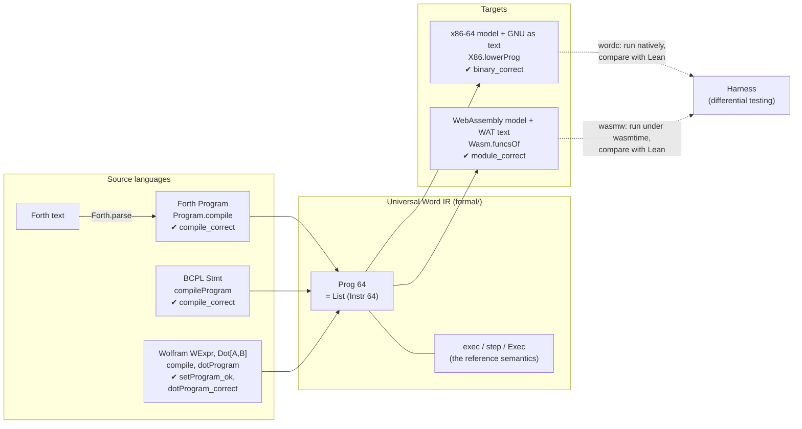

Solid arrows are translations with machine-checked correctness theorems (named with ✔ in the
box the arrow starts or ends at). Dotted arrows are
*testing*: the proofs are about Lean models of x86-64 and WebAssembly, and the harness checks
that those models agree with real hardware and a real engine.

### Library dependencies

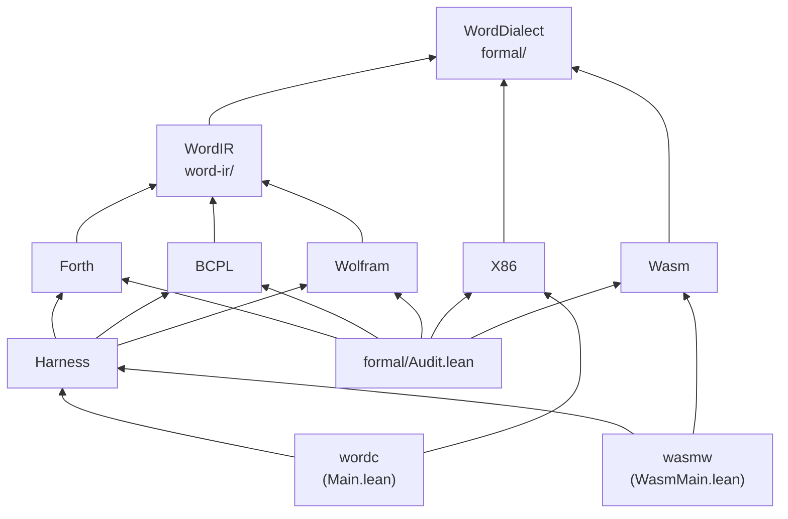

The backends depend only on the IR, never on a frontend: they are correct for *every* IR
program, whichever frontend produced it. The frontends depend on the IR and the shared
`WordIR` toolkit, never on a backend. Only the harness and the audit see everything.

## 2. `formal/`: the Universal Word IR

This library is the single source of truth. Every other correctness theorem in the repository
is stated relative to the definitions here.

### `WordDialect/Word.lean`

The machine word `Word n` is `BitVec n`, so the IR is parametric in the word width; both
backends instantiate it at 64. A pointer `Ptr n` is a word *interpreted* as a word-granular
address; converting in either direction is the identity on representation (`toWord_ofWord`,
`ofWord_toWord`), and `offset` is pointer displacement modulo `2^n`.

The file fixes conventions every other module relies on: arithmetic is two's complement;
unsigned division by zero is *not* defined here (the machine traps instead); a shift by a count
of `n` or more shifts every bit out (`Word.shl`, `Word.shr`); rotates reduce the count modulo
`n`. It also defines the ten comparison conditions `Cond` (`eq ne ult ule ugt uge slt sle sgt
sge`) with `Cond.eval`, and the boolean bridge `ofBool` / `isTrue` (a word is true iff it is
nonzero). Lemmas such as `shl_toNat`, `shr_le` and `rotr_rotl` give the numeric meaning of the
shift and rotate operations.

### `WordDialect/Memory.lean`

Memory is word-addressed: one address names one `Word n`. A `Memory n` is a `cell` function
plus a `valid` predicate. `read?` and `write?` return `none` outside the valid set, so an
invalid access is always a trap, never undefined behaviour. The lemmas are the standard
algebra of a store: `read_write_same`, `read_write_other`, `write?_valid` (writes never change
validity), `write_read_self` (writing back what you read changes nothing observable) and
`write_comm` (writes to distinct addresses commute). Mapping word addresses to byte addresses is
explicitly a backend concern.

### `WordDialect/Machine.lean`

The authoritative semantics. It defines:

* `Instr n`: `word`, `ptr`, `load`, `store`, `add sub mul div sdiv`, `and or xor not`,
  `shl shr rotl rotr`, `cmp c`, `select`, `jmp t`, `branch t`, `call t`, `ret`, `push r`,
  `pop r`, `dup drop swap over rot`, `tor fromr rfetch`, `halt`;
* `Trap`: `stackUnderflow`, `badAddress`, `divideByZero`, `badPc`, `returnUnderflow`;
* `State n`: `pc`, the data stack `dstack`, the return stack `rstack` (code addresses), the
  auxiliary data stack `astack`, the register file `regs : Nat → Word n` and `mem`;
* `Outcome n`: `next s`, `halted s`, `trapped t`;
* `exec i s`, the meaning of one instruction, and `step p s`, which fetches `p[s.pc]` and
  executes it (fetching outside the program is `badPc`).

The stack convention is Forth's: the head of `dstack` is the top, and a binary operation on
`a b` (with `b` on top) computes `a op b`. Code addresses are instruction indices, so control
flow is independent of any ISA. The register file is unbounded; mapping virtual registers onto
physical storage is the backend's job.

Two stacks deserve a note. `rstack` holds return addresses and is touched only by `call` and
`ret`. `astack` holds data words and is touched only by `tor` (move the data top onto it),
`fromr` (move its top back) and `rfetch` (copy its top). Because `call`/`ret` never touch
`astack`, a value parked there survives calls and recursion. This is exactly what Forth's
`>R`, `R>`, `R@` and `DO … LOOP` need. Taking from an empty `astack` traps
`returnUnderflow`, the same trap as `ret` on an empty `rstack`.

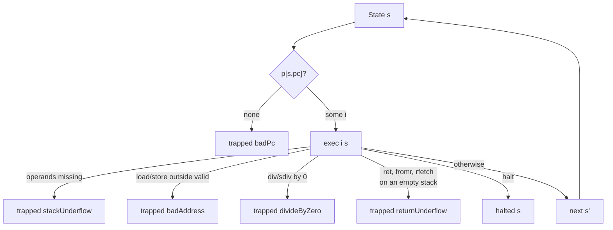

### `WordDialect/Stack.lean`

Defines, for each instruction, how many operands it consumes (`Instr.pops`) and how many results
it produces (`Instr.pushes`), and proves the two halves of operand checking:
`exec_underflow` (with too few operands an instruction traps `stackUnderflow` and does nothing
else) and `exec_not_underflow` (with enough operands it never does). Every backend relies on
`pops`: the code it emits for an instruction starts with a guard that compares the data-stack
depth against `pops`.

### `WordDialect/Invariants.lean`

Frame conditions for a single instruction, each proved by exhaustive case analysis over every
instruction and stack shape: the data-stack depth moves by exactly `pushes - pops`
(`exec_depth`); the set of valid addresses never changes (`exec_valid`); only `store` changes
memory (`exec_mem_frame`); only `pop` changes registers (`exec_regs_frame`); only `call`/`ret`
change the return stack (`exec_rstack_frame`); only `tor`/`fromr` change the auxiliary stack
(`exec_astack_frame`); only `halt` halts, leaving the state untouched (`exec_halted`); and every
trap has one of four causes (`exec_trap`). These are the facts a reader can check to see that
the IR has no hidden effects.

### `WordDialect/Exec.lean`

Execution over many steps:

* `Exec p s o`: running `p` from `s` terminates with final outcome `o` (halted or trapped). It is
  inductive, so non-terminating runs simply have no derivation.
* `Steps p s s'`: `s'` is reachable by finitely many non-terminal steps.
* `run`: a fuel-bounded interpreter, proved equivalent to `Exec` (`run_sound`, `run_complete`,
  `exec_iff_run`).

`Exec.deterministic` shows a program and a start state fix the outcome. The control-flow lemmas
(`step_jmp`, `step_branch_taken/fall`, `step_call`, `step_ret`, `step_ret_empty`,
`call_ret_roundtrip`) and `Steps.append_right` (code appended after a fragment does not affect
it) are what the frontend proofs use. The proof pattern throughout the repository is: show a
translated fragment moves the machine from one state to another with `Steps`, then hand the
rest of the program to `Exec`.

### `WordDialect/Rules.lean`

Every rule of `exec` restated as a named lemma (`exec_add`, `exec_load_bad`, `exec_pop`, …), plus
the numeric denotation of the word operations: `add`, `sub`, `mul` are arithmetic modulo `2^n`,
and `div` is exact integer division whenever the divisor is nonzero. A lowering from
mathematical expressions (Wolfram) relies on these.

### `WordDialect/Init.lean`

`State.init mem` is the start of execution: `pc = 0`, empty data, return and auxiliary stacks,
all registers zero. `Memory.ofImage img` builds an IR memory from a list of numbers: word `a`
holds `img[a]` modulo `2^n`, and exactly the addresses below `img.length` are valid. The test
harness and both backends' end-to-end theorems start from exactly this pair, so "the program run
on the image" means the same thing in the proofs and in the tests. The file closes with the
specification's own example, Forth `5 DUP +`, run to the stack `[10]`.

### `formal/WordDialect.lean` and `formal/Audit.lean`

`WordDialect.lean` re-exports the eight modules above. `Audit.lean` imports every library and
collects every theorem in the `WordDialect` namespace, more than two thousand of them. For each
it computes the axioms the proof depends on. Lean's standard `propext`, `Quot.sound` and
`Classical.choice` are allowed; any other axiom is reported with `logError`, so the command, and
CI, fail. Together with CI's ban on `sorry`, `admit`, `native_decide` and `axiom` declarations,
this is what makes "proved" mean proved.

## 3. `word-ir/`: the frontend toolkit

Frontends need the same few proof patterns over and over. This library proves them once.

### `WordIR/Straight.lean`

Straight-line code is code in which every instruction continues at `pc + 1`
(`Instr.isStraight`). `At p pc code` says `code` sits at address `pc` in program `p`, with
`at_append` and `at_embed` for composing placements. `execSeq` is a pure executor for a code
sequence, defined with `exec` alone, and `execSeq_steps` / `execSeq_trap` connect it to the
machine: a completed sequence is a `Steps` path, a trapping sequence is a `Steps` path followed
by a trapping step. Frontends then prove equalities about `execSeq`, which is ordinary
equational reasoning, instead of reasoning about program counters.

### `WordIR/Frag.lean`

A `Frag n` is a *position-parametric* code fragment: its jump targets depend on the address it
is placed at, its size does not. Every frontend builds its control flow from these combinators,
so the control-flow proofs are done once:

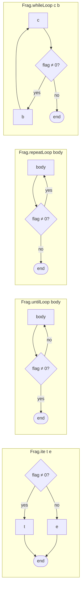

Each combinator has a size lemma (`seq_size`, `ite_size`, `until_size`, `repeat_size`, …), a
decoding lemma saying what instructions sit where (`ite_decode`, `until_decode`,
`repeat_decode`), and *rules* in terms of `Steps` (`ite_true_rule`, `until_again_rule`,
`repeat_again_rule`, …). `repeatLoop` was added for Forth's `DO … LOOP`, whose test leaves a
nonzero flag exactly when the loop must go round again.

### `WordIR/Flag.lean`

Source languages such as Forth and BCPL use `-1` for true and `0` for false, while IR `cmp`
yields `1`/`0`. `cmpFlagCode c` is the shared conversion (`cmp c` then `0 - x`), proved once
(`cmpFlagCode_exec`) and used by both frontends.

### `WordIR/RExpr.lean`

Register-and-memory expressions (`RExpr`): the building block for index arithmetic and
accumulators. `RExpr.code` leaves an expression's value on the data stack, and `code_ok` /
`code_err` prove it against `RExpr.eval`, for success and for traps.

### `WordIR/Loop.lean`

`countedLoop r N body` runs `body` for `r = 0 … N-1` using virtual register `r` as the counter.
`countedLoop_run` is a verified loop rule in Hoare style: given an invariant `Inv k` that the
body preserves (with the counter and data stack untouched), the loop ends with `Inv N`. The
invariant may mention memory, the stacks and every register other than `r`. The Wolfram matrix
lowering is three of these nested.

### `WordIR/Program.lean`

Lifts straight-line results to whole programs: `code ++ [HALT]` run from `pc = 0` halts with the
state `execSeq` computes (`exec_straight_halt`) or traps with the trap it reports
(`exec_straight_trap`).

## 4. `forth/`: Forth, from text to IR

Forth is the most developed frontend. It has source text, a parser with proofs in both
directions and a grammar it provably implements, colon definitions with recursion, `EXIT`,
variables, constants, and the return-stack words `>R R> R@` with `DO … LOOP`, `DO … +LOOP`,
`?DO`, `LEAVE`, `UNLOOP`, `I` and `J`.

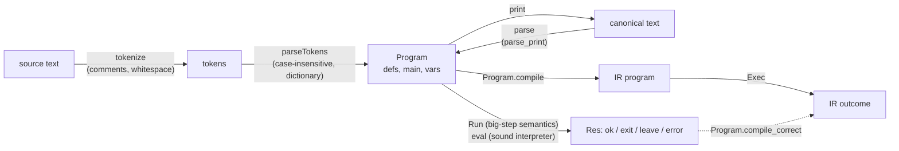

### `Forth/Semantics.lean`

The reference semantics, defined directly on a Forth state with no reference to the IR:

* `Op`: literals and the primitive words (`+ - * / MOD AND OR XOR INVERT LSHIFT RSHIFT`,
  comparisons, `0=`, stack words, `@ !`, and the return-stack words);
* `FState`: the data stack, memory, and a return-data stack `rstack` of words;
* `Block`: `nil`, `op o rest`, `ite t e rest` (`IF … ELSE … THEN`), `untilL body rest`
  (`BEGIN … UNTIL`), `call i rest` (a colon definition), `exit`, `doLoop body rest`
  (`DO … LOOP`), `plusLoop body rest` (`DO … +LOOP`) and `leave` (`LEAVE`);
* `Program`: a dictionary of word bodies `defs`, a `main` block and a variable count `vars`;
* `Res`: a run ends `ok` (fell off the end), `exit` (ran `EXIT`), `leave` (ran `LEAVE`, which the
  innermost loop catches) or `error t` (trapped);
* `Run defs b st r`: a big-step relation, with `Run.deterministic`.

The conventions are ANS Forth's: `/` truncates toward zero and `MOD` is the matching remainder;
true is `-1`. Variables are memory cells `0 … vars-1` (`Program.MemOk` states what a program may
assume about memory). The return-data stack is *separate* from call frames, mirroring the IR's
auxiliary stack. So unbalanced `>R` across `EXIT` or a call is defined behaviour here rather than
undefined as in ANS Forth, and the module documents each such choice explicitly. Examples are the
`LOOP` exit rule (exit when `index+1 = limit`), what `EXIT` inside a loop leaves behind, and `I`/`J`
outside a loop. `+LOOP` ends when `loopCrossed index limit step` holds, which
`Forth/LoopProps.lean` proves to be ANS Forth's crossing rule (`loopCrossed_eq_saddOverflow`)
and, for step `1`, the `LOOP` rule (`loopCrossed_one`).

### `Forth/Compile.lean`

The lowering. Forth's data stack *is* the IR data stack, so most words map one-to-one;
comparisons go through `cmpFlagCode`, `MOD` lowers to `OVER OVER SDIV MUL SUB`, and the
return-stack words lower to `tor`/`fromr`/`rfetch`. Colon definitions become IR subroutines:

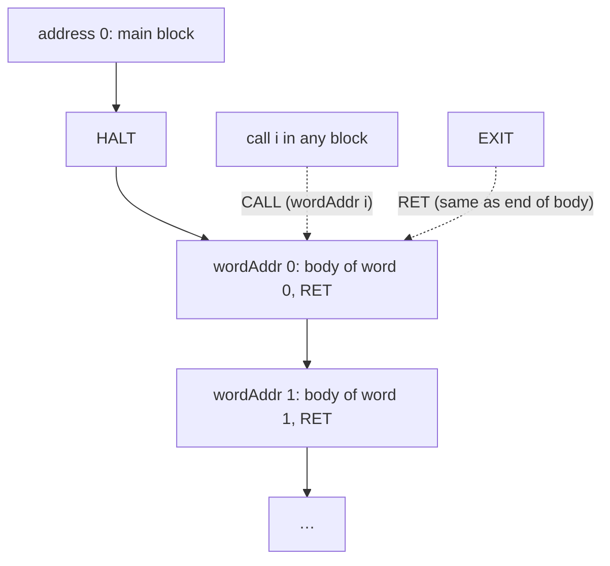

Code sizes do not depend on call targets or on the leave target (`compile_size`), so word
addresses are prefix sums of `Block.size`. `DO body LOOP` lowers to `SWAP TOR TOR`, the body,
then a test that increments the index, leaves `limit-(index+1)`, branches back while it is
nonzero, and finally drops both loop parameters (`loopFrag`). `DO body +LOOP` (`plusFrag`) has a
26-instruction test computing `index+step` and the `loopCrossed` flag, and branches *out* on it.
`compile addr lv b` takes a *leave target* `lv`: `LEAVE` lowers to `FROMR FROMR DROP DROP JMP lv`,
and a loop compiles its body with its own end address as the target.

### `Forth/OpCorrect.lean`

Each primitive operation, lowered to straight-line IR, behaves exactly as `Op.sem` says:
success reaches the corresponding state (`compileOp_ok`), failure traps with the same trap
(`compileOp_err`), both through `execSeq`.

### `Forth/Correct.lean`

The main theorem. `compile_correct` is proved by induction on the `Run` derivation. Whenever the
reference semantics derives result `r` for block `b`, the machine runs any program that contains
every word body at its address (`DefsAt`). Started at the block's address, with matching data
stack, memory and auxiliary stack, and with any return stack, it does exactly one of four things:

* it reaches the end of the block's code with matching stacks and memory and the return stack
  unchanged;
* for `EXIT`, it reaches a `RET` in the same situation;
* for `LEAVE`, it reaches the leave target in the same situation;
* it reaches a state whose next step traps with exactly Forth's trap.

The induction needs no separate argument for recursion, because a call's derivation contains the
callee's derivation, and a loop iteration's derivation contains the next iteration's.
`Program.compile_correct` lifts this to whole programs from `State.init`, and
`compileProgram_correct` is the special case without definitions.

### `Forth/LoopProps.lean`

What the `+LOOP` exit test means. `loopCrossed_eq_saddOverflow`: the loop ends exactly when
adding the step to `index - limit - 2^(n-1)` overflows as a signed number, which is ANS Forth's
rule that the index crossed the boundary between `limit - 1` and `limit`. `loopCrossed_one`: with
step `1` it is the `LOOP` test `index + 1 = limit`.

### `Forth/Eval.lean`

A fuel-bounded executable interpreter for the reference semantics, `eval`, with `eval_sound`:
if it returns a result, `Run` derives that result. This lets concrete facts, including about
recursive words, be established by evaluation instead of by hand-built derivations.

### `Forth/Parse.lean`

The text frontend. `tokenize` splits on whitespace and removes `\` line comments and `( … )`
comments (an unterminated `(` is an error). `parse` is case-insensitive. It reads integer
literals including negative ones, the primitive words, the return-stack words,
`IF/ELSE/THEN`, `BEGIN/UNTIL`, `DO/LOOP`, `DO/+LOOP`, `?DO` (parsed to an `IF` that skips the
loop when limit and index are equal), `LEAVE` (only inside a loop: `Program.leaveOK`), colon
definitions, `RECURSE`, `EXIT`, `VARIABLE` and `CONSTANT`. A name is visible from the start of its own body, which is how recursion by name
works, and a later definition shadows an earlier one. Every failure returns a message, for
example "unknown word: FOO", "DO without LOOP or +LOOP" or "definition of X has no ;".

### `Forth/Print.lean`

A printer from `Program` back to Forth source, and the round trip

    parse_print : P.WF → parse (print P) = .ok P

for every well-formed program. A program is well formed (`Program.WF`) when every call targets
a word already defined, counting the word being defined, `EXIT` occurs only inside
definitions, and `LEAVE` only inside loops. The proof has two halves: `tokenize_join` (the lexer splits printed text back into
the printed tokens) and `parseTokens_print` (the token-level parser inverts the printer).

### `Forth/ParseProps.lean`

The converse direction, which is also the largest file in the repository:

* `parse_wf`: every successful parse is well formed; hence `parse_print_of_parse`, so printing is
  a canonical form for any parseable source.
* Case: `tokenize_upper`, `parse_toUpper_ok` and `parse_case_insensitive`. Upper-casing the
  source changes neither the parsed program nor whether parsing fails; only the spelling quoted in
  an error message can change.
* Comments: `tokenize_paren_comment` and `tokenize_line_comment`. Comments tokenize like
  whitespace, with the exact side conditions under which that is true.
* Dictionary words: `n CONSTANT X` makes `X` the literal `n` (`classify_constant`), and
  `RECURSE` inside definition `k` is a call of word `k` (`classify_recurse`,
  `parseSeq_recurse_name`).

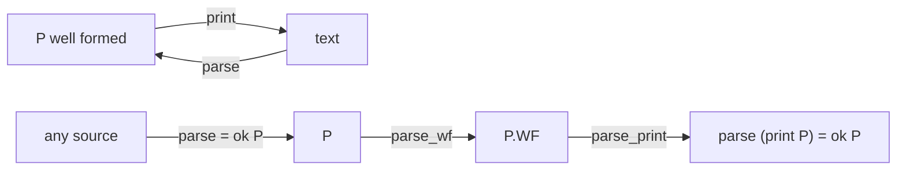

### `Forth/Grammar.lean`

A fuel-free specification of the parser. `Seq` is an inductive grammar for blocks (a token list
is a block, a stop word, and the remaining tokens), `Top` the grammar of top-level code with
definitions, variables and constants, and `Prog` adds the `LEAVE` check. The parser implements
it exactly: `parseSeq_iff`, `parseTop_iff`, `parseTokens_iff` and `parse_iff` (for every fuel
larger than the input, which is what `parse` uses), and the grammar is unambiguous
(`Seq.unique`, `Prog.unique`). The fuel is irrelevant: `parseSeq_fuel` (same result, error
message included, for all such fuel) and `parse_ne_fuel` (`parse` never reports
`input too deeply nested` or `input too long`).

### `Forth/Example.lean` and `Forth/TextExample.lean`

`Example.lean` takes `5 DUP +` through the semantics, the lowering and machine execution.
`TextExample.lean` does the same from source text, and pins the parser's behaviour on concrete
inputs: comments and case, `BEGIN/UNTIL`, words outside the subset, unknown words, use before
definition, a missing `;`, unbalanced control structures, a recursive `SUM` whose compiled
program halts with `55`, and examples for each newer word, including `+LOOP` counting up and
down, `?DO` skipping its loop, `LEAVE`, `UNLOOP EXIT`, and the rejection of `LEAVE` outside a
loop.

## 5. `bcpl/`: BCPL statements to IR

### `BCPL/Semantics.lean`

Abstract syntax (`Expr`, `LVal`, `Stmt`) and a reference semantics on word-addressed memory.
BCPL is typeless: every value is a word, a variable is a memory cell at `addr x`, and `!e` / `@x`
are indirection and address-of. Relational operators yield `-1`/`0`; a condition is true iff
nonzero; `/` truncates toward zero and traps on zero. Evaluation order is fixed, left operand
before right, and in `lhs := rhs` the right side before an indirect left side.
`Exec.deterministic` holds.

### `BCPL/Compile.lean`

There is no runtime. Expressions leave their value on the data stack (`compileE`), statements
leave the data stack as they found it (`compile`), and assignments write the variable's cell
(`assignCode`). Control flow uses `Frag.ite` and `Frag.whileLoop`.

### `BCPL/ExprCorrect.lean` and `BCPL/Correct.lean`

`ExprCorrect.lean` proves expression and assignment code straight-line correct against
`evalE` / `assignSem`, for success and traps. `Correct.lean` proves statements, including
sequencing, `IF/TEST` and `WHILE`, by induction on the semantics. `compile_correct` either
reaches the end of the statement's code with the stack unchanged and memory equal to the BCPL
result, or traps exactly as BCPL does. `compileProgram_correct` lifts it to whole programs.

### `BCPL/Example.lean`

`x := 2 + 3`, compiled and run on the machine, halts with `5` in `x`'s cell whenever that cell
is addressable.

## 6. `wolfram/`: integer arithmetic and matrix products

### `Wolfram/Scalar.lean`

`Plus`, `Times`, `Subtract`, `Minus` over integers, with symbols bound to memory cells. An
expression denotes an *integer* (`evalZ`), and the machine computes modulo `2^n`. So the theorems
(`lower_eval_ok`, `compile_ok`, `setProgram_ok`, and their error twins) state that the machine's
word is `ofInt n z`, where `z` is the exact mathematical value.

### `Wolfram/MatrixLayout.lean`

The vocabulary for matrices: a matrix is a function `Nat → Nat → Int`, `dotSum` is the partial
inner product, `MatAt` says a matrix sits row-major in memory, and `CWritten` says exactly the
first `cnt` words of the destination have been written.

### `Wolfram/MatrixDot.lean`

`Dot[A, B]` is lowered to three nested counted loops over memory, with virtual registers
`rI rJ rL rAcc`:

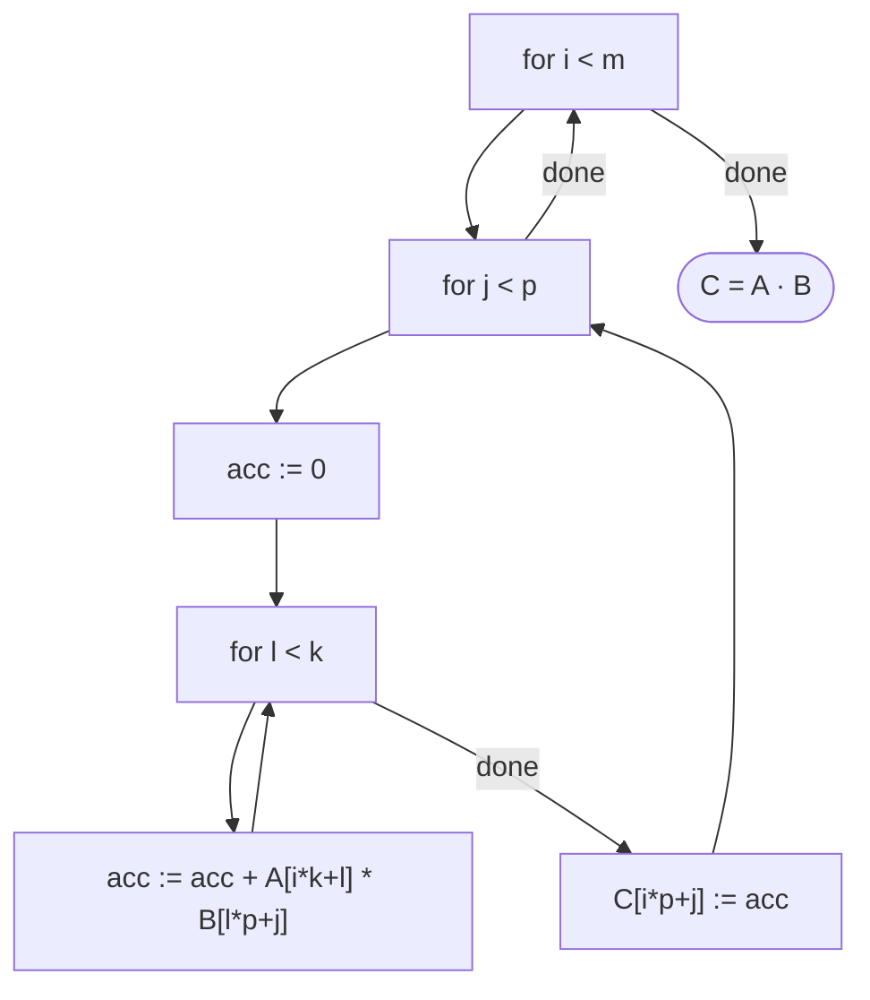

The IR never sees a matrix. The proofs go loop by loop: `inner_run`, then `cell_run`, `row_run`,
`dot_run` and `dotProgram_correct`, each an instance of `countedLoop_run` with an invariant built
from `dotSum` and `CWritten`.

### `Wolfram/MatrixExample.lean`

The preconditions of `dotProgram_correct` are satisfiable, and the theorem delivers the right
numbers. `[[1,2],[3,4]] · [[5,6],[7,8]] = [[19,22],[43,50]]`, with `A` at address 0, `B` at 4 and
`C` at 8.

## 7. `backend/common/Harness.lean`: differential testing

The harness is where the proofs meet reality. A backend supplies a `Runner` that takes a
`Sample` (IR program, memory image, register count), runs it on the real target, and reports the
dumped final state or the exit code. The harness runs the same program under the Lean semantics
(`WordDialect.run` from `State.init (Memory.ofImage mem)`) and compares.

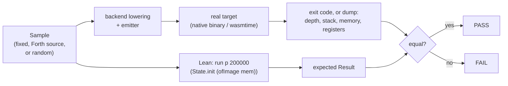

The samples include fixed programs from every frontend, Forth programs written as source text
(a parse failure is reported as an error, never silently skipped), and hand-written IR programs.
A fuzzer (`genInstr`, `genProg`) produces random programs that exercise every instruction,
including the auxiliary-stack instructions and forward jumps and branches. Exit codes are
common to all backends:

| Code | Meaning |
| --- | --- |
| 0 | halted; the state is dumped to stdout |
| 1 | `stackUnderflow` |
| 2 | `badAddress` |
| 3 | `divideByZero` |
| 4 | `badPc` |
| 5 | `returnUnderflow` (empty return stack on `ret`, or empty auxiliary stack) |
| 6 | target stack overflow (no IR counterpart: IR stacks are unbounded) |

## 8. `backend/wasm/`: the WebAssembly backend

### The design

The IR has arbitrary jumps, calls and returns; WebAssembly only has structured control flow. The
lowering therefore turns every IR instruction `k` into its own function `f_k : () → i32`, which
performs the instruction and returns the index of the next one. The module's start function is a
dispatch loop:

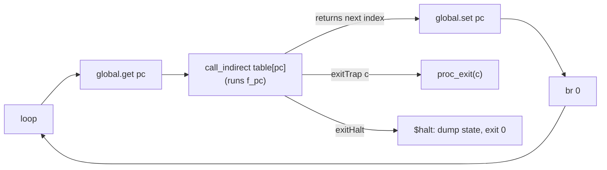

The data stack, return stack, auxiliary stack, register file and IR memory all live in linear
memory at fixed addresses. Four globals hold `pc`, `sp`, `rp` and `ap`. WebAssembly's own operand
stack is used only for temporaries within one instruction.

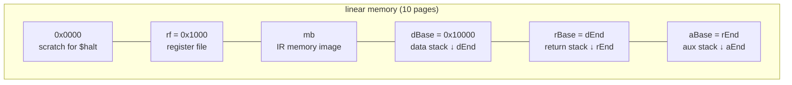

### Files, in dependency order

* **`Wasm/Isa.lean`** is a model of the WebAssembly subset the backend emits, following the
  core specification. It covers typed `i32`/`i64` values, globals, a byte-level linear memory
  (`read64`/`write64` little-endian, trapping when any byte is out of range, with no aliasing
  assumptions), `div_s`/`div_u` traps, shift counts modulo 64, `if`/`loop`/`br` with the
  specification's label discipline including operand-stack unwinding, and `call_indirect` on a
  fresh operand stack. Semantics is big-step (`RunI`, `Run`), so loops need no fuel. That this
  model matches a real engine is the trusted assumption, and `wasmw` tests it.
* **`Wasm/Lower.lean`** contains the lowering, built from small fragments.
  * `uf` is the operand-count guard, which exits 1.
  * `ovf` is the overflow guard, which exits 6.
  * `memAddr` bounds-checks addresses (exit 2) and scales them to bytes.
  * `binBody`, `shiftBody`, `zeroGuard` (exit 3) and `sdivBody` (which avoids the
    `INT64_MIN / -1` trap) build the arithmetic.
  * `lowerInstr` handles every IR instruction, `instrCode` adds the bad-pc stub (exit 4),
    `funcsOf` builds the function table, and `mainBody` is the dispatch loop.
  * Jump targets are clamped to the program length, so a jump past the end traps `badPc` as in
    the IR.
* **`Wasm/Emit.lean`** prints WAT from exactly the `WI` lists the lowering builds, so the text and
  the verified model cannot diverge. It also contains the small runtime: the globals, the memory
  with the IR image as a data segment, and `$halt`, which dumps the state through WASI.
* **`Wasm/Mem.lean`** gives the byte-level read-after-write facts that replace any "word cell"
  assumption.
* **`Wasm/Rel.lean`** defines the state relation. `Cfg` and `Geom` describe the regions and prove
  them disjoint and inside 32-bit memory. `StackRel`, `RegRel`, `MemRel`, `RsRel` and `AuxRel`
  read each IR component out of the bytes, and `Rel0` bundles them with the global pointers and
  capacity facts.
* **`Wasm/Seq.lean`** covers straight-line execution `execL` and its connection to `Run`,
  including `if` handling.
* **`Wasm/Frame.lean`** shows how one 8-byte write into one region leaves the other four views
  unchanged and updates its own view as expected (`wr_stack`, `wr_regs`, `wr_mem`, `push_rel`,
  `push_rs`, `pop_rs`, `adj_sp`).
* **`Wasm/Guard.lean`** covers `execL` over appended code, the pass/trap lemmas for the operand
  guard (`uf_pass`, `uf_trap`) and the overflow guard (`ovfD_pass/trap`, `ovfR_pass/trap`).
* **`Wasm/SimAlu.lean`, `SimAlu2.lean`, `SimStack.lean`, `SimMem.lean`, `SimCtl.lean` and
  `SimAux.lean`** contain one simulation theorem per IR instruction, covering every outcome.
  * `SimAlu` and `SimAlu2` cover the binary operations, shifts, division and `not`.
  * `SimStack` covers the stack words, `word`, `ptr`, `push`, `pop` and `select`.
  * `SimMem` covers `load` and `store` with their `badAddress` traps.
  * `SimCtl` covers `jmp`, `branch`, `call`, `ret` (exit 5 on an empty return stack), `halt` and
    the bad-pc stub.
  * `SimAux` covers `tor`, `fromr` and `rfetch`.
* **`Wasm/SimExec.lean`** has `sim_step`, the case analysis over the whole instruction set. From
  a related state, the function emitted for the current instruction either simulates the IR step
  (next, halted or trapped with the matching code), or the state lacks headroom (`¬ Fits`) and
  the code exits 6.
* **`Wasm/Correct.lean`** holds the dispatch-loop induction. `loop_step` covers one iteration,
  and `lowerProg_correct_or_overflow` is the whole-program theorem with no capacity hypothesis:
  IR outcome, or exit 6. `lowerProg_correct` adds `Fits` at every reachable state and gets
  exactly the IR outcome.
* **`Wasm/Init.lean`** contains the end-to-end theorem. `initState r` is the state WebAssembly
  instantiation produces for the emitted module: globals initialised, memory zero except the data
  segment, built with the emitter's own byte encoding. `geom` proves the runtime's fixed layout
  satisfies `Geom`, `init_relD` proves the entry relation, and `module_correct` composes them.
  Its only hypotheses are about the program: it fits the layout, has fewer than `2^32`
  instructions, and uses registers in range.

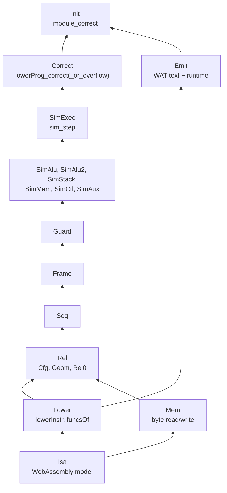

### `WasmMain.lean` (the `wasmw` executable)

It lowers each sample, emits WAT, runs it under `wasmtime` (found through `WASMTIME` or `PATH`),
and compares with the Lean semantics. It also runs auxiliary-stack programs and overflow programs
that must exit 6. `wasmw forth file.fs` and `wasmw emit-forth file.fs` do the same for a Forth
source file.

## 9. `backend/x86_64/`: the x86-64 backend

### The design

Here the IR's control flow maps directly onto the machine. IR `call`/`ret` are native
`call`/`ret`, so the IR return stack *is* the native stack. Every instruction's code has a size
that depends only on the instruction, so jump targets are absolute code indices computed as
prefix sums (`offs`). Register conventions:

| Register | Role |
| --- | --- |
| `r15` | data-stack pointer (grows down, empty at `dEnd`) |
| `r14` | base of the virtual register file |
| `r13` | base of IR memory |
| `r12` | `rsp` at entry; the native stack below it is the IR return stack |
| `rbp` | auxiliary-stack pointer (grows down, empty at `aEnd`) |
| `rax rcx rdx rbx` | scratch |

### Files, in dependency order

* **`X86/Isa.lean`** is a model of the x86-64 subset the backend emits. It has 64-bit registers,
  the shared `Memory 64` at byte addresses with aligned 8-byte accesses only, and concrete flags
  `ZF SF CF OF`. Instructions that leave flags architecturally undefined set them to `none`, and
  reading `none` *faults*, so a proof that the code never faults shows it never relies on
  undefined flags. Faults are a distinct outcome. `exitHalt`, `exitTrap t` and `exitOvf` stand
  for the runtime stubs. That the model matches the hardware is the stated assumption.
* **`X86/Lower.lean`** contains the lowering.
  * Guards: `uf` (operand count), `ovfD` and `ovfR` (data and return stack room, exit 6), and
    the address bounds check before `load`/`store`.
  * Sizing and placement: `isize` (code size), `lowerInstr`, `offs` (prefix sums), `lowerGo` and
    `lowerProg`.
  * The program ends with a bad-pc stub.
* **`X86/Emit.lean`** prints GNU `as` text with one label per model instruction, generated from
  exactly the list the lowering builds. It also contains the runtime: the prologue that
  establishes the register conventions, `.Lhalt` (dump state, `exit(0)`), the `.Ltrap1`–`.Ltrap6`
  stubs, the `.data` image, the `.bss` register file, and the `.dstack` and `.astack` sections.
  `Runtime.layout` is the one definition of the lowering constants, shared by `wordc` and the
  theorems.
* **`X86/Flags.lean`** proves that `Cc.holds` on `subFlags` coincides with `Cond.eval` for all
  ten conditions. This is what makes `cmp; cmovcc` a correct lowering of IR `cmp`.
* **`X86/Run.lean`** defines the run relations `XSteps` and `XExec`, code placement `XAt`, and
  `lowerProg_at` and `lowerProg_stub`, which locate each instruction's code inside the whole
  program.
* **`X86/Rel.lean`** has `Cfg`, `Geom` (regions disjoint and below `2^64`), `RegionsValid`
  (every region addressable), the per-component relations, and `Rel0`/`Rel`. `Rel` also requires
  `x.pc = offs p s.pc`.
* **`X86/Seq.lean`** covers straight-line execution `xseq` and the guard pattern `jcc; exitTrap`
  used for every check.
* **`X86/Micro.lean`** contains lemmas about how single instructions act on a related state.
  Every simulation proof is a chain of these.
* **`X86/Guard.lean`** has the operand guard (`uf_pass`, `uf_trap`) and the overflow guards
  (`ovfD_pass/trap`, `ovfR_pass/trap`). The return-stack guard computes its bound from `r12` at
  runtime, because the entry `rsp` differs between runs.
* **`X86/SimBin.lean`, `SimOps.lean`, `SimStack.lean`, `SimMem.lean`, `SimMemOps.lean`,
  `SimDiv.lean`, `SimCtl.lean` and `SimAux.lean`** hold the per-instruction simulations.
  * `SimBin` gives a generic proof for the binary-operation shape, instantiated for arithmetic,
    shifts, rotates and comparisons.
  * `SimDiv` handles division's zero guard, the `-1` special case of `idiv` that avoids the
    hardware overflow fault, and `select`.
  * `SimMem` and `SimMemOps` cover `push`, `pop`, `load` and `store`.
  * `SimCtl` covers `jmp`, `branch`, native `call` and `ret`, and `halt`.
  * `SimAux` covers the auxiliary-stack instructions on `rbp`.
* **`X86/SimStep.lean`** has `sim_exec`, the case analysis over every instruction and outcome,
  with the overflow alternative.
* **`X86/Correct.lean`** contains `step_sim` (one IR step, including the bad-pc stub),
  `lowerProg_correct_or_overflow` (no capacity hypothesis) and `lowerProg_correct` (with
  `Fits`).
* **`X86/Init.lean`** contains the end-to-end theorem from the binary's entry point. The
  prologue is modelled (`prologueCode`) and its effect proved (`prologue_run`). In it, each
  `lea` is read as a load of the address the linker resolves, which is the one trusted reading.
  What the operating system's loader provides at `_start` cannot be derived inside the model, so
  it is stated once, explicitly, as `Loader.Holds`:
  * the entry `rsp`;
  * the `.data` image;
  * the zeroed `.bss` register file;
  * that every region is addressable;
  * that the placement is disjoint.

  `binary_correct` composes these with the code-index bound `offs_lt`, derived from the program
  length.

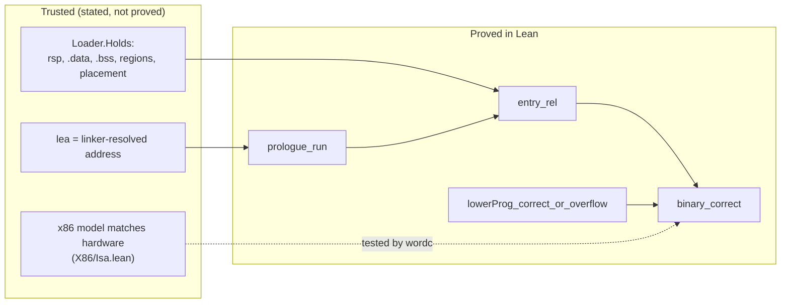

### `Main.lean` (the `wordc` executable)

It emits assembly, assembles and links with `as`/`ld` (placing `.dstack` and `.astack` at fixed
addresses), runs the binary, and compares the exit status and dump with the Lean semantics. It
also runs the auxiliary-stack and overflow programs. `wordc forth file.fs` runs a Forth source
file natively.

## 10. Trust boundaries in one place

Every theorem in this repository is a statement about Lean definitions. What connects them to
the outside world is listed here, together with how each link is checked.

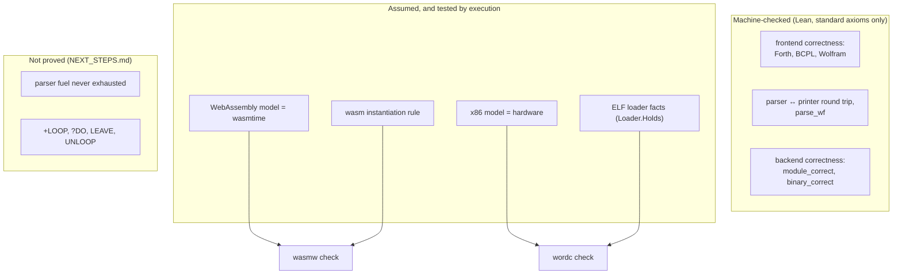

Things to keep in mind when reading the theorems:

* **Stacks are bounded on the targets and unbounded in the IR.** Both backends check before
  every push and every call, and exit 6 when a stack is full. The `_or_overflow` theorems say
  "IR outcome or exit 6"; the theorems without that suffix assume `Fits` and give the exact
  outcome.
* **Program-level hypotheses are small and checkable.** They are: registers named by
  `push`/`pop` exist (`RegsOk`), the program has fewer than `2^32` instructions (WebAssembly) or
  `17 · length < 2^64` (x86), and the register file and memory image fit the runtime layout
  (WebAssembly).
* **The emitted text is generated from the verified instruction lists.** `Wasm.Emit` and
  `X86.Emit` print exactly what the lowering produced, so there is no second hand-written copy of
  the code to drift. The hand-written parts are the small runtimes (prologue, dump routine, trap
  stubs), and each module documents them.

## 11. Where to start reading

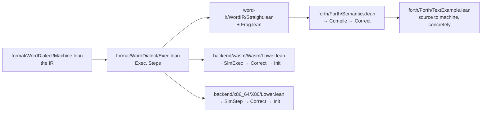

* For the meaning of a program, read `Machine.lean` (one screen) and `Exec.lean`.
* For a frontend proof in miniature, read `forth/Forth/OpCorrect.lean`, then the `op` and `call`
  cases of `Forth/Correct.lean`.
* For a backend, read the module docstring of `Lower.lean` and one simulation theorem, for
  example `sim_add` in `Wasm/SimAlu.lean`. Then read `sim_step`, and finally the top of
  `Init.lean` for the end-to-end statement.
* For concrete runs, read `forth/Forth/TextExample.lean` and `examples/forth/*.fs`, and run
  `wordc forth` / `wasmw forth` on them.

## 12. Checking it yourself

```sh
lake build                                   # every library and both executables
lake env lean formal/Audit.lean              # fails if any theorem uses a non-standard axiom
.lake/build/bin/wordc check 300              # x86-64: samples + 300 random programs, natively
.lake/build/bin/wasmw check 300              # WebAssembly: the same under wasmtime
.lake/build/bin/wordc forth examples/forth/loops.fs
```

CI runs all of these, plus a grep that rejects `sorry`, `admit`, `native_decide` and `axiom`
declarations anywhere in the Lean sources.
