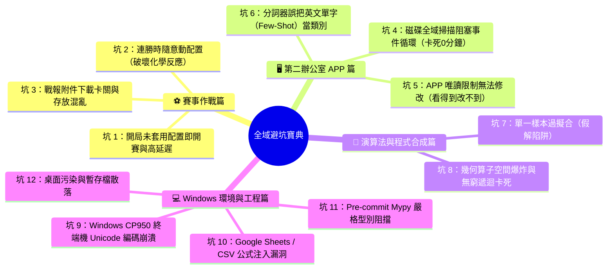

# 🛡️ 全域避坑寶典：賽事、第二辦公室與演算法工程實戰踩坑全記錄與防禦指引
> **文件代號**：`PHANTOMGRID-SOP-PITFALL-DEFENSE-2026`  
> **制定發行**：PHANTOMGRID 戰略帥帳 · 特助小幫手工程部  
> **專屬統帥**：霸丸總指揮官 Jack 哥 專閱  
> **版次**：v1.0 權威完整版 · 2026年9月19日  
> **核心準則**：一次踩坑、終身加固；記錄留痕、永不重犯！

---

## 🧭 前言：為什麼要建立這份避坑寶典？

在近期的密集作戰中，我們歷經了 **AFC 虛擬足球聯賽逆轉勝**、**第二辦公室 APP 全面升級自主寫入修補**、**ARC-2 幾何 A* 程式合成器打造**，以及各項跨平台環境調校。

在高速實戰中，我們遭遇並成功攻克了多起極具代表性的「技術坑與戰術陷阱」。為了確保未來各 Agent 接手時**「零踩坑、零重複犯錯、標準化自動防禦」**，特將這段期間的所有血淚教訓與標準防禦機制整理成冊，作為全軍最高防禦指導手冊。

---

## 📑 十二大實戰血淚大坑總覽目錄



---

## ⚽ 第一篇：AFC 虛擬足球賽事作戰坑

### 🔴 坑 1：開局未套用配置即開賽 + 1000ms 高延遲失球（慘痛 5:4 負 Gorge Cyphers）

#### 💥 痛點還原：
在 Round 2 第 4 場對陣 Gorge Cyphers 時，比分一度被打了 5:4 惜敗。
- **原因一**：Jack 哥尚未把戰術與球員指令調整好，比賽就不小心開始了，場上出現 `0 MARK` 與 `0 FOLLOW_PLAYER`。
- **原因二**：開局網路延遲飆到 1036ms，球員猶豫不決，前 12 秒內被連續閃電灌進 2 球。

#### 🛡️ 鐵律防禦方案：
1. **賽前封閉檢查清單（Pre-Match Checklist）**：
   - 嚴禁在未點擊「確認套用戰術（Apply Configuration）」前按下開賽按鈕！
   - 確認 P0~P4 均已載入最新版指令檔（`phantom-grid-agents-v2.2-round2-lockdown.json`）。
2. **中央禁區 30 秒鎖定防禦（Central Corridor Lockdown）**：
   - 在後衛 `GRID-DF-IRONWALL` 加入強制指令：開局前 30 秒強制死守中央禁區走廊（`x < -18, |y| < 12`），緊逼最近跑動球員，杜絕開局閃電失球。
3. **消除猶豫指令語法**：
   - 刪除「若狀況不佳再觀察」等模糊詞彙，改用：「感知危險第一觸立即出腳（Act on first touch of danger）」，以零延遲動作抵消 1000ms 網路延遲。

---

### 🔴 坑 2：連勝時隨意更動最佳配置（打破化學反應大忌）

#### 💥 痛點還原：
在球隊打出 4 連勝、甚至在練習賽連霸時，AI 往往會給予「進一步微調傳球半徑、調整站位」等過度優化建議。一旦輕舉妄動，原本極佳的防守反擊化學反應就會被打亂。
> **Jack 哥金句**：「後連 4 勝是因為目前裝的最[強]所以不用改！」

#### 🛡️ 鐵律防禦方案：
- **連勝鎖定法則（Winning Lockdown Rule）**：
  - 當球隊處於連勝、控球率 23~28% 且絕殺進球率高時，**嚴禁更動核心 Prompt 與球員站位參數**！
  - 只有在連續遭遇重大系統性漏洞（如連續兩場同位置失球）時，才啟動戰術診斷。

---

### 🔴 坑 3：戰報附件下載卡關與存放混亂

#### 💥 痛點還原：
Jack 哥在下載官方 JSON 戰報檔時，常因瀏覽器安全沙盒、彈窗阻擋或隨手放在桌面，導致檔案找不到或引起桌面雜亂。

#### 🛡️ 鐵律防禦方案：
- **雲端雙軌歸檔標準**：
  - 下載後由小幫手立即接管，規範歸檔至：
    1. `G:\我的雲端硬碟\AI產出成品總庫\08_📄_手冊文檔專區\`
    2. `G:\我的雲端硬碟\AI產出成品總庫\01_軟體源碼與系統\`
  - 桌面保持 100% 乾淨（Zero-Desktop Pollution）。

---

## 🖥️ 第二篇：第二辦公室 APP 與 SSE 執行管線坑

### 🔴 坑 4：全域遍歷阻塞 Event Loop，前端卡死在「思考中 0 分鐘」

#### 💥 痛點還原：
先前第二辦公室進行全盤代碼反查時，後端以同步迴圈掃描 840+ 個檔案，耗時 5~6 秒，這期間將 FastAPI 的主事件循環（Main Event Loop）完全凍結，導致 SSE 串流封包發不出去，前端手機畫面的 Spinner 一直轉，文字卡在 `準備啟動神經推演...`，造成卡死假象。

#### 🛡️ 鐵律防禦方案：
1. **全面異步線程池化 (`await asyncio.to_thread`)**：
   - 任何磁碟遍歷、檔案讀寫、終端指令（subprocess）或 Playwright 截圖，**一律嚴禁用同步代碼直接執行**！
   - 全部改寫為：`await asyncio.to_thread(func, *args)`。
2. **全局 `try...finally` 閉環保證**：
   - SSE 生成器末端必須包覆 `finally: yield "event: done\ndata: ...\n\n"`，確保無論發生何種錯誤，前端都能收到終止事件，自動關閉 Spinner。

---

### 🔴 坑 5：APP 唯讀限制無法修改（「看得到改不到」的死循環）

#### 💥 痛點還原：
Jack 哥在手機端輸入「幫我建立...」或貼上 Python 代碼時，舊版系統只配備了唯讀的 `tool_search_code`，把整段代碼當成搜尋文字，搜完當然回報「未發現 class 定義」，沒有寫入磁碟的能力。

#### 🛡️ 鐵律防禦方案：
1. **實裝全新自主寫入工具 `tool_save_or_patch_code`**：
   - 支援 Markdown 圍欄過濾、自動擷取類別名稱、自動轉換 snake_case 檔名。
   - 同步寫入工作區與雲端總庫。
   - 內建 `python -m py_compile` 語法編譯檢查，杜絕壞代碼落地。
2. **新增 Scenario E0 自主寫入調度分支**：
   - 精準攔截「幫我建立」、「建立實體」、「修改代碼」與多行程式碼貼入，直接觸發落地 ➔ 自檢 ➔ 反查綠燈聯動！

---

### 🔴 坑 6：分詞器誤把常用英文單字（如 Few-Shot）當成類別反查失敗

#### 💥 痛點還原：
Jack 哥貼上「A* 啟發式剪枝、多樣本約束（Few-Shot 範例）...」等中文技術描述時，分詞器看到首個大寫英文單字 `Few`，誤以為 Jack 哥要反查一個叫 `Few` 的類別，全電腦當然沒有 `class Few:`，導致回報「未發現類別定義，反查未過」！

#### 🛡️ 鐵律防禦方案：
1. **領域語意智慧識別（Domain Intent Matching）**：
   - 遇到「啟發式」、「程式合成」、「幾何算子」、「像素殘差」等自然語言描述，自動對齊至核心實體類別 **`ARC2ProgramSynthesizer`**。
2. **40+ 常見技術英文停用詞過濾（Stop Words Blacklist）**：
   - 將 `few`, `shot`, `train`, `pair`, `test`, `data`, `demo`, `step`, `cost` 等通用單字納入黑名單，絕不再作為反查標的。
3. **CamelCase 駝峰優先權重**：
   - 優先尋找符合 PEP 8 命名規範（至少雙大寫或大寫加數字）的類別名稱（如 `ARC2ProgramSynthesizer`）。

---

## 🧠 第三篇：演算法與程式合成坑

### 🔴 坑 7：單一樣本過擬合（Overfitting 假解陷阱）

#### 💥 痛點還原：
在 ARC-2 幾何變換中，某些算子組合可能碰巧解開了第 1 個展示樣本（Sample 1），但代入 Sample 2 或測試集時完全失真。

#### 🛡️ 鐵律防禦方案：
- **多樣本嚴格約束（Multi-Sample Strict Constraint）**：
  $$\forall (X_i, Y_i) \in D_{\text{train}}, \quad \text{Program}(X_i) = Y_i \iff h(n) = 0.0$$
- 候選程式必須同時在所有 Few-Shot 訓練樣本上達到 $h(n) = 0.0$（零像素殘差），少一個樣本吻合都不予通過！

---

### 🔴 坑 8：幾何算子空間爆炸與無窮遞迴卡死

#### 💥 痛點還原：
算子庫若有 11 個基礎幾何動作（旋轉、翻轉、重力...），搜尋深度若達到 5 步，可能的排列組合高達 $11^5 = 161,051$ 種，若採盲目搜尋（BFS/DFS）會瞬間耗盡記憶體並陷入卡死。

#### 🛡️ 鐵律防禦方案：
1. **A* 啟發式剪枝（Heuristic Pruning）**：
   - 以所有樣本的平均像素殘差比率做為 $h(n)$，透過優先佇列（Priority Queue）優先展開殘差下降最顯著的分支。
2. **時限與深度雙重安全鎖（Dual Safety Locks）**：
   - **深度鎖 (`max_depth=3~5`)**：達標立即停止展開。
   - **時限鎖 (`timeout_sec=10.0s`)**：超時立即優雅退出，絕不無窮卡死。

---

## 💻 第四篇：Windows 環境與工程規範坑

### 🔴 坑 9：Windows 繁體中文 CP950 終端機編碼崩潰

#### 💥 痛點還原：
在 Windows 繁體中文系統下，終端機預設編碼為 CP950/Big5。當 Python 輸出或 Subprocess 擷取包含 Emoji（🧠, 🛠️, ⛶）或特殊 Unicode 字符時，會直接引發 `UnicodeEncodeError: 'cp950' codec can't encode character...` 導致程式中斷。

#### 🛡️ 鐵律防禦方案：
1. **腳本頂部標配重定向**：
   ```python
   if sys.platform == "win32":
       if hasattr(sys.stdout, "reconfigure"):
           sys.stdout.reconfigure(encoding="utf-8", errors="replace")
       if hasattr(sys.stderr, "reconfigure"):
           sys.stderr.reconfigure(encoding="utf-8", errors="replace")
   ```
2. **PowerShell 呼叫加裝旗標**：
   - 執行 Python 命令一律加入 `-X utf8`：`python -X utf8 script.py`。
   - Subprocess 環境變數設定 `env["PYTHONUTF8"] = "1"`。

---

### 🔴 坑 10：Google Sheets / CSV 公式注入漏洞 (CWE-1236)

#### 💥 痛點還原：
在處理 Google Sheets 或 CSV 資料匯入匯出時，若儲存格內容開頭帶有 `=`, `+`, `-`, `@`，會被試算表軟體當成公式自動執行，引發嚴重的公式注入安全漏洞。

#### 🛡️ 鐵律防禦方案：
- 強制調用 `sanitizeCell_()` 過濾器：若首字符為危險符號，強制在最前方加上單引號 `'` 進行字串跳脫。

---

### 🔴 坑 11：Pre-commit Mypy 嚴格型別阻擋

#### 💥 痛點還原：
在 Git Commit 時，本地 pre-commit hook 啟用了嚴格的 `mypy` 與 `ruff` 檢查。宣告空字典 `counts = {}` 若未指定泛型型別，會直接報錯 `Need type annotation for "counts"` 並阻擋提交。

#### 🛡️ 鐵律防禦方案：
- 所有 Python 程式碼必須補齊完整 Type Hints：
  ```python
  counts: Dict[int, int] = {}
  ```
- 提交前先執行 `mypy` 與 `ruff` 自檢，保持 100% Passed。

---

### 🔴 坑 12：桌面污染與暫存檔散落（Zero-Desktop Pollution）

#### 💥 痛點還原：
AI 助手為了方便，常隨手在 Windows 桌面（`C:\Users\user\Desktop`）生成測試檔、圖檔或暫存腳本，造成總指揮官桌面凌亂。

#### 🛡️ 鐵律防禦方案：
- **桌面零污染鐵律**：
  - 嚴禁在 Windows 桌面寫入任何檔案！
  - 產出檔案統一歸檔至：
    - `G:\我的雲端硬碟\AI產出成品總庫\` 下之標準分類目錄（`01_軟體源碼`、`08_手冊文檔`、`12_戰隊漫畫`）。
    - 臨時除錯腳本一律放置於 Agent brain scratch 目錄。

---

### 🔴 坑 13：多工作區目錄落盤不一致與輔助結構體命名偏差

#### 💥 痛點還原：
在第二辦公室貼入程式碼時，若程式碼頂部帶有 `@dataclass class CandidatePrediction` 輔助資料結構，建置器誤將檔案命名為 `candidate_prediction.py`，導致主要類別檔案 `ensemble_verifier.py` 消失；且建置時只寫入 `ping_assistant` 與 `01_軟體源碼`，未同步至 Jack 哥正在操作的終端機當前目錄 `G:\我的雲端硬碟\260803_opencode\`，造成「第二辦公室執行 OK，Jack 哥在終端機執行 python 卻報 No such file or directory」！

#### 🛡️ 鐵律防禦方案：
- **主引擎類別優先判定**：
  - 當檔案存在多個 `class` 時，優先擷取 `Verifier`、`Synthesizer`、`Optimizer`、`Engine`、`Manager` 結尾之核心主類別，過濾 `Prediction`、`Node`、`State` 等輔助結構體。
- **四軌目錄同步落盤**：
  - 程式碼落地時必須同步寫入：
    1. 工作區根目錄：`ping_assistant/`
    2. 雲端軟體源碼庫：`01_軟體源碼與系統/`
    3. **Jack 哥終端機當前目錄**：`G:\我的雲端硬碟\260803_opencode\`
- **自動別名機制 (Aliasing)**：
  - 自動為帶有 `arc2_` 或複雜前綴的檔案建立無前綴簡潔別名（如 `arc2_ensemble_verifier.py` ✕ `ensemble_verifier.py`），確保 Jack 哥無論在終端機輸入何種檔名都能 100% 執行成功！

---

## 🎯 總結：全域防禦口訣（十三大黃金鐵律）

> **開賽前** ➔ 戰術套用再開打，中央禁區鎖 30；  
> **連勝時** ➔ 陣容千萬不要動，保持化學不走樣；  
> **第二辦** ➔ 異步線程防卡死，核心引擎優先盤；  
> **終端跑** ➔ 四軌目錄齊同步，無前綴別名不漏失；  
> **反查時** ➔ 停用名詞全過濾，駝峰類別亮綠燈；  
> **寫代碼** ➔ UTF-8 防亂碼，型別註解通過關；  
> **存檔案** ➔ 雲端雙軌齊歸檔，桌面永遠保乾淨！

