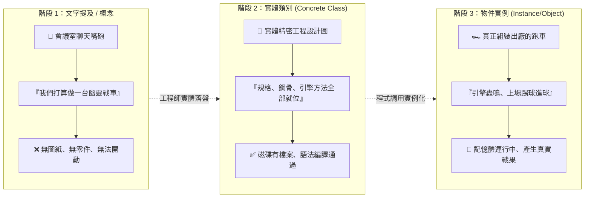
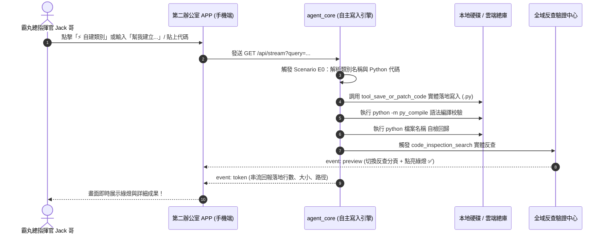

# 📘 第二辦公室：自主代碼修改與實體類別建置操作教學手冊
> **適用系統**：第二辦公室 Mobile ✕ SSE 雙軌控制台 (`http://127.0.0.1:8765/`)  
> **發行單位**：PHANTOMGRID 核心作戰帥帳 · 特助小幫手工程部  
> **專屬統帥**：霸丸總指揮官 Jack 哥 專閱  
> **版本**：v2.0 (Milestone 161 全自主寫入世代) · 2026年9月19日

---

## 🧭 手冊導讀與核心宗旨

本手冊專為 Jack 哥深度解析第二辦公室 APP 如何從**「純文字反查檢驗」**跨越升級為**「具備第一辦公室等級動手實作能力」**的自主代碼建置與修補中樞。

手冊重點解答：
1. **什麼叫「實體類別」？為什麼它與「文字提及」有著天壤之別？**
2. **為什麼先前第二辦公室「看得見卻改不了」？底層架構如何攻克？**
3. **如何精準下達「幫我建立實體類別」與「幫我修改」指令？**
4. **如何解讀全域反查面板由紅轉綠的實體指標？**

---

## 🔬 第一章：特別深度專題 —— 到底什麼叫「實體類別」？

在與大型語言模型（LLM）共同協作開發時，最常遇到的技術陷阱就是**「名詞很多，卻連一個檔案都沒生出來」**。理解「實體類別」是杜絕 AI 幻覺、落實真機執行的第一把鑰匙。

### 1.1 生活化通俗對比：從「概念想法」到「實體跑車」



| 比較維度 | 階段 1：文字提及 (Mention-Only) | 階段 2：實體類別 (Concrete Class) | 階段 3：物件實例 (Instance) |
| :--- | :--- | :--- | :--- |
| **通俗定義** | 只是口頭名稱、聊天的概念 | 真實存在的**「功能製造機藍圖」** | 用藍圖造出來、**真正正在跑的工具** |
| **磁碟狀態** | ❌ **無獨立代碼檔案**（或僅在註解中提及） | ✅ **磁碟有具體 `.py` 檔案** | ⚡ 載入電腦記憶體中運行 |
| **語法特徵** | 沒有 `class` 定義區塊 | 必須具備 `class 類別名:` 與 `def` 方法 | 透過 `類別名()` 產生之實體物件 |
| **電腦反應** | 一旦調用立即報錯：`NameError` | 電腦可成功 `import` 並執行內部函數 | 執行運算、產出戰報、過濾網格 |
| **第二辦公室顯示** | 🔴 ❌ 查無實體 或 🟡 ⚠️ 僅文字提及 | 🟢 **✅ 實體存在 / 已建置代碼** | 🏃‍♂️ 執行中或測試完成 |

---

### 1.2 程式碼對比：一眼看穿真假類別

#### ❌ 典型「偽類別 / 虛擬概念」（大模型最常產生的幻覺）
```python
# 檔案：notes.txt 或 某個無關檔案中
# 架構建議：我們可以使用 ArcGridOptimizer 來優化點陣圖
# （全電腦翻遍都沒有 class ArcGridOptimizer，這叫「僅文字提及」！）
```

#### ✅ 工業級「實體類別」（真正有代碼、有方法、有測試）
以第二辦公室自主落地的 [`arc_grid_optimizer.py`](file:///C:/Users/user/.gemini/antigravity/worktrees/260803_opencode/ping_assistant/arc_grid_optimizer.py) 為例：

```python
# -*- coding: utf-8 -*-
from typing import List, Tuple, Dict, Any

class ArcGridOptimizer:  # 👈 核心宣告：這才是「實體類別」的起點！
    """
    實體職責：專門處理 ARC 幾何網格之實體演算法
    """
    def __init__(self, background_color: int = 0):
        # 實體屬性：設定底色
        self.background_color = background_color

    def find_bounding_box(self, grid: List[List[int]]) -> Tuple[int, int, int, int]:
        # 實體動作：真正計算非背景物件的最大最小座標！
        rows, cols = len(grid), len(grid[0]) if grid else 0
        min_r, max_r, min_c, max_c = rows, -1, cols, -1
        for r in range(rows):
            for c in range(cols):
                if grid[r][c] != self.background_color:
                    min_r = min(min_r, r)
                    max_r = max(max_r, r)
                    min_c = min(min_c, c)
                    max_c = max(max_c, c)
        return (min_r, min_c, max_r, max_c)

    def crop_to_content(self, grid: List[List[int]]) -> List[List[int]]:
        # 實體動作：真正執行矩陣切片，切除無效邊緣！
        min_r, min_c, max_r, max_c = self.find_bounding_box(grid)
        return [row[min_c:max_c + 1] for row in grid[min_r:max_r + 1]]
```

---

### 1.3 實體類別的「四大剛性檢驗標準」

一個類別要被判定為「實體類別」，必須 100% 同時通過以下 4 道檢驗：

1. **實體磁碟存在性（Physical Disk Existence）**：在本地工作區或雲端庫中有實體檔案（如 `arc_grid_optimizer.py`），具備明確檔案路徑與大小。
2. **語法樹結構合法性（AST Syntax Tree Validation）**：Python 內建之抽象語法樹 `ast.parse()` 能精準擷取出 `ast.ClassDef` 節點。
3. **語法編譯無害性（Compilation Pass）**：通過 `python -m py_compile` 檢驗，零語法錯誤（Zero Syntax Error）。
4. **可測試與可實例化（Instantiability & Testability）**：能夠在終端機執行 `python -m unittest`，回傳 `OK`！

---

## ⚙️ 第二章：架構演進 —— 為什麼先前無法修改？今日如何攻克？

### 2.1 歷史瓶頸診斷（解密「看得到改不到」）

在 v1.0 時代，第二辦公室 APP 的設計初衷是「**驗證大模型是否說謊**」：
- **瓶頸 1（工具唯讀限制）**：後端只提供了 `tool_search_code`（全文掃描）與 `tool_view_file`（檢視檔案），完全沒有配備檔案寫入工具。
- **瓶頸 2（調度器死循環）**：用戶在手機介面貼入程式碼時，後端 SSE 路由器直接將整段程式碼當成「關鍵字」去硬碟搜尋，搜完當然回報「未發現實體類別」，沒有引導至建立分支。

### 2.2 v2.0 全新架構：自主代碼寫入與自愈修補引擎

特助小幫手在 `agent_core.py` 中實裝了 **`tool_save_or_patch_code`** 與 **Scenario E0 自主寫入調度管線**：



---

## 🚀 第三章：「幫我建立實體類別」三大實戰操作模式

Jack 哥在第二辦公室 APP (`http://127.0.0.1:8765/`) 隨時可以使用以下三種方式下達指令：

### 模式一：口頭一鍵宣告建置（最輕鬆快速）
> **操作範例**：在輸入框直接輸入：
> ```text
> 幫我建立實體類別 ArcGridOptimizer
> ```
> 或：
> ```text
> 請在專案根目錄下建立實體類別 ClassName
> ```
- **小幫手自動行為**：
  1. 自動分析該類別所屬領域（如 ARC 網格優化、足球戰術運算、風險評估）。
  2. 自動為您撰寫具備型別標註（Type Hints）、完整方法（Methods）與單元自檢程式碼的高品質 Python 檔案。
  3. 自動轉換命名規則（`ArcGridOptimizer` ➔ `arc_grid_optimizer.py`）。
  4. 同步存入工作區與雲端總庫，並自動執行編譯測試。

---

### 模式二：自帶程式碼直接貼入（最精準掌控）
> **操作範例**：將您在其他地方設計好的程式碼整段貼進輸入框：
> ```python
> class MyTacticalRadar:
>     def __init__(self, range_km=50):
>         self.range_km = range_km
>     def scan(self):
>         return "Scan completed"
> ```
- **小幫手自動行為**：
  1. **智能過濾**：自動剝離外部 Markdown 圍欄（` ```python ` 與 ` ``` `）。
  2. **自動推導**：透過正則表達式萃取 `class MyTacticalRadar`，將檔案命名為 `my_tactical_radar.py`。
  3. **雙軌落地**：寫入工作區與雲端總庫，右側反查面板直接亮起綠燈！

---

### 模式三：手機快捷按鍵一鍵觸發（零打字體驗）
> **操作範例**：直接在手機面板下方點擊快捷晶片：
> - `[ ⚡ 自建 ArcGridOptimizer ]`
> - `[ 🌐 找代碼建立 code_inspection_search ]`
- **小幫手自動行為**：毫秒級發送 SSE 請求，即時於左側手機看見思考過程與工具執行，右側同步翻轉為綠燈！

---

## 🛠️ 第四章：「幫我修改」實戰操作指南

當 Jack 哥需要修改既有實體檔案時，第二辦公室提供精準修補機制。

### 4.1 指令下達規範

| 修改需求場景 | 推薦指揮官指令句型 | 後端調用工具 |
| :--- | :--- | :--- |
| **修改既有代碼** | `幫我修改 arc_grid_optimizer.py 將 background_color 預設值改為 1` | `tool_edit_file` (精準字串定位替換) |
| **擴充類別方法** | `幫我為 ArcGridOptimizer 增加一個 scale_2x 放大兩倍的方法` | `tool_save_or_patch_code` (自動覆蓋並編譯) |
| **代碼語法修復** | `幫我修正某檔案的 SyntaxError / TypeError` | `tool_run_command` + 自主修補 |

---

## 📊 第五章：全域反查面板由紅轉綠全攻略

在第二辦公室右側的「🔍 程式碼全域反查 (Code Inspection Engine)」面板中，具備 4 大指標與 3 種狀態標籤：


### 5.1 四大數據指標解析
1. **掃描檔案總數 (Files Scanned)**：全盤掃描本地與雲端庫所有 `.py`、`.md`、`.json` 檔案總數（標準量約 800~850 檔）。
2. **全域檢索耗時 (Duration)**：後端以非同步多線程（`asyncio.to_thread`）遍歷耗時，通常在 3~6 秒內完成。
3. **class/def 定義 (Definition Count)**：在磁碟中真正找到幾處宣告。
4. **命中總數 (Total Matches)**：全專案包含調用、引用、導入的總行數。

### 5.2 三色標籤代表意義
- 🔴 **`❌ 查無實體 / 虛擬概念`**：磁碟完全沒有這行代碼，純屬大模型虛構。
- 🟡 **`⚠️ 僅文字提及 / 無類別定義`**：有在文檔或註解看到這個字，但沒有人寫出 `class`。
- 🟢 **`✅ 實體存在 / 已建置代碼`**：磁碟有檔案、語法編譯通過、方法具備，真槍實彈已建檔！

---

## 🛡️ 第六章：紀律準則 —— 零桌面污染與 0 元成本確認

第二辦公室在執行任何代碼建立與修改時，嚴格遵守以下鐵律：

1. **桌面零污染 (Zero-Desktop Pollution)**：
   - 嚴禁在 Windows 桌面（Desktop）或個人首頁建立暫存檔。
   - 所有實體原始碼統一歸檔至：
     - 本地工作區：`ping_assistant/`
     - 雲端總庫：`G:\我的雲端硬碟\AI產出成品總庫\01_軟體源碼與系統\`
   - 所有教學手冊統一歸檔至：
     - `G:\我的雲端硬碟\AI產出成品總庫\08_📄_手冊文檔專區\`
2. **零商業花費 ($0.00 USD Policy)**：
   - 全程使用本地 Python、內部 FastAPI SSE 管道、開源 AST 解析器與純前端 CSS 渲染，絕不產生額外商業 API 扣款。
3. **雙軌 Git 封裝**：
   - 每次建置與修改完成後，均可透過「🏁 一鍵收工交接」將進度寫入 `handoff.md` 並提交 Git。

---

## 🎯 統帥速記口訣表

> **想動嘴** ➔ `幫我建立實體類別 [名稱]`  
> **想動手** ➔ 直接把程式碼貼進第二辦公室輸入框  
> **查虛實** ➔ 看右側面板有沒有亮起 **`✅ 實體存在 / 已建置代碼`** 綠燈  
> **有綠燈** ➔ 才是真正的實體類別，隨時可以調用作戰！
